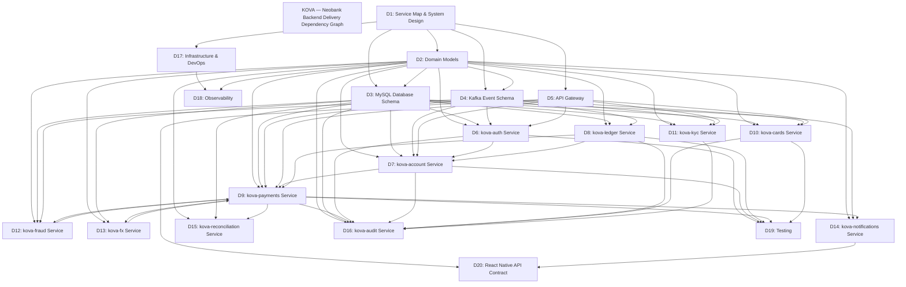

# KOVA — Neobank Backend Task Registry

## Legend
- [ ] Not started
- [~] In progress
- [x] Complete
- [!] Blocked (reason in notes)

---

## Deliverable 1 — Service Map & System Design

### TASK-001 — Define Service Boundaries and Ownership Contracts
- **Deliverable:** Service Map & System Design
- **Estimated complexity:** High
- **Depends on:** None
- **What to build:** Produce a `docs/service-map.md` document that names all 11 KOVA backend services (kova-auth, kova-account, kova-ledger, kova-payments, kova-cards, kova-kyc, kova-fraud, kova-fx, kova-notifications, kova-reconciliation, kova-audit), states which MySQL database each service owns exclusively, and defines the synchronous vs. asynchronous communication boundary for each pair of services that interact. Each service entry must list its inbound REST/gRPC callers and its Kafka topic subscriptions.
- **Acceptance criteria:**
  - All 11 services are listed with their owned MySQL database name following the pattern `kova_<service>_db`
  - Every inter-service call is classified as either synchronous (REST or gRPC) or asynchronous (Kafka)
  - No service is listed as reading directly from another service's MySQL database
  - Document compiles correctly as Markdown with no broken internal links
- **Crates/tools:** None (documentation task)
- **Notes:** Database-per-service isolation is a hard architectural constraint. If two services need shared data, the owning service must expose an API. This boundary must be enforced at the network policy level in Kubernetes (see TASK-109).
- **Status:** [x] Complete

---

### TASK-002 — Define Kafka Topic Registry
- **Deliverable:** Service Map & System Design
- **Estimated complexity:** Medium
- **Depends on:** TASK-001
- **What to build:** Produce `docs/kafka-topics.yaml` listing every Kafka topic used across all KOVA services. Each entry must include topic name (prefixed `kova.`), partition count, replication factor, retention policy, producer service, and all consumer services. Cover the full topic set: payment events, account lifecycle, card events, KYC events, fraud decisions, ledger events, notification events, reconciliation events, and audit fan-out.
- **Acceptance criteria:**
  - Every topic name begins with `kova.`
  - Each topic has partition count ≥ 3 and replication factor = 3 for production, 1 for local dev
  - No topic is listed without at least one producer and one consumer
  - Retention policy is explicit (e.g., `7d` for operational topics, `unlimited` for audit)
  - YAML is valid and parseable
- **Crates/tools:** None (configuration/documentation task)
- **Notes:** Topic names established here become the single source of truth referenced by all service tasks. Any deviation in implementation tasks must be flagged as a breaking change.
- **Status:** [x] Complete

---

### TASK-003 — Author gRPC Proto Definitions for Internal Calls
- **Deliverable:** Service Map & System Design
- **Estimated complexity:** Medium
- **Depends on:** TASK-001
- **What to build:** Create `proto/` directory at the monorepo root with `.proto` files for every synchronous internal call: `kova_auth.proto` (token validation), `kova_ledger.proto` (balance query, post entry), `kova_fraud.proto` (evaluate request), `kova_fx.proto` (get quote, consume quote), `kova_kyc.proto` (get KYC status). All messages must use `bytes` for UUID fields and `string` for decimal amounts (never `double`).
- **Acceptance criteria:**
  - All `.proto` files use `syntax = "proto3"` and `package kova.*`
  - UUID fields use `bytes` type (16 bytes, matching BINARY(16) in MySQL)
  - Monetary amount fields use `string` type with a comment stating they map to `DECIMAL(19,4)`
  - `protoc` compiles all files without errors
  - Each RPC method has a corresponding error status code table in a comment
- **Crates/tools:** `tonic`, `prost`, `tonic-build`
- **Notes:** Internal gRPC calls are authenticated via signed KOVA-internal JWTs (see KOVA Implementation Rules). Never expose gRPC ports outside the Kubernetes cluster.
- **Status:** [x] Complete

---

### TASK-004 — Draw Service Dependency Graph in Mermaid
- **Deliverable:** Service Map & System Design
- **Estimated complexity:** Low
- **Depends on:** TASK-001, TASK-002, TASK-003
- **What to build:** Add a `docs/architecture.md` file containing a Mermaid `flowchart TD` diagram showing all 11 KOVA services as nodes, with directed edges labeled either `REST`, `gRPC`, or `Kafka →` for each dependency. Include MySQL database nodes as cylinders and Redis/Kafka as infrastructure nodes. The chart title must read "KOVA — System Architecture".
- **Acceptance criteria:**
  - Diagram renders without errors in GitHub Markdown preview
  - Every service from TASK-001 appears as a node
  - All edges are labeled with protocol type
  - MySQL databases are distinct cylinder nodes, one per service
  - No circular synchronous dependencies exist in the graph
- **Crates/tools:** None (documentation task)
- **Notes:** Circular synchronous dependencies (A calls B calls A) are forbidden. If identified, the design must be resolved using Kafka before this task is marked complete.
- **Status:** [x] Complete

---

### TASK-005 — Define Inter-Service Authentication Contract
- **Deliverable:** Service Map & System Design
- **Estimated complexity:** Medium
- **Depends on:** TASK-003
- **What to build:** Write `docs/internal-auth.md` specifying the KOVA-internal JWT contract: issuer claim (`kova-internal`), subject claim format (`svc:<service-name>`), required scopes per endpoint, signing key rotation strategy (RS256, 90-day rotation via AWS Secrets Manager), and the middleware interface every service must implement to validate inbound internal JWTs. Include a sequence diagram for the token validation flow.
- **Acceptance criteria:**
  - Document specifies exact JWT claim names and value formats
  - Every gRPC endpoint listed in TASK-003 has a corresponding required scope defined
  - Key rotation procedure is documented step by step
  - Sequence diagram is valid Mermaid
  - Document references the AWS Secrets Manager secret naming convention
- **Crates/tools:** `jsonwebtoken`, `ring`
- **Notes:** Internal service tokens have a 5-minute TTL and are not revocable — revocation is achieved by rotating the signing key, which invalidates all outstanding tokens.
- **Status:** [x] Complete

---

### TASK-006 — Define MySQL Database Isolation Plan
- **Deliverable:** Service Map & System Design
- **Estimated complexity:** Medium
- **Depends on:** TASK-001
- **What to build:** Produce `docs/database-plan.md` enumerating all 11 MySQL databases, their owning service, the MySQL user account each service connects as (principle of least privilege: only SELECT/INSERT/UPDATE on its own DB, no DDL in production), connection pool sizing recommendations per service load tier (low/medium/high), and the migration tooling strategy (sqlx CLI `migrate run` called at service startup in dev, manual in production with approval gate).
- **Acceptance criteria:**
  - Each service maps to exactly one database; no database is shared
  - Each MySQL user is granted only the minimum required privileges (no GRANT ALL)
  - Connection pool min/max values are specified per service tier
  - Migration strategy distinguishes dev (auto-apply) from production (manual with rollback plan)
  - All database names follow the pattern `kova_<service>_db`
- **Crates/tools:** `sqlx-cli`
- **Notes:** Cross-database JOINs are forbidden at the application layer. If reporting requires data from multiple services, use the kova-reconciliation or kova-audit service's read models.
- **Status:** [x] Complete

---

## Deliverable 2 — Domain Models

### TASK-007 — Implement Newtype ID Wrappers
- **Deliverable:** Domain Models
- **Estimated complexity:** Low
- **Depends on:** TASK-001
- **What to build:** In `crates/kova-types/src/ids.rs`, implement newtype structs for all domain IDs: `KovaUserId`, `KovaAccountId`, `KovaTransactionId`, `KovaCardId`, `KovaLedgerEntryId`, `KovaKycDocumentId`, `KovaAuditEventId`, `KovaPaymentId`, `KovaFxQuoteId`, `KovaNotificationId`. Each wraps a `uuid::Uuid` internally, derives `Debug`, `Clone`, `Copy`, `PartialEq`, `Eq`, `Hash`, `serde::Serialize`, `serde::Deserialize`, and implements `sqlx::Type` mapping to `BINARY(16)` for MySQL.
- **Acceptance criteria:**
  - All ID types compile and pass `cargo test`
  - `sqlx::Type` implementation uses `BINARY(16)` encoding (UUID bytes in network order)
  - `From<uuid::Uuid>` and `Into<uuid::Uuid>` are implemented for all ID types
  - Serialization produces a hyphenated UUID string (e.g., `"018f-..."`)
  - A type alias confusion compile test confirms `KovaUserId` cannot be passed where `KovaAccountId` is expected
- **Crates/tools:** `uuid`, `sqlx`, `serde`
- **Notes:** MySQL BINARY(16) storage requires `UUID_TO_BIN(?, true)` on insert and `BIN_TO_UUID(id, true)` on select (the `true` flag preserves time ordering for UUIDv7). Use UUIDv7 for all new IDs to maintain insert-order locality on InnoDB B-tree indexes.
- **Status:** [x] Complete

---

### TASK-008 — Implement Money<C: Currency> Phantom-Typed Struct
- **Deliverable:** Domain Models
- **Estimated complexity:** Medium
- **Depends on:** TASK-007
- **What to build:** In `crates/kova-types/src/money.rs`, implement a `Money<C: Currency>` struct backed by `rust_decimal::Decimal`. Define a `Currency` sealed trait with unit structs `NGN`, `GBP`, `USD`, `KES`. Implement `Add`, `Sub`, `Mul<Decimal>`, `PartialOrd`, and `Display` for `Money<C>`. Add a `checked_add` and `checked_sub` returning `Result<Money<C>, MoneyError>`. Implement `sqlx::Type` mapping to `DECIMAL(19,4)`.
- **Acceptance criteria:**
  - `Money<NGN>` and `Money<GBP>` cannot be added together — this is a compile error
  - All arithmetic operations preserve 4 decimal places (DECIMAL(19,4) semantics)
  - `Money<C>::zero()` returns the additive identity
  - Negative balances can be represented (needed for ledger debits)
  - `sqlx::Type` encodes/decodes correctly against a real MySQL DECIMAL(19,4) column in integration tests
- **Crates/tools:** `rust_decimal`, `sqlx`, `serde`, `thiserror`
- **Notes:** Never use `f64` or `f32` for any monetary calculation. The `rust_decimal` crate's `Decimal` type is the only acceptable numeric type for money. Division is forbidden on `Money<C>` — if pro-rating is needed, it must be done via explicit `Decimal` arithmetic with banker's rounding.
- **Status:** [x] Complete

---

### TASK-009 — Implement Core Entity Structs
- **Deliverable:** Domain Models
- **Estimated complexity:** Medium
- **Depends on:** TASK-007, TASK-008
- **What to build:** In `crates/kova-types/src/entities.rs`, implement the core entity structs: `User`, `Account`, `Card`, `LedgerEntry`, `FxQuote`, `AuditEvent`. Each struct must derive `sqlx::FromRow` for MySQL compatibility, `serde::Serialize`/`Deserialize`, `Debug`, and `Clone`. All UUID fields use the newtype IDs from TASK-007. All monetary fields use `Money<C>` or `rust_decimal::Decimal` with an explicit currency field.
- **Acceptance criteria:**
  - All structs compile with `sqlx::FromRow` derived
  - No `f64` or `f32` fields exist on any struct
  - All timestamp fields use `chrono::DateTime<chrono::Utc>`
  - `LedgerEntry` has `debit_account_id`, `credit_account_id`, `amount`, `currency`, `idempotency_key`, and `created_at` fields
  - `FxQuote` has `quote_token: String`, `expires_at: DateTime<Utc>`, `from_currency`, `to_currency`, `rate: Decimal`, `locked_amount: Decimal`
- **Crates/tools:** `sqlx`, `serde`, `chrono`, `rust_decimal`, `uuid`
- **Notes:** `sqlx::FromRow` with MySQL requires careful column name matching. Use `#[sqlx(rename = "column_name")]` where Rust field names differ from snake_case column names.
- **Status:** [x] Complete

---

### TASK-010 — Implement Payment State Machine Enum
- **Deliverable:** Domain Models
- **Estimated complexity:** Medium
- **Depends on:** TASK-009
- **What to build:** In `crates/kova-types/src/payment.rs`, implement `PaymentStatus` as an enum with variants: `Initiated`, `Validating`, `FraudCheck`, `FxConversion`, `SettlementSubmitted`, `Settled`, `Failed`, `Refunded`, `Expired`. Implement a `transition(self, event: PaymentEvent) -> Result<PaymentStatus, InvalidTransition>` method that encodes the full allowed transition graph. `PaymentEvent` covers `ValidationPassed`, `ValidationFailed`, `FraudApproved`, `FraudBlocked`, `FraudReview`, `FxConverted`, `SubmittedToRail`, `RailSettled`, `RailFailed`, `RefundRequested`, `Expired`.
- **Acceptance criteria:**
  - All valid transitions from the specification are encoded and return `Ok`
  - All invalid transitions (e.g., `Settled → Initiated`) return `Err(InvalidTransition)`
  - Table-driven tests cover every valid and invalid transition (minimum 30 test cases)
  - `PaymentStatus` implements `sqlx::Type` mapping to MySQL `ENUM` column
  - `PaymentStatus` implements `Display` returning the snake_case string matching MySQL ENUM value
- **Crates/tools:** `sqlx`, `serde`, `thiserror`
- **Notes:** MySQL ENUM values are case-sensitive. The `Display` impl must produce exactly the string stored in MySQL. Adding new ENUM values to MySQL requires a schema migration — document this in the task notes when the state machine is extended.
- **Status:** [x] Complete

---

### TASK-011 — Implement KYC Status Enum and Risk Level
- **Deliverable:** Domain Models
- **Estimated complexity:** Low
- **Depends on:** TASK-009
- **What to build:** In `crates/kova-types/src/kyc.rs`, implement `KycStatus` enum with variants `Unverified`, `Pending`, `UnderReview`, `Approved`, `Rejected`, `Expired` and `KycRiskLevel` enum with variants `Low`, `Medium`, `High`. Both must implement `sqlx::Type` (MySQL ENUM), `serde`, `Display`, and `TryFrom<&str>`. Implement `KycStatus::allows_payment(&self) -> bool` and `KycStatus::allows_card_issuance(&self) -> bool` encoding the business rules for which statuses unlock capabilities.
- **Acceptance criteria:**
  - `KycStatus::Approved.allows_payment()` returns `true`
  - `KycStatus::Unverified.allows_payment()` returns `false`
  - `TryFrom<&str>` returns `Err` for unrecognised strings
  - Both enums round-trip through MySQL ENUM column in integration test
  - `KycStatus` transition rules are enforced: `Approved → Expired` is valid, `Rejected → Approved` is not
- **Crates/tools:** `sqlx`, `serde`, `thiserror`
- **Notes:** KYC status directly gates payment and card capabilities. The `allows_*` methods are the single source of truth — no other service should re-implement this logic.
- **Status:** [x] Complete

---

### TASK-012 — Implement Shared Error Types
- **Deliverable:** Domain Models
- **Estimated complexity:** Medium
- **Depends on:** TASK-007
- **What to build:** In `crates/kova-types/src/errors.rs`, define the shared error hierarchy using `thiserror`: `KovaError` (top-level), `DatabaseError` (wrapping `sqlx::Error`), `ValidationError(String)`, `NotFoundError { entity: &'static str, id: String }`, `InsufficientFundsError`, `InvalidTransition { from: String, to: String }`, `IdempotencyConflict { key: String }`, `AuthError`, `FraudBlockError`. Each variant must map to an HTTP status code via a `http_status(&self) -> u16` method.
- **Acceptance criteria:**
  - All error types derive `thiserror::Error` — no `anyhow` usage in library code
  - `http_status()` returns correct codes: `NotFoundError` → 404, `ValidationError` → 400, `InsufficientFundsError` → 422, `AuthError` → 401, `IdempotencyConflict` → 409
  - `DatabaseError` wraps `sqlx::Error` without exposing internal SQL details in the message
  - All error types implement `serde::Serialize` for JSON error response serialization
  - No `.unwrap()` or `.expect()` calls appear in error-handling code
- **Crates/tools:** `thiserror`, `serde`, `sqlx`
- **Notes:** `anyhow` is acceptable in binary crates (service `main.rs`) but forbidden in library crates (`kova-types`, all service library modules). This ensures error types are explicit across service boundaries.
- **Status:** [x] Complete

---

### TASK-013 — Set Up kova-types Crate and Workspace
- **Deliverable:** Domain Models
- **Estimated complexity:** Low
- **Depends on:** None
- **What to build:** Initialise the Cargo workspace at the repository root with a `Cargo.toml` listing all 11 service crates and the shared `kova-types` crate. Create `crates/kova-types/` with its own `Cargo.toml`, `src/lib.rs` re-exporting all modules from TASK-007 through TASK-012. Configure workspace-level dependency versions for `sqlx` (MySQL feature), `tokio`, `serde`, `uuid`, `rust_decimal`, `chrono`, `thiserror`, `tracing`.
- **Acceptance criteria:**
  - `cargo build --workspace` succeeds from the repository root
  - `kova-types` is listed as a dependency in all 11 service `Cargo.toml` files
  - `sqlx` is configured with features `["runtime-tokio-native-tls", "mysql", "uuid", "chrono", "rust_decimal", "macros"]`
  - `uuid` is configured with features `["v7", "serde"]`
  - `cargo clippy --workspace -- -D warnings` passes with zero warnings
- **Crates/tools:** `cargo`, `sqlx`, `tokio`, `serde`, `uuid`, `rust_decimal`, `chrono`, `thiserror`, `tracing`
- **Notes:** Use a single `[workspace.dependencies]` table in the root `Cargo.toml` to pin all shared dependency versions. Service crates inherit versions via `{ workspace = true }` to prevent version drift.
- **Status:** [x] Complete

---

## Deliverable 3 — MySQL Database Schema

### TASK-014 — Users and Auth Schema (kova_auth_db)
- **Deliverable:** MySQL Database Schema
- **Estimated complexity:** High
- **Depends on:** TASK-013
- **What to build:** Create `services/kova-auth/migrations/` with numbered sqlx migration files creating the `kova_auth_db` schema: `users` table (id BINARY(16) PK, phone_number VARCHAR(20) UNIQUE, pin_hash VARCHAR(255), kyc_status ENUM, created_at, updated_at), `sessions` table (id BINARY(16) PK, user_id BINARY(16) FK, refresh_token_hash VARCHAR(255), device_fingerprint VARCHAR(255), expires_at DATETIME, revoked_at DATETIME), `otp_codes` table (id BINARY(16) PK, user_id BINARY(16) FK, code_hash VARCHAR(255), expires_at DATETIME, used_at DATETIME), `devices` table. All tables use ENGINE=InnoDB, CHARSET=utf8mb4, COLLATE=utf8mb4_unicode_ci.
- **Acceptance criteria:**
  - All migrations apply cleanly via `sqlx migrate run` against a fresh MySQL 8.0 instance
  - `users.phone_number` has a UNIQUE constraint
  - `otp_codes` has a CHECK constraint ensuring `expires_at > created_at`
  - `sessions.refresh_token_hash` is indexed for fast lookup
  - All BINARY(16) PK columns default to `(UUID_TO_BIN(UUID(), true))`
  - `sqlx migrate revert` cleanly rolls back all migrations
- **Crates/tools:** `sqlx-cli`, MySQL 8.0
- **Notes:** OTP codes are stored hashed (bcrypt or argon2id), never plaintext. The `used_at` column enforces single-use at the application layer — once set, any attempt to use the same OTP must be rejected. Pin hashes use argon2id (see TASK-038).
- **Status:** [x] Complete

---

### TASK-015 — Accounts Schema (kova_account_db)
- **Deliverable:** MySQL Database Schema
- **Estimated complexity:** High
- **Depends on:** TASK-013
- **What to build:** Create `services/kova-account/migrations/` with migration files for `kova_account_db`: `accounts` table (id BINARY(16) PK, user_id BINARY(16) NOT NULL, account_number VARCHAR(20) UNIQUE, currency ENUM('NGN','GBP','USD','KES'), status ENUM('Active','Frozen','Closed','PendingKYC'), created_at, updated_at, closed_at). Add a generated column `account_number_idx` and a UNIQUE index on `(user_id, currency)` to prevent duplicate currency accounts per user. No balance column — balance is always derived from kova-ledger.
- **Acceptance criteria:**
  - UNIQUE constraint on `(user_id, currency)` prevents duplicate same-currency accounts per user
  - `accounts.status` is a MySQL ENUM with exactly the four values matching `AccountStatus` in Rust
  - No `balance` column exists — the schema must make stored balance impossible
  - CHECK constraint: `closed_at IS NULL OR status = 'Closed'`
  - All migrations apply and revert cleanly
  - `account_number` follows a defined format (e.g., `KOVA` + 10 digits) enforced by a CHECK constraint
- **Crates/tools:** `sqlx-cli`, MySQL 8.0
- **Notes:** The absence of a balance column is intentional and must be preserved. Any future task that attempts to add a balance column to this table must be rejected — balance is the exclusive responsibility of kova-ledger.
- **Status:** [x] Complete

---

### TASK-016 — Ledger Schema (kova_ledger_db)
- **Deliverable:** MySQL Database Schema
- **Estimated complexity:** High
- **Depends on:** TASK-013
- **What to build:** Create `services/kova-ledger/migrations/` for `kova_ledger_db`: `ledger_entries` table (id BINARY(16) PK, debit_account_id BINARY(16) NOT NULL, credit_account_id BINARY(16) NOT NULL, amount DECIMAL(19,4) NOT NULL, currency ENUM('NGN','GBP','USD','KES'), idempotency_key VARCHAR(255) NOT NULL UNIQUE, payment_id BINARY(16), created_at DATETIME(6) NOT NULL, metadata JSON). Add a `ledger_account_snapshots` table for reconciliation. Add a MySQL BEFORE UPDATE trigger on `ledger_entries` that raises `SIGNAL SQLSTATE '45000' SET MESSAGE_TEXT = 'ledger entries are immutable'`. Add CHECK: `amount > 0` and `debit_account_id != credit_account_id`.
- **Acceptance criteria:**
  - `idempotency_key` UNIQUE constraint prevents duplicate postings
  - BEFORE UPDATE trigger fires and raises SQLSTATE '45000' — verified by a test that attempts an UPDATE and catches the MySQL error
  - CHECK constraint `amount > 0` rejects zero and negative amounts
  - CHECK constraint `debit_account_id != credit_account_id` rejects self-transfers
  - Index on `(debit_account_id, created_at)` and `(credit_account_id, created_at)` for balance queries
  - DATETIME(6) used for microsecond precision on `created_at` for accurate ordering
- **Crates/tools:** `sqlx-cli`, MySQL 8.0
- **Notes:** MySQL BEFORE DELETE trigger should also block deletions: `SIGNAL SQLSTATE '45000' SET MESSAGE_TEXT = 'ledger entries cannot be deleted'`. The `DATETIME(6)` type is critical for maintaining correct ordering when multiple entries are created within the same second.
- **Status:** [x] Complete

---

### TASK-017 — Payments Schema (kova_payments_db)
- **Deliverable:** MySQL Database Schema
- **Estimated complexity:** High
- **Depends on:** TASK-013
- **What to build:** Create `services/kova-payments/migrations/` for `kova_payments_db`: `payments` table with full state machine columns (id, user_id, source_account_id, destination_account_id, amount DECIMAL(19,4), currency, status ENUM covering all PaymentStatus variants, rail VARCHAR(50), retry_count INT DEFAULT 0, next_retry_at DATETIME, idempotency_key UNIQUE, created_at, updated_at, settled_at, failed_reason TEXT). Add `payment_outbox` table (id BINARY(16) PK, payment_id BINARY(16), event_type VARCHAR(100), payload JSON, published_at DATETIME NULL, created_at). Index `payment_outbox` on `(published_at IS NULL, created_at)` using a generated column.
- **Acceptance criteria:**
  - `payments.idempotency_key` has a UNIQUE constraint
  - `payment_outbox.published_at` NULL rows are efficiently queryable via generated column index
  - CHECK constraint: `retry_count >= 0`
  - CHECK constraint: `amount > 0`
  - All PaymentStatus ENUM values match the Rust enum from TASK-010 exactly
  - Outbox table has a partial-index equivalent: generated column `is_unpublished` TINYINT GENERATED ALWAYS AS (IF(published_at IS NULL, 1, NULL)), with index on `is_unpublished`
- **Crates/tools:** `sqlx-cli`, MySQL 8.0
- **Notes:** MySQL does not support partial indexes. The generated column pattern (`GENERATED ALWAYS AS`) is the correct workaround. The outbox pattern requires polling the `payment_outbox` table for rows where `published_at IS NULL` — the generated column index makes this efficient.
- **Status:** [x] Complete

---

### TASK-018 — Cards Schema (kova_cards_db)
- **Deliverable:** MySQL Database Schema
- **Estimated complexity:** Medium
- **Depends on:** TASK-013
- **What to build:** Create `services/kova-cards/migrations/` for `kova_cards_db`: `cards` table (id BINARY(16) PK, account_id BINARY(16), user_id BINARY(16), vault_token VARCHAR(255) UNIQUE, last_four CHAR(4), expiry_month TINYINT, expiry_year SMALLINT, status ENUM('Active','Frozen','Cancelled'), spend_controls JSON, created_at, updated_at). Add `card_transactions` table (id BINARY(16) PK, card_id BINARY(16), amount DECIMAL(19,4), merchant_name VARCHAR(255), mcc VARCHAR(10), status ENUM, authorized_at, settled_at). Add FULLTEXT index on `card_transactions(merchant_name)` for receipt matching.
- **Acceptance criteria:**
  - `cards.vault_token` has a UNIQUE constraint and is NOT NULL
  - No `pan` or `card_number` column exists anywhere in the schema
  - FULLTEXT index on `card_transactions.merchant_name` is created and functional
  - `spend_controls` JSON column can store per-transaction limit, daily limit, and MCC restrictions
  - CHECK constraint: `last_four REGEXP '^[0-9]{4}$'`
  - `card_transactions` indexed on `(card_id, authorized_at DESC)` for pagination
- **Crates/tools:** `sqlx-cli`, MySQL 8.0
- **Notes:** The `vault_token` is an HMAC-derived reference to the actual PAN stored in an external vault (mock in development). Raw PANs must never appear in any KOVA database, log, or Kafka message.
- **Status:** [x] Complete

---

### TASK-019 — KYC Schema (kova_kyc_db)
- **Deliverable:** MySQL Database Schema
- **Estimated complexity:** Medium
- **Depends on:** TASK-013
- **What to build:** Create `services/kova-kyc/migrations/` for `kova_kyc_db`: `kyc_applications` table (id BINARY(16) PK, user_id BINARY(16) UNIQUE, status ENUM('Unverified','Pending','UnderReview','Approved','Rejected','Expired'), risk_level ENUM('Low','Medium','High') NULL, submitted_at DATETIME, reviewed_at DATETIME, expires_at DATETIME, rejection_reason TEXT, reviewer_id BINARY(16) NULL). Add `kyc_documents` table (id BINARY(16) PK, application_id BINARY(16) FK, document_type ENUM, s3_object_key VARCHAR(500), ocr_result JSON NULL, uploaded_at DATETIME). Add index on `kyc_applications(expires_at)` for the expiry cron job.
- **Acceptance criteria:**
  - UNIQUE constraint on `kyc_applications.user_id` (one application per user at a time)
  - `expires_at` index enables efficient cron query for expiring KYC records
  - `s3_object_key` is NOT NULL and NOT EMPTY (CHECK constraint)
  - `ocr_result` JSON column can be NULL until OCR processing completes
  - CHECK: `reviewed_at IS NULL OR status IN ('Approved','Rejected')`
  - All migrations apply and revert cleanly
- **Crates/tools:** `sqlx-cli`, MySQL 8.0
- **Notes:** `s3_object_key` stores only the object key, not the full URL. The presigned URL is generated at request time by kova-kyc service using the key. This prevents URL expiry issues in stored data.
- **Status:** [x] Complete

---

### TASK-020 — Audit Schema (kova_audit_db)
- **Deliverable:** MySQL Database Schema
- **Estimated complexity:** High
- **Depends on:** TASK-013
- **What to build:** Create `services/kova-audit/migrations/` for `kova_audit_db`: `audit_events` table (id BINARY(16) PK, event_type VARCHAR(100), entity_type VARCHAR(50), entity_id BINARY(16), actor_id BINARY(16), payload JSON NOT NULL, previous_hash BINARY(32), event_hash BINARY(32), created_at DATETIME(6)). Add MySQL BEFORE UPDATE trigger raising SQLSTATE '45000'. Add MySQL BEFORE DELETE trigger raising SQLSTATE '45000'. Add compound index on `(entity_type, entity_id, created_at)` and `(actor_id, created_at)` for query performance.
- **Acceptance criteria:**
  - BEFORE UPDATE trigger verified by test attempting UPDATE — MySQL error is returned
  - BEFORE DELETE trigger verified by test attempting DELETE — MySQL error is returned
  - `event_hash` is BINARY(32) storing the SHA-256 hash of `(previous_hash || payload)` — populated by the application layer
  - Index on `(entity_type, entity_id, created_at)` supports filtered audit queries efficiently
  - `created_at DATETIME(6)` provides microsecond ordering for sequential hash chain
  - Migration includes a comment explaining the hash chain integrity mechanism
- **Crates/tools:** `sqlx-cli`, MySQL 8.0
- **Notes:** The hash chain (each row's hash incorporates the previous row's hash) provides tamper evidence but is NOT cryptographic proof — a MySQL superuser could still alter the trigger and modify rows. For true immutability, export to a WORM storage layer. This satisfies FCA audit trail requirements at the application tier.
- **Status:** [x] Complete

---

## Deliverable 4 — Kafka Event Schema

### TASK-021 — Payment Event Structs (kova.payment.*)
- **Deliverable:** Kafka Event Schema
- **Estimated complexity:** Medium
- **Depends on:** TASK-009, TASK-010, TASK-002
- **What to build:** In `crates/kova-types/src/events/payment.rs`, define Rust structs for all payment Kafka events: `PaymentInitiatedEvent`, `PaymentValidatedEvent`, `PaymentFraudCheckedEvent`, `PaymentFxConvertedEvent`, `PaymentSettledEvent`, `PaymentFailedEvent`, `PaymentRefundedEvent`, `PaymentExpiredEvent`. Each struct must have `event_id: KovaPaymentId`, `payment_id: KovaPaymentId`, `user_id: KovaUserId`, `occurred_at: DateTime<Utc>`, `schema_version: u8`, and event-specific fields. All structs derive `serde::Serialize`/`Deserialize`.
- **Acceptance criteria:**
  - All event structs serialize to valid JSON with `serde_json::to_string`
  - `occurred_at` serializes as ISO 8601 UTC string, never Unix epoch integer
  - `schema_version` field is present on all events (current value: 1)
  - Monetary amount fields use `Decimal` serialized as a string (e.g., `"1250.0000"`)
  - All event structs are re-exported from `kova-types` crate root
  - Unit tests verify round-trip serialization for each event type
- **Crates/tools:** `serde`, `serde_json`, `chrono`, `rust_decimal`
- **Notes:** Kafka messages use JSON serialization. Avro is not used. The `schema_version` field enables forward-compatible evolution — consumers must ignore unknown fields (`#[serde(deny_unknown_fields)]` must NOT be used on event structs).
- **Status:** [x] Complete

---

### TASK-022 — Account Lifecycle Event Structs (kova.account.*)
- **Deliverable:** Kafka Event Schema
- **Estimated complexity:** Low
- **Depends on:** TASK-009, TASK-002
- **What to build:** In `crates/kova-types/src/events/account.rs`, define: `AccountCreatedEvent`, `AccountFrozenEvent`, `AccountUnfrozenEvent`, `AccountClosedEvent`, `AccountStatusChangedEvent`. Each includes `event_id`, `account_id: KovaAccountId`, `user_id: KovaUserId`, `occurred_at`, `schema_version`, and event-specific fields (e.g., `AccountFrozenEvent` includes `reason: String`, `frozen_by: KovaUserId`). Map to topics: `kova.account.created`, `kova.account.frozen`, `kova.account.unfrozen`, `kova.account.closed`, `kova.account.status_changed`.
- **Acceptance criteria:**
  - All event structs compile and serialize without error
  - Topic name constants are defined as `const` strings in the same module
  - `AccountClosedEvent` includes `final_balance_confirmed: bool` field
  - All events are covered by unit round-trip tests
  - Re-exported from `kova-types` crate root
- **Crates/tools:** `serde`, `serde_json`, `chrono`
- **Notes:** `AccountStatusChangedEvent` is a catch-all for compliance logging — it must always be produced alongside the more specific events (e.g., when an account is frozen, both `AccountFrozenEvent` and `AccountStatusChangedEvent` are published to their respective topics).
- **Status:** [x] Complete

---

### TASK-023 — Card Event Structs (kova.card.*)
- **Deliverable:** Kafka Event Schema
- **Estimated complexity:** Low
- **Depends on:** TASK-009, TASK-002
- **What to build:** In `crates/kova-types/src/events/card.rs`, define: `CardIssuedEvent`, `CardFrozenEvent`, `CardUnfrozenEvent`, `CardCancelledEvent`, `CardAuthorizationEvent`, `CardSettlementEvent`, `CardDeclinedEvent`. `CardAuthorizationEvent` and `CardDeclinedEvent` must include `merchant_name`, `mcc`, `amount`, `currency`, `decline_reason` (Option). Topics: `kova.card.issued`, `kova.card.frozen`, `kova.card.cancelled`, `kova.card.authorization`, `kova.card.declined`.
- **Acceptance criteria:**
  - No PAN or full card number appears in any event struct field
  - `CardAuthorizationEvent` includes `vault_token: String` (not a PAN)
  - All event structs serialize to valid JSON
  - Topic name constants are defined
  - `decline_reason` on `CardDeclinedEvent` is a strongly typed enum, not a free string
- **Crates/tools:** `serde`, `serde_json`, `chrono`
- **Notes:** PCI-DSS requires that card numbers never appear in logs or message queues. The `vault_token` is the only card identifier permitted in events. Auditors will check this.
- **Status:** [x] Complete

---

### TASK-024 — KYC Event Structs (kova.kyc.*)
- **Deliverable:** Kafka Event Schema
- **Estimated complexity:** Low
- **Depends on:** TASK-011, TASK-002
- **What to build:** In `crates/kova-types/src/events/kyc.rs`, define: `KycSubmittedEvent`, `KycApprovedEvent`, `KycRejectedEvent`, `KycExpiredEvent`, `KycRiskLevelAssignedEvent`. `KycApprovedEvent` must include `risk_level: KycRiskLevel` and `expires_at: DateTime<Utc>`. `KycRejectedEvent` includes `rejection_code: String` and `rejection_reason: String`. Topics: `kova.kyc.submitted`, `kova.kyc.approved`, `kova.kyc.rejected`, `kova.kyc.expired`.
- **Acceptance criteria:**
  - `KycApprovedEvent` consumption by kova-account triggers account status update (contract documented in event struct comment)
  - All events include `user_id: KovaUserId`
  - No document file content or S3 URLs appear in event payloads (only object keys if needed)
  - Round-trip serialization tests pass
- **Crates/tools:** `serde`, `serde_json`, `chrono`
- **Notes:** kova-account subscribes to `kova.kyc.approved` to unblock accounts from `PendingKYC` status. This is the only mechanism for that status transition — the account service must not poll kova-kyc directly.
- **Status:** [x] Complete

---

### TASK-025 — Fraud Event Structs (kova.fraud.*)
- **Deliverable:** Kafka Event Schema
- **Estimated complexity:** Low
- **Depends on:** TASK-009, TASK-002
- **What to build:** In `crates/kova-types/src/events/fraud.rs`, define: `FraudDecisionEvent` with `payment_id`, `user_id`, `decision: FraudDecision` (enum: `Allow`, `Review`, `Block`), `risk_score: u8` (0–100), `triggered_rules: Vec<String>`, `occurred_at`. Topic: `kova.fraud.decision`. Also define `FraudCaseCreatedEvent` for `Review` decisions that creates a case in a compliance queue.
- **Acceptance criteria:**
  - `risk_score` is bounded 0–100 — a CHECK is enforced via a custom serde deserializer that rejects values outside range
  - `triggered_rules` contains the rule names that contributed to the decision
  - `FraudDecision` enum serializes as lowercase string (`"allow"`, `"review"`, `"block"`)
  - Round-trip tests pass for all variants
- **Crates/tools:** `serde`, `serde_json`, `chrono`
- **Notes:** `risk_score` of 0 = definitely legitimate, 100 = definitely fraud. The threshold for `Block` vs `Review` is configurable at runtime in kova-fraud (see TASK-077), not hardcoded in the event schema.
- **Status:** [x] Complete

---

### TASK-026 — Ledger Event Structs (kova.ledger.*)
- **Deliverable:** Kafka Event Schema
- **Estimated complexity:** Low
- **Depends on:** TASK-009, TASK-002
- **What to build:** In `crates/kova-types/src/events/ledger.rs`, define: `LedgerEntryCreatedEvent` with `entry_id: KovaLedgerEntryId`, `debit_account_id`, `credit_account_id`, `amount`, `currency`, `idempotency_key`, `payment_id: Option<KovaPaymentId>`, `occurred_at`. Topic: `kova.ledger.entry.created`. Also define `LedgerReconciliationEvent` for end-of-day reconciliation results.
- **Acceptance criteria:**
  - `amount` serializes as decimal string, never float
  - `idempotency_key` is included in the event for downstream idempotency checks
  - `payment_id` is optional to support non-payment ledger entries (e.g., fee postings)
  - Round-trip serialization tests pass
- **Crates/tools:** `serde`, `serde_json`, `chrono`, `rust_decimal`
- **Notes:** kova-audit subscribes to all `kova.ledger.*` events for the immutable audit log. The ledger event must be published via the outbox pattern — never directly within the MySQL transaction that creates the ledger entry.
- **Status:** [x] Complete

---

### TASK-027 — Notification Event Structs (kova.notification.*)
- **Deliverable:** Kafka Event Schema
- **Estimated complexity:** Low
- **Depends on:** TASK-009, TASK-002
- **What to build:** In `crates/kova-types/src/events/notification.rs`, define: `PushNotificationRequestedEvent` with `user_id`, `notification_type: NotificationType` (enum covering PaymentSent, PaymentReceived, CardDeclined, KycApproved, KycRejected, LowBalance, SecurityAlert), `title: String`, `body: String`, `deep_link: Option<String>`, `idempotency_key`. Topic: `kova.notification.push.requested`. Also define `InAppNotificationEvent` for WebSocket broadcast.
- **Acceptance criteria:**
  - `NotificationType` enum covers all listed variants
  - `deep_link` is optional and when present follows the `kova://` scheme
  - `idempotency_key` prevents duplicate push notifications on retry
  - Round-trip serialization tests pass
- **Crates/tools:** `serde`, `serde_json`, `chrono`
- **Notes:** kova-notifications is the sole consumer. Other services produce to `kova.notification.push.requested` rather than sending pushes directly. This centralises device token management and notification preferences.
- **Status:** [x] Complete

---

### TASK-028 — Kafka Producer and Consumer Infrastructure
- **Deliverable:** Kafka Event Schema
- **Estimated complexity:** High
- **Depends on:** TASK-021, TASK-022, TASK-023, TASK-024, TASK-025, TASK-026, TASK-027
- **What to build:** In `crates/kova-kafka/`, implement a `KovaKafkaProducer` wrapping `rdkafka::producer::FutureProducer` with a `publish<E: Serialize>(topic: &str, key: &str, event: &E) -> Result<()>` method. Implement a `KovaKafkaConsumer` wrapping `rdkafka::consumer::StreamConsumer` with typed `consume<E: DeserializeOwned>() -> impl Stream<Item = Result<E>>`. Both must use the JSON serialization defined in TASK-021 through TASK-027. Include retry logic on producer transient errors (max 3 retries, exponential backoff).
- **Acceptance criteria:**
  - `KovaKafkaProducer::publish` serializes to JSON and sets the message key to the entity ID
  - `KovaKafkaConsumer::consume` deserializes JSON and commits offset only after successful processing
  - Producer respects `acks=all` configuration for durability
  - Integration test against a real Kafka instance (testcontainers-rs) publishes and consumes a `PaymentInitiatedEvent` round-trip
  - `cargo clippy` passes with zero warnings
- **Crates/tools:** `rdkafka`, `serde_json`, `tokio`, `futures`, `testcontainers`
- **Notes:** Never publish Kafka messages directly inside a MySQL transaction. All services must use the outbox pattern (write to `payment_outbox` in the same transaction, then poll and publish). `KovaKafkaProducer` is used only by the outbox worker, not by request handlers.
- **Status:** [x] Complete

---

## Deliverable 5 — API Gateway

### TASK-029 — Axum Router Setup and Route Table
- **Deliverable:** API Gateway
- **Estimated complexity:** High
- **Depends on:** TASK-013, TASK-012
- **What to build:** In `services/kova-gateway/src/router.rs`, define the complete Axum router with all KOVA routes prefixed `/api/v1/kova/`. Group routes by service: auth routes (`/auth/register`, `/auth/otp/request`, `/auth/otp/verify`, `/auth/token/refresh`, `/auth/logout`), account routes (`/accounts`, `/accounts/:id`, `/accounts/:id/statement`), payment routes (`/payments`, `/payments/:id`), card routes (`/cards`, `/cards/:id`, `/cards/:id/freeze`), KYC routes (`/kyc/submit`, `/kyc/status`). Every route must be wired to a handler stub returning `501 Not Implemented` initially.
- **Acceptance criteria:**
  - All routes are prefixed `/api/v1/kova/`
  - `cargo test` for the router module passes with all routes returning non-panic responses
  - Route table is documented in a `routes.md` file listing method, path, handler name, and upstream service
  - No route accepts a path parameter that could cause SQL injection (all path params are UUIDs parsed via `KovaAccountId::try_from`)
  - Router applies all middleware layers defined in TASK-030 through TASK-033
- **Crates/tools:** `axum`, `tower`, `tokio`
- **Notes:** All path parameters must be parsed into typed ID newtypes (from TASK-007) at the handler boundary. Any non-UUID path parameter must fail with 400 before reaching the handler body.
- **Status:** [ ] Not started

---

### TASK-030 — JWT RS256 Authentication Middleware
- **Deliverable:** API Gateway
- **Estimated complexity:** High
- **Depends on:** TASK-029
- **What to build:** In `services/kova-gateway/src/middleware/auth.rs`, implement an Axum middleware layer that extracts the `Authorization: Bearer <token>` header, validates the JWT using RS256 against the KOVA public key loaded from AWS Secrets Manager at startup, extracts `sub` (KovaUserId), `exp`, `iat`, `jti` claims, and injects `AuthenticatedUser` into Axum request extensions. Return 401 with `{ "error": "unauthorized", "code": "TOKEN_EXPIRED" }` for expired tokens and `TOKEN_INVALID` for malformed tokens.
- **Acceptance criteria:**
  - Middleware rejects tokens signed with any key other than the KOVA RS256 key
  - Expired tokens return exactly `{ "error": "unauthorized", "code": "TOKEN_EXPIRED" }` with HTTP 401
  - `AuthenticatedUser` extension is accessible in all downstream handlers
  - Public key is loaded from environment/Secrets Manager at startup, not hardcoded
  - Unit tests cover: valid token, expired token, wrong algorithm (HS256), missing header, malformed Bearer format
- **Crates/tools:** `jsonwebtoken`, `axum`, `tower`, `serde`
- **Notes:** The public key must be loaded once at startup and cached — never re-read per request. Key rotation requires a rolling deployment with a short overlap window where both old and new keys are accepted (implement via a key ID `kid` claim matching a key set).
- **Status:** [ ] Not started

---

### TASK-031 — Rate Limiting Middleware (Redis Sliding Window)
- **Deliverable:** API Gateway
- **Estimated complexity:** High
- **Depends on:** TASK-029
- **What to build:** In `services/kova-gateway/src/middleware/rate_limit.rs`, implement a Redis sliding window rate limiter using a Lua script executed atomically via `redis::cmd("EVAL")`. Define three tiers: `AuthTier` (10 req/min per IP for OTP endpoints), `StandardTier` (100 req/min per user_id), `PaymentTier` (30 req/min per user_id for payment initiation). Return `429 Too Many Requests` with `Retry-After` header when limit is exceeded. Redis key format: `kova:ratelimit:<tier>:<identifier>:<window_minute>`.
- **Acceptance criteria:**
  - Lua script is atomic — no race condition between check and increment
  - `Retry-After` header is set to the number of seconds until the window resets
  - Rate limit tier is configurable per route group without code changes (via `RateLimitConfig` passed to middleware)
  - Integration test verifies that the 11th request in a 10 req/min window is rejected
  - Redis key TTL is set to window duration + 1 second to prevent stale key accumulation
- **Crates/tools:** `redis`, `axum`, `tower`, `tokio`
- **Notes:** OTP endpoints must use IP-based limiting (not user_id) because the user_id may not be authenticated at that point. Use `X-Forwarded-For` header carefully — trust only if the gateway is behind a known proxy (configure allowed proxy IPs in env).
- **Status:** [ ] Not started

---

### TASK-032 — Request ID and OpenTelemetry Tracing Middleware
- **Deliverable:** API Gateway
- **Estimated complexity:** Medium
- **Depends on:** TASK-029
- **What to build:** In `services/kova-gateway/src/middleware/tracing.rs`, implement middleware that generates a `X-KOVA-Request-ID` UUID for each request (or propagates an existing one from the header), creates an OpenTelemetry span with `http.method`, `http.route`, `http.status_code`, `kova.user_id`, `kova.request_id` attributes, and propagates the trace context via `traceparent` / `tracestate` headers to upstream services. Emit a structured JSON log line per request with all these fields via `tracing::info!`.
- **Acceptance criteria:**
  - Every request receives a `X-KOVA-Request-ID` response header
  - OTel span attributes include `http.method`, `http.route`, `http.status_code`
  - Trace context is propagated to upstream gRPC calls via metadata headers
  - Structured log output includes `kova_service`, `request_id`, `user_id`, `duration_ms`, `status_code`
  - `tracing::instrument` is applied to all handler functions (not just middleware)
- **Crates/tools:** `tracing`, `tracing-opentelemetry`, `opentelemetry`, `opentelemetry-otlp`, `axum`, `tower`
- **Notes:** The `kova_service` field in every log line enables log aggregation across all 11 services in a single query. Set it at service startup via `tracing::Span::current().record("kova_service", service_name)`.
- **Status:** [ ] Not started

---

### TASK-033 — Circuit Breaker Middleware with Tower
- **Deliverable:** API Gateway
- **Estimated complexity:** Medium
- **Depends on:** TASK-029
- **What to build:** In `services/kova-gateway/src/middleware/circuit_breaker.rs`, implement a `tower::Service`-based circuit breaker wrapping upstream HTTP/gRPC calls. States: `Closed` (normal), `Open` (failing fast after 5 consecutive failures), `HalfOpen` (probe one request after 30s timeout). Return 503 with `{ "error": "service_unavailable", "service": "<name>" }` in Open state. Use `tower::limit::ConcurrencyLimit` to cap inflight requests per upstream service.
- **Acceptance criteria:**
  - Circuit opens after 5 consecutive failures and stays open for 30 seconds
  - Half-open state allows exactly one probe request; success closes, failure re-opens
  - 503 response includes the upstream service name in the error body
  - Circuit breaker state is per-upstream-service, not global
  - Unit tests simulate failure sequences and verify state transitions
- **Crates/tools:** `tower`, `axum`, `tokio`, `tracing`
- **Notes:** Circuit breaker state is in-memory per gateway instance — it is not shared across Kubernetes replicas. This is acceptable; each replica will independently discover failures. For coordinated circuit breaking across replicas, Redis state would be required (out of scope for initial implementation).
- **Status:** [ ] Not started

---

### TASK-034 — OpenAPI 3.1 Schema — Auth Endpoints
- **Deliverable:** API Gateway
- **Estimated complexity:** Medium
- **Depends on:** TASK-029, TASK-030
- **What to build:** In `docs/openapi/kova-auth.yaml`, write the OpenAPI 3.1 schema for all auth endpoints: `POST /api/v1/kova/auth/register`, `POST /api/v1/kova/auth/otp/request`, `POST /api/v1/kova/auth/otp/verify`, `POST /api/v1/kova/auth/token/refresh`, `DELETE /api/v1/kova/auth/sessions/:id`. Each endpoint must have complete request body schema, response schemas for 200/400/401/429/500, security requirements, and example payloads. All responses use the `{ data, error, meta }` envelope.
- **Acceptance criteria:**
  - OpenAPI schema validates with `redocly lint` (zero errors)
  - Every endpoint has at least one 4xx response documented
  - All request body fields have type, format, description, and example
  - `{ data, error, meta }` envelope is defined as a reusable schema component
  - Phone number fields document the E.164 format (`+234XXXXXXXXXX`)
- **Crates/tools:** OpenAPI 3.1, `utoipa` (Rust OpenAPI generation), `redocly`
- **Notes:** Use `utoipa` macros to generate OpenAPI from Rust handler annotations where possible — this keeps the schema and implementation in sync. The YAML file is the source of truth for the React Native TypeScript types generated in TASK-133.
- **Status:** [ ] Not started

---

### TASK-035 — OpenAPI 3.1 Schema — Account and Payment Endpoints
- **Deliverable:** API Gateway
- **Estimated complexity:** Medium
- **Depends on:** TASK-034
- **What to build:** In `docs/openapi/kova-accounts-payments.yaml`, write the OpenAPI 3.1 schema for: `POST /api/v1/kova/accounts`, `GET /api/v1/kova/accounts/:id`, `GET /api/v1/kova/accounts/:id/balance`, `GET /api/v1/kova/accounts/:id/statement`, `POST /api/v1/kova/payments`, `GET /api/v1/kova/payments/:id`. Statement endpoint must document cursor-based pagination (`cursor`, `limit`, `has_more` — no page numbers). Payment initiation must document idempotency via `Idempotency-Key` request header.
- **Acceptance criteria:**
  - `Idempotency-Key` header documented on payment initiation with format and uniqueness requirements
  - Statement response documents `{ data: [...], meta: { cursor, has_more, limit } }` envelope
  - All monetary amounts documented as `string` type with `format: decimal` (not `number`)
  - Schema validates with `redocly lint`
  - Balance endpoint documents that balance is derived, not stored
- **Crates/tools:** OpenAPI 3.1, `utoipa`, `redocly`
- **Notes:** Documenting amounts as `string` type (not `number`) is critical — JSON numbers lose precision for large financial values. React Native must parse amount strings using a decimal library, not `parseFloat`.
- **Status:** [ ] Not started

---

### TASK-036 — OpenAPI 3.1 Schema — Card Endpoints
- **Deliverable:** API Gateway
- **Estimated complexity:** Medium
- **Depends on:** TASK-034
- **What to build:** In `docs/openapi/kova-cards.yaml`, write the OpenAPI 3.1 schema for: `POST /api/v1/kova/cards` (issue virtual card), `GET /api/v1/kova/cards/:id`, `POST /api/v1/kova/cards/:id/freeze`, `DELETE /api/v1/kova/cards/:id/freeze` (unfreeze), `GET /api/v1/kova/cards/:id/transactions`, `PUT /api/v1/kova/cards/:id/spend-controls`. Document spend controls JSON structure (per-transaction limit, daily limit, allowed MCC list). Card transaction list uses cursor pagination.
- **Acceptance criteria:**
  - No PAN or full card number field appears anywhere in request or response schemas
  - `last_four` field is documented as a 4-digit string, not an integer
  - Spend controls schema documents all controllable dimensions with examples
  - Transaction list uses cursor pagination matching the account statement schema structure
  - Schema validates with `redocly lint`
- **Crates/tools:** OpenAPI 3.1, `utoipa`, `redocly`
- **Notes:** PCI-DSS forbids returning full PANs from any API endpoint. The card detail response must only include `last_four`, `expiry_month`, `expiry_year`, `status`, and `vault_token` (the vault token is opaque to the React Native client).
- **Status:** [ ] Not started

---

## Deliverable 6 — kova-auth Service

### TASK-037 — User Registration Endpoint (Phone-First)
- **Deliverable:** kova-auth Service
- **Estimated complexity:** Medium
- **Depends on:** TASK-014, TASK-029, TASK-030
- **What to build:** In `services/kova-auth/src/handlers/register.rs`, implement `POST /api/v1/kova/auth/register` accepting `{ phone_number: string, device_fingerprint: string }`. Validate E.164 phone format, check uniqueness against `kova_auth_db.users`, insert new user row with `kyc_status = 'Unverified'`, and publish `AccountCreatedEvent` (user sub-event) to trigger downstream account provisioning. Return `{ data: { user_id, phone_number }, error: null, meta: {} }`.
- **Acceptance criteria:**
  - E.164 phone validation rejects malformed numbers with 400
  - Duplicate phone number returns 409 with `code: "PHONE_ALREADY_REGISTERED"`
  - New user row is inserted with `kyc_status = 'Unverified'`
  - `device_fingerprint` is stored in the `devices` table linked to `user_id`
  - `tracing::instrument` is applied to the handler
  - Unit test covers: valid registration, duplicate phone, invalid phone format
- **Crates/tools:** `axum`, `sqlx`, `phonenumber`, `tracing`, `uuid`
- **Notes:** Africa-first design means Nigerian (+234), Kenyan (+254), Ghanaian (+233), and South African (+27) numbers are the primary formats. Use the `phonenumber` crate for robust E.164 validation rather than a regex.
- **Status:** [ ] Not started

---

### TASK-038 — PIN Hashing and OTP Generation
- **Deliverable:** kova-auth Service
- **Estimated complexity:** Medium
- **Depends on:** TASK-037
- **What to build:** In `services/kova-auth/src/crypto.rs`, implement `hash_pin(pin: &str) -> Result<String>` using `argon2` (Argon2id variant, memory 64MB, iterations 3, parallelism 4), `verify_pin(pin: &str, hash: &str) -> Result<bool>`, `generate_otp() -> String` (6-digit cryptographically random numeric string using `ring::rand`), and `hash_otp(otp: &str) -> Result<String>` (bcrypt cost 10 for OTPs — argon2 is too slow for OTP verify under SLA). Store hashed OTP in `kova_auth_db.otp_codes` with 5-minute expiry.
- **Acceptance criteria:**
  - `hash_pin` uses Argon2id with parameters meeting OWASP recommendations
  - `generate_otp` uses `ring::rand::SystemRandom` — not `rand::thread_rng()`
  - OTP is 6 digits, uniformly distributed (no modulo bias)
  - `hash_otp` uses bcrypt (OTP verify must complete in <50ms)
  - `verify_pin` runs in constant time (uses argon2's constant-time comparison)
  - Unit tests verify that two hashes of the same input differ (salt is random)
- **Crates/tools:** `argon2`, `bcrypt`, `ring`, `sqlx`
- **Notes:** PIN is 4–6 digits. Never log or include PINs in error messages or traces. The `tracing::instrument` macro must be applied with `skip(pin)` and `skip(hash)` to prevent PIN values appearing in span fields.
- **Status:** [ ] Not started

---

### TASK-039 — OTP Request and Verification Endpoints
- **Deliverable:** kova-auth Service
- **Estimated complexity:** Medium
- **Depends on:** TASK-038
- **What to build:** Implement `POST /api/v1/kova/auth/otp/request` (accepts phone_number, generates OTP, stores hashed OTP in DB, dispatches SMS via mock provider returning success) and `POST /api/v1/kova/auth/otp/verify` (accepts phone_number + otp_code, validates against stored hash, marks OTP as used, issues JWT access + refresh token pair). Rate-limit OTP requests to 3 per 10 minutes per phone number enforced in Redis.
- **Acceptance criteria:**
  - OTP expires after exactly 5 minutes (`expires_at` checked on verify)
  - Second use of the same OTP returns 409 (`used_at` is already set)
  - OTP rate limit (3 per 10 min per phone) returns 429 before generating a new OTP
  - Successful verify returns `{ data: { access_token, refresh_token, expires_in: 900 } }`
  - Mock SMS provider call is behind a trait for easy substitution in tests
  - `tracing::instrument(skip(otp_code))` on verify handler
- **Crates/tools:** `axum`, `sqlx`, `redis`, `jsonwebtoken`, `tracing`
- **Notes:** The SMS mock provider must log the OTP to stdout in development mode only (guarded by `cfg!(debug_assertions)`). In production, the OTP must never appear in logs.
- **Status:** [ ] Not started

---

### TASK-040 — JWT Issuance and Refresh Token Rotation
- **Deliverable:** kova-auth Service
- **Estimated complexity:** High
- **Depends on:** TASK-039
- **What to build:** In `services/kova-auth/src/tokens.rs`, implement `issue_token_pair(user_id: KovaUserId, device_id: &str) -> Result<TokenPair>` that creates an RS256 access token (TTL 15 min, claims: `sub`, `jti`, `iat`, `exp`, `iss: "kova-auth"`, `kova_device_id`) and a refresh token (TTL 30 days, stored hashed in `kova_auth_db.sessions`). Implement `POST /api/v1/kova/auth/token/refresh` that validates the refresh token, rotates it (deletes old, issues new), and returns a new token pair.
- **Acceptance criteria:**
  - Access token TTL is exactly 900 seconds
  - Refresh token TTL is exactly 2592000 seconds (30 days)
  - Refresh token rotation: old token is invalidated atomically in the same transaction that creates the new one
  - Replaying an already-rotated refresh token returns 401 `REFRESH_TOKEN_REUSE` (potential token theft)
  - `jti` (JWT ID) is a new UUIDv7 per issued token for revocation tracking
  - RS256 private key is loaded from AWS Secrets Manager env var, not the filesystem
- **Crates/tools:** `jsonwebtoken`, `sqlx`, `ring`, `uuid`, `chrono`
- **Notes:** Refresh token reuse detection is a critical security control. When a rotated (already-used) refresh token is presented, the entire session family must be invalidated — not just that token. This prevents an attacker from silently using a stolen refresh token after legitimate rotation.
- **Status:** [ ] Not started

---

### TASK-041 — Biometric Challenge Token
- **Deliverable:** kova-auth Service
- **Estimated complexity:** Medium
- **Depends on:** TASK-040
- **What to build:** Implement `POST /api/v1/kova/auth/biometric/challenge` (requires valid access token, returns a short-lived `challenge_token` — a random 32-byte hex string stored in Redis with 60s TTL keyed by `kova:biometric:challenge:<user_id>`) and `POST /api/v1/kova/auth/biometric/verify` (accepts `challenge_token` + biometric signature from React Native, validates the challenge exists in Redis, deletes it, issues a new full token pair). The biometric signature field is treated as opaque bytes — actual crypto verification is delegated to the device OS.
- **Acceptance criteria:**
  - Challenge token is single-use (Redis DEL on first use)
  - Challenge expires after exactly 60 seconds (Redis TTL)
  - Re-using an expired or already-used challenge returns 401 `CHALLENGE_INVALID`
  - `POST /biometric/verify` requires an existing valid session (the user must have logged in at least once before biometric is registered)
  - Integration test uses a real Redis instance (testcontainers-rs)
- **Crates/tools:** `redis`, `axum`, `ring`, `tracing`
- **Notes:** The biometric challenge-response pattern allows React Native to use Face ID/Touch ID without the server knowing anything about the biometric data. The server only validates that the correct challenge was returned — the OS guarantees the biometric check happened.
- **Status:** [ ] Not started

---

### TASK-042 — Device Fingerprint Registration and Session Revocation
- **Deliverable:** kova-auth Service
- **Estimated complexity:** Medium
- **Depends on:** TASK-040
- **What to build:** Implement `POST /api/v1/kova/auth/devices` (registers device fingerprint + FCM/APNs token for the authenticated user, stores in `kova_auth_db.devices`), `GET /api/v1/kova/auth/devices` (lists authenticated user's devices), `DELETE /api/v1/kova/auth/sessions/:id` (revokes a specific session by setting `revoked_at`), and `DELETE /api/v1/kova/auth/sessions` (revoke all sessions — security logout-all). Also implement `POST /api/v1/kova/auth/logout` (revokes current session by `jti` claim).
- **Acceptance criteria:**
  - Revoked sessions are rejected by the JWT middleware (check `revoked_at IS NULL` in DB on each request — cache negative results in Redis for 60s to avoid DB hit per request)
  - `logout-all` revokes all non-expired sessions for the user in a single UPDATE
  - Device list returns `device_name`, `last_seen_at`, `is_current` flag
  - Revocation is reflected within 60 seconds (Redis cache TTL)
  - Unit test: revoke session, then verify subsequent requests with that token return 401
- **Crates/tools:** `axum`, `sqlx`, `redis`, `tracing`
- **Notes:** Session revocation via database check on every request is a performance trade-off. The 60-second Redis cache mitigates this. For high-security operations (password reset, suspicious activity), bypass the cache and check MySQL directly.
- **Status:** [ ] Not started

---

### TASK-043 — PIN Set and Change Endpoints
- **Deliverable:** kova-auth Service
- **Estimated complexity:** Low
- **Depends on:** TASK-038, TASK-040
- **What to build:** Implement `POST /api/v1/kova/auth/pin` (set initial PIN for newly registered user — requires valid access token and `kyc_status = 'Unverified'` or higher, hashes PIN with argon2id, stores in `kova_auth_db.users.pin_hash`) and `PUT /api/v1/kova/auth/pin` (change PIN — requires current PIN verification + valid access token). Both endpoints require re-authentication via OTP before PIN change is committed.
- **Acceptance criteria:**
  - PIN must be 4–6 digits — enforced by validation returning 400 for non-numeric or out-of-range length
  - `tracing::instrument(skip(pin, current_pin, new_pin))` on all handlers
  - PIN change requires OTP re-verification (prevents a stolen access token from changing the PIN)
  - Setting a PIN on an account that already has one returns 409
  - Argon2id parameters match TASK-038 exactly
- **Crates/tools:** `axum`, `sqlx`, `argon2`, `tracing`
- **Notes:** PIN is the primary authentication factor in the Africa-first model — many users will not have reliable email access. The OTP re-verification requirement for PIN change is a mandatory security control.
- **Status:** [ ] Not started

---

### TASK-044 — kova-auth Service Wiring and Health Check
- **Deliverable:** kova-auth Service
- **Estimated complexity:** Low
- **Depends on:** TASK-042, TASK-043, TASK-031, TASK-032
- **What to build:** In `services/kova-auth/src/main.rs`, wire together the Axum router, all middleware (auth, rate limit, tracing, circuit breaker), MySQL connection pool (`sqlx::MySqlPool`), Redis connection pool (`deadpool-redis`), and OpenTelemetry initialisation. Implement `GET /api/v1/kova/auth/health` returning `{ data: { status: "ok", db: "ok", redis: "ok" }, error: null }` — checking real DB and Redis connectivity. Implement graceful shutdown on `SIGTERM`.
- **Acceptance criteria:**
  - Service starts cleanly with `cargo run` after setting required env vars
  - `/health` returns 200 when DB and Redis are reachable, 503 if either is down
  - Graceful shutdown drains in-flight requests before closing DB pool (max 30s drain window)
  - All required env vars (`DATABASE_URL`, `REDIS_URL`, `JWT_PRIVATE_KEY`, `JWT_PUBLIC_KEY`) are validated at startup — service panics with a clear message if any are missing
  - `cargo clippy -- -D warnings` passes
- **Crates/tools:** `axum`, `sqlx`, `deadpool-redis`, `tokio`, `tracing-subscriber`, `opentelemetry-otlp`
- **Notes:** Panicking at startup on missing env vars is intentional — it surfaces misconfiguration immediately in deployment rather than failing on the first request. Use `std::env::var(...).expect("DATABASE_URL must be set")` in `main()` only.
- **Status:** [ ] Not started

---

## Deliverable 7 — kova-account Service

### TASK-045 — Account Creation with Initial Ledger Entry
- **Deliverable:** kova-account Service
- **Estimated complexity:** High
- **Depends on:** TASK-015, TASK-029, TASK-030, TASK-022
- **What to build:** Implement `POST /api/v1/kova/accounts` in `services/kova-account/src/handlers/create.rs`. Accept `{ currency: "NGN"|"GBP"|"USD"|"KES" }`. Validate the user does not already have an account in that currency (UNIQUE constraint on `(user_id, currency)`). Insert the account row in `kova_account_db`. Make a gRPC call to kova-ledger to create a zero-balance opening ledger entry. Publish `AccountCreatedEvent` to `kova.account.created`. Return the created account.
- **Acceptance criteria:**
  - Duplicate currency account returns 409 `ACCOUNT_ALREADY_EXISTS`
  - gRPC call to kova-ledger creates an opening entry before the HTTP response is returned
  - `AccountCreatedEvent` is published to Kafka (via outbox pattern — see TASK-028)
  - Account `status` defaults to `PendingKYC` for new users
  - `tracing::instrument` applied with distributed trace propagated to gRPC call
  - Integration test: create account, verify row in `kova_account_db`, verify ledger entry created
- **Crates/tools:** `axum`, `sqlx`, `tonic`, `tracing`, `rdkafka`
- **Notes:** If kova-ledger is unavailable (circuit breaker open), the account creation must fail and the MySQL row must not be committed. Use a distributed saga or compensating transaction: insert account row, call ledger, rollback account row if ledger fails.
- **Status:** [ ] Not started

---

### TASK-046 — Account Status State Machine
- **Deliverable:** kova-account Service
- **Estimated complexity:** Medium
- **Depends on:** TASK-045, TASK-024
- **What to build:** In `services/kova-account/src/state_machine.rs`, implement `AccountStatus` transitions: `PendingKYC → Active` (triggered by `kova.kyc.approved` Kafka event), `Active → Frozen` (admin or fraud trigger), `Frozen → Active` (admin unfreeze), `Active → Closed` (user-initiated closure after settlement), `Frozen → Closed`. Implement a Kafka consumer for `kova.kyc.approved` that calls the transition and updates `kova_account_db`. Persist every transition to MySQL before the transition is considered complete.
- **Acceptance criteria:**
  - All invalid transitions (e.g., `Closed → Active`) return `Err(InvalidTransition)`
  - `PendingKYC → Active` transition is triggered only by a valid `kova.kyc.approved` event
  - Kafka consumer commits offset only after the MySQL UPDATE is committed
  - `AccountStatusChangedEvent` is published for every transition
  - Table-driven tests cover all valid and invalid transitions
- **Crates/tools:** `axum`, `sqlx`, `rdkafka`, `tracing`
- **Notes:** The Kafka consumer for `kova.kyc.approved` must be idempotent — if the same event is consumed twice (at-least-once delivery), the second processing must be a no-op (check current status before applying transition).
- **Status:** [ ] Not started

---

### TASK-047 — Balance Query Endpoint (Derived from kova-ledger)
- **Deliverable:** kova-account Service
- **Estimated complexity:** Medium
- **Depends on:** TASK-045, TASK-051
- **What to build:** Implement `GET /api/v1/kova/accounts/:id/balance` in `services/kova-account/src/handlers/balance.rs`. This endpoint makes a gRPC call to kova-ledger's `GetBalance(account_id)` RPC (defined in TASK-003), which returns the sum of ledger entries. Cache the result in Redis with a 5-second TTL keyed by `kova:balance:<account_id>`. Return `{ data: { account_id, currency, available_balance, pending_amount }, error: null }`.
- **Acceptance criteria:**
  - Balance is never read from `kova_account_db` — always from kova-ledger gRPC
  - Redis cache is set with exactly 5-second TTL after a successful ledger call
  - Cache miss results in a gRPC call; cache hit skips gRPC
  - If kova-ledger gRPC fails, Redis-cached value is returned with a `stale: true` flag in `meta`
  - `available_balance` is returned as a decimal string, never a float
  - Circuit breaker from TASK-033 wraps the gRPC call
- **Crates/tools:** `axum`, `tonic`, `redis`, `tracing`
- **Notes:** The 5-second cache TTL is a deliberate trade-off between consistency and latency. For the card authorization hot path, kova-cards maintains its own Redis balance cache updated on every ledger event (see TASK-068).
- **Status:** [ ] Not started

---

### TASK-048 — Account Statement with Cursor-Based Pagination
- **Deliverable:** kova-account Service
- **Estimated complexity:** High
- **Depends on:** TASK-047, TASK-054
- **What to build:** Implement `GET /api/v1/kova/accounts/:id/statement` with query params `cursor`, `limit` (default 20, max 100), `from_date`, `to_date`. Make a gRPC call to kova-ledger's `GetStatement(account_id, cursor, limit)` RPC. The cursor is an opaque base64-encoded string wrapping the last `(created_at, entry_id)` tuple for keyset pagination. Return `{ data: [transactions], meta: { cursor, has_more, limit } }`.
- **Acceptance criteria:**
  - Cursor is opaque to the client (base64-encoded, not a raw timestamp)
  - `limit` > 100 is rejected with 400
  - `has_more: true` when additional records exist beyond the current page
  - No OFFSET used anywhere in the pagination — keyset only
  - Results are in descending `created_at` order (most recent first)
  - Integration test: insert 25 entries, paginate in pages of 10, verify all 25 are returned exactly once
- **Crates/tools:** `axum`, `tonic`, `base64`, `tracing`
- **Notes:** OFFSET pagination on large tables causes full table scans in MySQL. Keyset pagination via `WHERE (created_at, id) < (cursor_ts, cursor_id)` uses the compound index and is O(log n) regardless of page depth.
- **Status:** [ ] Not started

---

### TASK-049 — Multi-Currency Account Support
- **Deliverable:** kova-account Service
- **Estimated complexity:** Medium
- **Depends on:** TASK-045
- **What to build:** Implement `GET /api/v1/kova/accounts` (list all accounts for the authenticated user across all currencies) and enforce currency validation throughout the account service. Add a `CurrencyValidator` that rejects currency values outside `["NGN", "GBP", "USD", "KES"]` with a 400 error. Implement `GET /api/v1/kova/accounts/:id` returning full account details including currency. Add a `kova_account_db.supported_currencies` config table seeded via migration.
- **Acceptance criteria:**
  - Unsupported currency values are rejected with `400 UNSUPPORTED_CURRENCY`
  - `GET /accounts` returns all accounts for the user, each with correct currency
  - A user can hold at most one account per currency (enforced by DB UNIQUE + application check)
  - `supported_currencies` table is seeded with `NGN`, `GBP`, `USD`, `KES` in the migration
  - Response shape matches OpenAPI schema from TASK-035
- **Crates/tools:** `axum`, `sqlx`, `tracing`
- **Notes:** The supported currency list is intentionally small for the initial release. Adding a new currency requires both a migration (add to `supported_currencies`) and a code change (add to the `Currency` enum in TASK-008).
- **Status:** [ ] Not started

---

### TASK-050 — Account Closure Workflow
- **Deliverable:** kova-account Service
- **Estimated complexity:** High
- **Depends on:** TASK-046, TASK-047
- **What to build:** Implement `DELETE /api/v1/kova/accounts/:id` triggering the account closure workflow: (1) verify no pending payments exist for the account via kova-payments gRPC, (2) verify balance is zero via kova-ledger gRPC, (3) transition status to `Closed` in MySQL, (4) publish `AccountClosedEvent`. If balance is non-zero, return 422 `ACCOUNT_HAS_BALANCE`. If pending payments exist, return 422 `PENDING_PAYMENTS_EXIST`. All three checks and the status update must be in a single MySQL transaction using a SAVEPOINT.
- **Acceptance criteria:**
  - Non-zero balance returns 422 `ACCOUNT_HAS_BALANCE` with the current balance in the error detail
  - Pending payment check calls kova-payments via gRPC before any DB writes
  - Status transition to `Closed` is persisted before the HTTP response is returned
  - `AccountClosedEvent` is published after successful closure
  - `closed_at` timestamp is set in `kova_account_db.accounts`
  - Closure of an already-closed account returns 409
- **Crates/tools:** `axum`, `sqlx`, `tonic`, `tracing`
- **Notes:** Account closure is irreversible. Once `status = 'Closed'`, no transition back to `Active` is permitted by the state machine. Add an explicit comment to the transition table in TASK-046 marking this.
- **Status:** [ ] Not started

---

## Deliverable 8 — kova-ledger Service

### TASK-051 — Double-Entry Posting Function
- **Deliverable:** kova-ledger Service
- **Estimated complexity:** Very High
- **Depends on:** TASK-016, TASK-009
- **What to build:** In `services/kova-ledger/src/posting.rs`, implement `post_entry(pool: &MySqlPool, entry: NewLedgerEntry) -> Result<LedgerEntry>`. This function must: open a MySQL transaction, check for existing `idempotency_key` (return existing entry if found), insert the ledger entry row, verify both account IDs exist (SELECT FOR UPDATE to prevent race), verify amounts are positive, commit the transaction. If any step fails, ROLLBACK. Use `SAVEPOINT post_entry_sp` for nested rollback support.
- **Acceptance criteria:**
  - Duplicate `idempotency_key` returns the existing entry without inserting a duplicate (idempotent)
  - Negative or zero amount returns `Err(ValidationError)`
  - `debit_account_id == credit_account_id` returns `Err(ValidationError("self-transfer"))`
  - MySQL transaction is committed atomically — partial inserts are impossible
  - `tracing::instrument` applied with span recording `entry_id`, `amount`, `currency`
  - sqlx integration test against real MySQL 8.0 (testcontainers) verifies all failure modes
- **Crates/tools:** `sqlx`, `tracing`, `rust_decimal`, `testcontainers`
- **Notes:** `SELECT FOR UPDATE` on account rows prevents two concurrent postings from both seeing the same "account exists" state before one of them fails. The InnoDB row-level lock is released on commit or rollback. Never use `LOCK TABLES` — it is too coarse-grained.
- **Status:** [ ] Not started

---

### TASK-052 — Balance Derivation Query
- **Deliverable:** kova-ledger Service
- **Estimated complexity:** Medium
- **Depends on:** TASK-051
- **What to build:** In `services/kova-ledger/src/balance.rs`, implement `get_balance(pool: &MySqlPool, account_id: KovaAccountId) -> Result<Money<Currency>>` using the SQL query: `SELECT SUM(CASE WHEN credit_account_id = ? THEN amount ELSE 0 END) - SUM(CASE WHEN debit_account_id = ? THEN amount ELSE 0 END) AS balance FROM ledger_entries WHERE (credit_account_id = ? OR debit_account_id = ?) AND currency = ?`. Expose this via the gRPC `GetBalance` RPC (proto from TASK-003).
- **Acceptance criteria:**
  - Balance is computed as `sum(credits) - sum(debits)` from the ledger — never from a stored column
  - Returns `Decimal` via `DECIMAL(19,4)` aggregate — sqlx maps to `rust_decimal::Decimal`
  - Returns `Decimal::ZERO` for accounts with no ledger entries (not an error)
  - Query uses the `(credit_account_id, created_at)` and `(debit_account_id, created_at)` indexes
  - gRPC `GetBalance` handler applies the `tracing::instrument` macro
  - Unit test: post 5 entries for an account, verify balance equals expected sum
- **Crates/tools:** `sqlx`, `tonic`, `rust_decimal`, `tracing`
- **Notes:** MySQL `SUM()` returns NULL for empty sets — the query must use `COALESCE(SUM(...), 0)` to handle accounts with no entries. Missing this causes a sqlx decode error on `Option<Decimal>` where `Decimal` is expected.
- **Status:** [ ] Not started

---

### TASK-053 — Idempotency Enforcement
- **Deliverable:** kova-ledger Service
- **Estimated complexity:** Medium
- **Depends on:** TASK-051
- **What to build:** In `services/kova-ledger/src/idempotency.rs`, implement `check_or_create_idempotency_key(pool: &MySqlPool, key: &str, payload_hash: &str) -> Result<IdempotencyResult>` where `IdempotencyResult` is `Existing(LedgerEntry)` or `New`. This function uses the `UNIQUE` constraint on `idempotency_key` as the enforcement mechanism — an INSERT attempt on a duplicate key returns `sqlx::Error::Database` with MySQL error code 1062 (ER_DUP_ENTRY), which is mapped to `IdempotencyConflict`. Also implement a cleanup job removing idempotency keys older than 90 days.
- **Acceptance criteria:**
  - MySQL error 1062 is explicitly caught and mapped to `IdempotencyConflict`, not a generic 500
  - `payload_hash` (SHA-256 of the request body) is stored alongside the key — conflicting requests with different payload hashes return 422 `IDEMPOTENCY_MISMATCH`
  - Cleanup job deletes entries older than 90 days in batches of 1000 (avoids long-running DELETE)
  - Integration test: submit same `idempotency_key` twice, verify second call returns existing entry
  - `tracing::instrument` applied
- **Crates/tools:** `sqlx`, `sha2`, `tracing`, `tokio`
- **Notes:** The payload hash check catches a common client bug where the same idempotency key is reused for a different operation. This is a data integrity protection, not just a UX improvement.
- **Status:** [ ] Not started

---

### TASK-054 — Cursor-Based Paginated Statement Query
- **Deliverable:** kova-ledger Service
- **Estimated complexity:** High
- **Depends on:** TASK-051
- **What to build:** In `services/kova-ledger/src/statement.rs`, implement `get_statement(pool: &MySqlPool, account_id: KovaAccountId, cursor: Option<StatementCursor>, limit: u32) -> Result<StatementPage>`. `StatementCursor` wraps `(created_at: DateTime<Utc>, entry_id: KovaLedgerEntryId)`. The SQL uses keyset pagination: `WHERE (debit_account_id = ? OR credit_account_id = ?) AND (created_at, id) < (?, ?) ORDER BY created_at DESC, id DESC LIMIT ?`. Expose via gRPC `GetStatement` RPC.
- **Acceptance criteria:**
  - No OFFSET used anywhere in pagination logic
  - Cursor decodes from base64 to `(created_at, entry_id)` and encodes back on response
  - `has_more` is computed by fetching `limit + 1` rows and checking if the extra row exists
  - `ORDER BY created_at DESC, id DESC` is consistent with the compound index
  - Integration test: insert 55 entries, paginate in pages of 20, verify all 55 are returned exactly once with no duplicates
  - Empty result set returns `StatementPage { entries: [], cursor: None, has_more: false }`
- **Crates/tools:** `sqlx`, `tonic`, `base64`, `chrono`, `tracing`
- **Notes:** The `(created_at, id) < (?, ?)` comparison requires both values as separate query parameters because MySQL does not support row-value comparisons with indexes efficiently in all versions. Test with `EXPLAIN` to verify index usage.
- **Status:** [ ] Not started

---

### TASK-055 — Kafka Producer for kova.ledger.entry.created
- **Deliverable:** kova-ledger Service
- **Estimated complexity:** Medium
- **Depends on:** TASK-028, TASK-051
- **What to build:** In `services/kova-ledger/src/outbox.rs`, implement the outbox worker: a background `tokio::task` that polls `kova_ledger_db.ledger_outbox` (add this table via migration — mirrors `payment_outbox` from TASK-017) for unpublished events, publishes them to Kafka via `KovaKafkaProducer`, and marks them as published in a MySQL UPDATE. The worker runs on a 100ms polling interval with exponential backoff on Kafka publish failures.
- **Acceptance criteria:**
  - `ledger_outbox` row is inserted in the same MySQL transaction as the `ledger_entries` row
  - Kafka publish happens outside the MySQL transaction
  - Published events are marked with `published_at = NOW()` in the same Kafka callback
  - Worker handles Kafka unavailability gracefully (retry with backoff, emit `tracing::error!`)
  - Integration test: post a ledger entry, verify `kova.ledger.entry.created` event appears in Kafka within 500ms
- **Crates/tools:** `rdkafka`, `sqlx`, `tokio`, `tracing`
- **Notes:** The 100ms polling interval means events are published within ~100ms of the ledger entry being committed. For tighter SLAs, consider MySQL binlog-based CDC (Debezium), but that is out of scope for the initial release.
- **Status:** [ ] Not started

---

### TASK-056 — End-of-Day Reconciliation Job
- **Deliverable:** kova-ledger Service
- **Estimated complexity:** Medium
- **Depends on:** TASK-052
- **What to build:** In `services/kova-ledger/src/reconciliation.rs`, implement `run_eod_reconciliation(pool: &MySqlPool) -> Result<ReconciliationReport>`. This function runs: (1) `SELECT SUM(amount) FROM ledger_entries WHERE debit_account_id IS NOT NULL` = total debits; (2) `SELECT SUM(amount) FROM ledger_entries WHERE credit_account_id IS NOT NULL` = total credits; (3) asserts debits == credits (double-entry invariant); (4) writes result to `ledger_account_snapshots` table; (5) publishes a `LedgerReconciliationEvent`. Schedule via `tokio_cron_scheduler` at 23:59 UTC.
- **Acceptance criteria:**
  - Debit/credit mismatch triggers `tracing::error!` and emits a Prometheus metric `kova_ledger_imbalance_total`
  - Report includes total entries processed, total volume, imbalance amount (0 if balanced)
  - Cron schedule is configurable via env var `EOD_RECONCILIATION_CRON` (default: `59 23 * * *`)
  - Job is idempotent — running twice on the same day does not double-insert snapshots
  - `LedgerReconciliationEvent` is published to `kova.ledger.reconciliation.completed`
- **Crates/tools:** `sqlx`, `tokio-cron-scheduler`, `tracing`, `rdkafka`
- **Notes:** The global debit/credit equality check is a mathematical invariant of double-entry bookkeeping. Any imbalance indicates a bug in the posting logic and must be treated as a P0 incident. The alert rule in TASK-118 fires on this metric.
- **Status:** [ ] Not started

---

### TASK-057 — kova-ledger gRPC Server Wiring
- **Deliverable:** kova-ledger Service
- **Estimated complexity:** Medium
- **Depends on:** TASK-051, TASK-052, TASK-054, TASK-055
- **What to build:** In `services/kova-ledger/src/main.rs`, wire the tonic gRPC server implementing the `KovaLedger` service from TASK-003: `PostEntry`, `GetBalance`, `GetStatement`. Apply the internal JWT authentication middleware to all RPCs. Wire the sqlx `MySqlPool`, the `KovaKafkaProducer`, the outbox worker `tokio::task`, and the EOD reconciliation scheduler. Implement a gRPC health check (`grpc.health.v1.Health`). Configure graceful shutdown.
- **Acceptance criteria:**
  - gRPC server starts and responds to `grpc.health.v1.Health/Check`
  - All RPCs reject requests without valid internal KOVA JWTs
  - Outbox worker starts as a background task and survives individual Kafka failures
  - Reconciliation scheduler is registered and fires at the configured cron time
  - `cargo clippy -- -D warnings` passes
  - Required env vars fail fast at startup
- **Crates/tools:** `tonic`, `sqlx`, `tokio`, `tokio-cron-scheduler`, `tracing-subscriber`
- **Notes:** The gRPC server port (default 50051) must not be exposed outside the Kubernetes cluster. The Kubernetes Service for kova-ledger must be `ClusterIP` type only.
- **Status:** [ ] Not started

---

## Deliverable 9 — kova-payments Service

### TASK-058 — Payment Initiation Endpoint
- **Deliverable:** kova-payments Service
- **Estimated complexity:** High
- **Depends on:** TASK-017, TASK-029, TASK-030, TASK-021
- **What to build:** Implement `POST /api/v1/kova/payments` in `services/kova-payments/src/handlers/initiate.rs`. Accept `{ source_account_id, destination_account_id, amount, currency, rail, idempotency_key, reference }`. Validate: account ownership (source must belong to authenticated user), currency match, amount > 0, sufficient balance (via kova-ledger gRPC), idempotency key uniqueness. Insert payment row with `status = 'Initiated'` and insert outbox row in the same MySQL transaction. Return `{ data: { payment_id, status: "Initiated" } }`.
- **Acceptance criteria:**
  - Insufficient balance returns 422 `INSUFFICIENT_FUNDS` with available balance in error detail
  - `idempotency_key` UNIQUE violation returns 409 `IDEMPOTENCY_CONFLICT` with original payment_id
  - Source account not owned by authenticated user returns 403
  - All validations happen before any DB writes
  - `PaymentInitiatedEvent` is written to `payment_outbox` in the same transaction as the `payments` row
  - Response is returned immediately after DB commit — no synchronous fraud/FX calls
- **Crates/tools:** `axum`, `sqlx`, `tonic`, `tracing`
- **Notes:** The payment initiation endpoint is asynchronous by design — the response indicates the payment has been accepted, not completed. The actual processing (fraud check, FX, rail submission) happens via the state machine worker in TASK-059.
- **Status:** [ ] Not started

---

### TASK-059 — Payment State Machine Worker
- **Deliverable:** kova-payments Service
- **Estimated complexity:** Very High
- **Depends on:** TASK-058, TASK-010, TASK-025
- **What to build:** In `services/kova-payments/src/worker.rs`, implement a background `tokio::task` polling `kova_payments_db.payments` for rows with processable statuses. For each payment, execute the state machine: `Initiated → Validating` (validate accounts still active), `Validating → FraudCheck` (gRPC call to kova-fraud), `FraudCheck → FxConversion` (if cross-currency, gRPC to kova-fx), `FxConversion → SettlementSubmitted` (call mock rail adapter), `SettlementSubmitted → Settled` (on rail confirmation). Each transition: UPDATE `payments.status` in MySQL, insert outbox event, move to next state.
- **Acceptance criteria:**
  - Each state transition is persisted to MySQL before the next step begins
  - Fraud block transitions payment to `Failed` with `failed_reason = 'FRAUD_BLOCKED'`
  - Rail failure transitions to `Failed` with reason and increments `retry_count`
  - Worker is idempotent — reprocessing a payment in `FraudCheck` re-calls fraud but handles 200 OK idempotently
  - `tracing::instrument` with `payment_id` and `status` fields on the worker loop iteration
  - Integration test exercises the full `Initiated → Settled` happy path
- **Crates/tools:** `sqlx`, `tonic`, `tokio`, `tracing`
- **Notes:** The worker must use `SELECT ... FOR UPDATE SKIP LOCKED` when fetching payments to process — this prevents multiple worker instances from processing the same payment simultaneously in a multi-replica deployment.
- **Status:** [ ] Not started

---

### TASK-060 — Outbox Pattern for Exactly-Once Kafka Publishing
- **Deliverable:** kova-payments Service
- **Estimated complexity:** High
- **Depends on:** TASK-059, TASK-028
- **What to build:** In `services/kova-payments/src/outbox.rs`, implement the outbox worker (same pattern as TASK-055 but for `kova_payments_db.payment_outbox`). Poll for `published_at IS NULL` rows using the generated column index from TASK-017. Publish to the corresponding `kova.payment.*` topic based on `event_type`. Mark as published. Implement dead-letter handling: after 5 failed publish attempts, move the event to `payment_outbox_dlq` table with `failed_reason`.
- **Acceptance criteria:**
  - Events are published in insertion order per payment (FIFO per payment_id)
  - Dead-letter threshold of 5 retries is respected before moving to DLQ
  - `payment_outbox_dlq` table is created via migration with `failed_at` and `failed_reason`
  - DLQ entries emit `tracing::error!` and increment `kova_payment_dlq_total` Prometheus metric
  - Integration test: simulate Kafka failure for 5 attempts, verify event moves to DLQ
- **Crates/tools:** `rdkafka`, `sqlx`, `tokio`, `tracing`
- **Notes:** The DLQ table requires a separate monitoring alert (TASK-118) and a manual recovery tool for compliance teams to replay DLQ events after diagnosing the root cause.
- **Status:** [ ] Not started

---

### TASK-061 — Retry Logic with Exponential Backoff
- **Deliverable:** kova-payments Service
- **Estimated complexity:** Medium
- **Depends on:** TASK-059
- **What to build:** In `services/kova-payments/src/retry.rs`, implement `schedule_retry(pool: &MySqlPool, payment_id: KovaPaymentId, attempt: u32) -> Result<()>`. Compute `next_retry_at = NOW() + 2^attempt * base_delay` (base 30 seconds, max 4 hours). UPDATE `payments` setting `retry_count`, `next_retry_at`, `status = 'Initiated'` (to re-enter the state machine). Cap retries at 5 — on the 6th failure, set `status = 'Failed'` permanently. The worker in TASK-059 filters on `next_retry_at <= NOW()`.
- **Acceptance criteria:**
  - Retry delays follow: 30s, 60s, 120s, 240s, 480s
  - After 5 retries, `status` is set to `Failed` — no further retries
  - `retry_count` and `next_retry_at` are updated atomically in the same MySQL transaction as the status change
  - Prometheus metric `kova_payment_retry_total` is incremented on each retry
  - Unit tests verify each delay value and the max retry cap
- **Crates/tools:** `sqlx`, `chrono`, `tracing`
- **Notes:** Exponential backoff prevents thundering herd after a downstream outage. The 4-hour cap ensures payments don't stay retrying indefinitely — after 5 attempts (total retry window ~8 hours), the payment fails and the user is notified.
- **Status:** [ ] Not started

---

### TASK-062 — Payment Failure and Refund Flows
- **Deliverable:** kova-payments Service
- **Estimated complexity:** High
- **Depends on:** TASK-059
- **What to build:** Implement `POST /api/v1/kova/payments/:id/refund` in `services/kova-payments/src/handlers/refund.rs`. Validate payment is in `Settled` status (only settled payments are refundable). Create a new refund payment row referencing the original. Call kova-ledger to reverse the ledger entries (debit the destination, credit the source). Transition original payment to `Refunded`. Publish `PaymentRefundedEvent`. Implement the failure notification path: on `Failed` status, publish `PaymentFailedEvent` and trigger a `PushNotificationRequestedEvent`.
- **Acceptance criteria:**
  - Refund of a non-`Settled` payment returns 422 `PAYMENT_NOT_REFUNDABLE`
  - Refund creates a new payment row (refund payments are first-class entities)
  - Ledger reversal posts two entries (debit original destination, credit original source) in a single transaction
  - `PaymentRefundedEvent` is published via outbox
  - `PushNotificationRequestedEvent` is published for both failure and refund outcomes
  - Double refund of the same payment is prevented by checking `status = 'Settled'` (after first refund, status = 'Refunded')
- **Crates/tools:** `axum`, `sqlx`, `tonic`, `tracing`
- **Notes:** Refunds are subject to the same fraud scoring as original payments. The refund payment flows through the full state machine in TASK-059, including a fraud check.
- **Status:** [ ] Not started

---

### TASK-063 — Mock SEPA and Faster Payments Rail Adapters
- **Deliverable:** kova-payments Service
- **Estimated complexity:** Medium
- **Depends on:** TASK-059
- **What to build:** In `services/kova-payments/src/rails/`, define a `PaymentRail` trait with `submit(&self, payment: &Payment) -> Result<RailResponse>` and `check_status(&self, rail_ref: &str) -> Result<RailStatus>`. Implement `SepaRailAdapter` and `FasterPaymentsRailAdapter` as mocks: `submit` returns `Ok(RailResponse { rail_ref: uuid, status: Pending })` after a 50ms simulated delay. `check_status` returns `Settled` after 2 calls (simulating async settlement). Store `rail_ref` in `payments.rail_reference`.
- **Acceptance criteria:**
  - `PaymentRail` trait allows easy substitution of real rail adapters without changing the state machine
  - Mock adapters compile and pass unit tests
  - `rail_reference` is stored in MySQL when `submit` succeeds
  - Simulated delay uses `tokio::time::sleep` (not `std::thread::sleep`)
  - Rail selection is based on `payments.rail` column value (`"SEPA"` or `"FASTER_PAYMENTS"`)
  - `tracing::instrument` applied to both `submit` and `check_status`
- **Crates/tools:** `tokio`, `tracing`, `async-trait`
- **Notes:** `async-trait` is needed because Rust does not support `async fn` in traits natively (pre-AFIT). In Rust 1.75+, use native async traits if the MSRV permits; otherwise use the `async-trait` crate.
- **Status:** [ ] Not started

---

### TASK-064 — Payment Query Endpoints
- **Deliverable:** kova-payments Service
- **Estimated complexity:** Low
- **Depends on:** TASK-058
- **What to build:** Implement `GET /api/v1/kova/payments/:id` (returns single payment by ID for the authenticated user) and `GET /api/v1/kova/payments` (paginated list of the authenticated user's payments with cursor pagination on `(created_at, payment_id)`, supporting `status` filter). Both endpoints scope queries to `WHERE user_id = ?` — row-level security at application layer.
- **Acceptance criteria:**
  - `GET /payments/:id` for a payment belonging to another user returns 404 (not 403) — prevents user enumeration
  - `GET /payments` uses keyset cursor pagination — no OFFSET
  - `status` filter is validated against the `PaymentStatus` enum — invalid values return 400
  - Response matches the OpenAPI schema from TASK-035
  - `tracing::instrument` applied
- **Crates/tools:** `axum`, `sqlx`, `tracing`
- **Notes:** Returning 404 (not 403) for another user's resource is a deliberate security choice — it prevents an attacker from confirming whether a payment ID exists for another user. This must be consistent across all resource endpoints in all services.
- **Status:** [ ] Not started

---

## Deliverable 10 — kova-cards Service

### TASK-065 — Virtual Card Issuance
- **Deliverable:** kova-cards Service
- **Estimated complexity:** High
- **Depends on:** TASK-018, TASK-029, TASK-030
- **What to build:** Implement `POST /api/v1/kova/cards` in `services/kova-cards/src/handlers/issue.rs`. Validate user has `Approved` KYC (via kova-kyc gRPC). Generate card details: `last_four` (random 4 digits), expiry (3 years from now), and `vault_token` (HMAC-SHA256 of `user_id + card_uuid + secret_key` truncated to 32 hex chars). Store only `vault_token`, `last_four`, `expiry_month`, `expiry_year` in `kova_cards_db`. Publish `CardIssuedEvent`. Return card details to React Native.
- **Acceptance criteria:**
  - No PAN or full card number is generated, stored, or returned
  - `vault_token` is deterministically derived from HMAC — same inputs always produce the same token
  - KYC check gates card issuance — users with `Unverified` or `Rejected` KYC get 422
  - `CardIssuedEvent` is published via Kafka (outbox pattern)
  - `tracing::instrument(skip(secret_key))` applied to the HMAC generation function
  - Unit test: verify `vault_token` uniqueness across different `card_uuid` inputs
- **Crates/tools:** `axum`, `sqlx`, `tonic`, `ring`, `hex`, `tracing`
- **Notes:** HMAC-derived vault tokens are not reversible to a PAN without the secret key — they function as opaque references. The secret key must be loaded from AWS Secrets Manager, never hardcoded.
- **Status:** [ ] Not started

---

### TASK-066 — Spend Controls Engine
- **Deliverable:** kova-cards Service
- **Estimated complexity:** High
- **Depends on:** TASK-065
- **What to build:** In `services/kova-cards/src/spend_controls.rs`, implement the spend controls evaluation engine. Parse `cards.spend_controls` JSON column into a `SpendControls` struct with fields: `per_transaction_limit: Option<Decimal>`, `daily_limit: Option<Decimal>`, `allowed_mcc: Option<Vec<String>>`, `blocked_mcc: Option<Vec<String>>`. Implement `evaluate(controls: &SpendControls, auth: &CardAuthRequest) -> SpendControlsResult` returning `Approved` or `Declined(DeclineReason)`. Track daily spend in Redis (`kova:daily_spend:<card_id>:<date>` with 25-hour TTL).
- **Acceptance criteria:**
  - `per_transaction_limit` decline if `auth.amount > limit`
  - `daily_limit` decline if `redis_daily_spend + auth.amount > daily_limit`
  - `allowed_mcc` decline if `auth.mcc` not in the list
  - `blocked_mcc` decline if `auth.mcc` is in the list
  - Daily spend Redis key uses `INCRBY` for atomic increment — no race conditions
  - `PUT /api/v1/kova/cards/:id/spend-controls` updates the JSON column and invalidates Redis cache
  - Unit tests cover every decline reason with table-driven test cases
- **Crates/tools:** `redis`, `sqlx`, `serde_json`, `rust_decimal`, `tracing`
- **Notes:** MCC (Merchant Category Code) is a 4-digit ISO 18245 code. Store as a string, not an integer, to preserve leading zeros. The `allowed_mcc` and `blocked_mcc` lists are mutually exclusive — enforce this constraint when updating spend controls.
- **Status:** [ ] Not started

---

### TASK-067 — Card Freeze and Unfreeze Endpoints
- **Deliverable:** kova-cards Service
- **Estimated complexity:** Low
- **Depends on:** TASK-065
- **What to build:** Implement `POST /api/v1/kova/cards/:id/freeze` (sets `status = 'Frozen'` in `kova_cards_db`, publishes `CardFrozenEvent`, invalidates Redis balance cache for the card) and `DELETE /api/v1/kova/cards/:id/freeze` (sets `status = 'Active'`, publishes `CardUnfrozenEvent`). Both require the card to belong to the authenticated user. Freeze is idempotent — freezing an already-frozen card returns 200, not 409.
- **Acceptance criteria:**
  - Freeze of a `Cancelled` card returns 422 `CARD_CANCELLED`
  - Both operations are idempotent
  - `CardFrozenEvent` and `CardUnfrozenEvent` are published via Kafka outbox
  - Redis balance cache key for the card is DEL'd on both freeze and unfreeze
  - Authorization handler (TASK-068) checks `status = 'Frozen'` from Redis, not MySQL
  - `tracing::instrument` applied
- **Crates/tools:** `axum`, `sqlx`, `redis`, `tracing`
- **Notes:** Card status is cached in Redis for the authorization hot path. The freeze/unfreeze endpoints must update both MySQL and Redis atomically — use a MULTI/EXEC Redis transaction or a Lua script to ensure the cache is invalidated if and only if the MySQL UPDATE succeeds.
- **Status:** [ ] Not started

---

### TASK-068 — Card Authorization Handler (<100ms SLA)
- **Deliverable:** kova-cards Service
- **Estimated complexity:** Very High
- **Depends on:** TASK-066, TASK-067
- **What to build:** In `services/kova-cards/src/handlers/authorize.rs`, implement the card authorization endpoint (internal, called by the mock card network). The handler must: (1) lookup card status from Redis (miss → MySQL fallback), (2) check card not frozen/cancelled, (3) evaluate spend controls (TASK-066), (4) check available balance from Redis balance cache (miss → kova-ledger gRPC), (5) if all pass, reserve the amount in Redis (`DECRBY` on available balance cache), (6) insert `card_transactions` row with `status = 'Authorized'`, (7) return `Approved` or `Declined` within 100ms p99.
- **Acceptance criteria:**
  - Criterion benchmark asserts p99 latency < 100ms (TASK-127)
  - All reads hit Redis first — MySQL and gRPC are fallback only
  - `DECRBY` on Redis balance is atomic — no race condition between check and reserve
  - Redis balance cache key format: `kova:available_balance:<account_id>`
  - `CardAuthorizationEvent` (approved) or `CardDeclinedEvent` (declined) published to Kafka
  - `tracing::instrument` with all relevant span attributes (card_id, amount, merchant, mcc)
- **Crates/tools:** `axum`, `redis`, `sqlx`, `tonic`, `tracing`
- **Notes:** The Redis `DECRBY` for balance reservation must be wrapped in a Lua script that also checks the resulting value is non-negative — otherwise two concurrent authorizations could both succeed against the same balance. A negative result must trigger a ROLLBACK of the `DECRBY`.
- **Status:** [ ] Not started

---

### TASK-069 — Paginated Card Transaction History
- **Deliverable:** kova-cards Service
- **Estimated complexity:** Low
- **Depends on:** TASK-065
- **What to build:** Implement `GET /api/v1/kova/cards/:id/transactions` with cursor pagination on `(authorized_at DESC, id DESC)`, `limit` (default 20, max 100), `status` filter. Scope all queries to `WHERE card_id = ?` and verify card belongs to authenticated user. Return `{ data: [transactions], meta: { cursor, has_more, limit } }`. Each transaction row includes `merchant_name`, `mcc`, `amount`, `currency`, `status`, `authorized_at`, `settled_at`.
- **Acceptance criteria:**
  - No OFFSET pagination — keyset only
  - Card ownership verified before returning any data (404 for other users' cards)
  - `status` filter is optional; when provided, validated against `card_transactions` ENUM
  - Response matches the OpenAPI schema from TASK-036
  - Index `(card_id, authorized_at DESC)` is used by the query (verify with EXPLAIN)
- **Crates/tools:** `axum`, `sqlx`, `tracing`
- **Notes:** Same 404-not-403 security pattern as TASK-064 applies here.
- **Status:** [ ] Not started

---

### TASK-070 — Receipt Matching Engine
- **Deliverable:** kova-cards Service
- **Estimated complexity:** High
- **Depends on:** TASK-069
- **What to build:** In `services/kova-cards/src/receipt.rs`, implement `match_receipt(pool: &MySqlPool, card_id: KovaCardId, receipt: ReceiptData) -> Result<MatchResult>`. Use MySQL FULLTEXT search on `card_transactions.merchant_name` (`MATCH(merchant_name) AGAINST(? IN BOOLEAN MODE)`) combined with a date proximity filter (`ABS(DATEDIFF(authorized_at, ?)) <= 2`) and amount proximity filter (`ABS(amount - ?) < 0.01`) to score candidates. Return the best match above a configurable similarity threshold.
- **Acceptance criteria:**
  - FULLTEXT search uses the index created in TASK-018
  - Amount proximity uses `DECIMAL` comparison — not float
  - Date proximity is configurable (default ±2 days) via env var
  - Match score combines FULLTEXT relevance + amount match + date proximity
  - `MatchResult` is either `Matched(card_transaction_id, score)` or `NoMatch`
  - Unit tests cover: exact match, partial merchant name match, wrong amount (no match)
- **Crates/tools:** `sqlx`, `tracing`
- **Notes:** MySQL FULLTEXT `IN BOOLEAN MODE` supports `+word` (required) and `-word` (excluded) operators. Pre-process the receipt merchant name to extract the most distinctive tokens before building the FULLTEXT query.
- **Status:** [ ] Not started

---

## Deliverable 11 — kova-kyc Service

### TASK-071 — Document and Selfie Upload Endpoint
- **Deliverable:** kova-kyc Service
- **Estimated complexity:** Medium
- **Depends on:** TASK-019, TASK-029, TASK-030
- **What to build:** Implement `POST /api/v1/kova/kyc/submit` in `services/kova-kyc/src/handlers/submit.rs`. Accept a `multipart/form-data` body with fields `document_type` (enum: NationalId, Passport, DriversLicense), `document_front` (file), `document_back` (file, optional), `selfie` (file). Validate file type (JPEG/PNG only), file size (<10MB per file). Upload files to S3-compatible storage via `aws-sdk-s3` (object key format: `kyc/{user_id}/{document_id}/{filename}`). Insert `kyc_applications` and `kyc_documents` rows. Publish `KycSubmittedEvent`.
- **Acceptance criteria:**
  - Unsupported file types (e.g., PDF, GIF) are rejected with 400 `UNSUPPORTED_FILE_TYPE`
  - Files >10MB are rejected with 413 `FILE_TOO_LARGE` before upload
  - S3 upload failure rolls back the MySQL inserts
  - `kyc_applications.status` is set to `Pending` on submission
  - Only `s3_object_key` is stored in MySQL — never the presigned URL
  - `tracing::instrument` applied with `skip(document_front, document_back, selfie)` to avoid logging binary data
- **Crates/tools:** `axum`, `sqlx`, `aws-sdk-s3`, `multer`, `tracing`
- **Notes:** KYC documents contain PII and biometric data. S3 bucket must be private (no public access). All access must be via short-lived presigned URLs generated at request time. The bucket name comes from an env var, never hardcoded.
- **Status:** [ ] Not started

---

### TASK-072 — Mock OCR Extraction Pipeline
- **Deliverable:** kova-kyc Service
- **Estimated complexity:** Medium
- **Depends on:** TASK-071
- **What to build:** In `services/kova-kyc/src/ocr.rs`, define an `OcrProvider` trait with `extract(s3_key: &str) -> Result<OcrResult>`. Implement `MockOcrProvider` that returns deterministic structured data based on the document type: `{ full_name, date_of_birth, document_number, expiry_date, nationality }`. Wire the mock to trigger asynchronously after document upload (background `tokio::task`). On completion, update `kyc_documents.ocr_result` JSON column and transition `kyc_applications.status` to `UnderReview`.
- **Acceptance criteria:**
  - `OcrProvider` trait allows easy substitution with a real OCR provider (e.g., AWS Textract) without changing callers
  - Mock returns structured `OcrResult` within 500ms (simulated latency via `tokio::time::sleep`)
  - `kyc_documents.ocr_result` is updated atomically with status transition to `UnderReview`
  - OCR failure sets `ocr_result` to `null` and emits `tracing::warn!`
  - `tracing::instrument` applied to `extract` with `skip(s3_key)` omitted (key is safe to log)
- **Crates/tools:** `axum`, `sqlx`, `tokio`, `serde_json`, `tracing`, `async-trait`
- **Notes:** The mock OCR provider must never make real HTTP calls in test environments. Use `cfg!(test)` to short-circuit to an immediate deterministic response in unit tests.
- **Status:** [ ] Not started

---

### TASK-073 — KYC Status State Machine and Review API
- **Deliverable:** kova-kyc Service
- **Estimated complexity:** High
- **Depends on:** TASK-072, TASK-024
- **What to build:** Implement the KYC status state machine transitions in `services/kova-kyc/src/state_machine.rs`. Add an internal `POST /internal/kyc/applications/:id/approve` and `POST /internal/kyc/applications/:id/reject` endpoint (accessible only with an internal KOVA JWT scoped to `kyc:review`). Approval sets `status = 'Approved'`, assigns `risk_level`, sets `expires_at = NOW() + 1 YEAR`, publishes `KycApprovedEvent`. Rejection sets `status = 'Rejected'`, stores `rejection_reason`, publishes `KycRejectedEvent`.
- **Acceptance criteria:**
  - `Approved` transitions publish `KycApprovedEvent` with `risk_level` and `expires_at`
  - Internal endpoints reject requests without `kyc:review` JWT scope (403)
  - `KycApprovedEvent` consumption by kova-account triggers `PendingKYC → Active` transition (verified in integration test)
  - All invalid transitions return `Err(InvalidTransition)` from the state machine
  - `expires_at` is exactly 365 days from `reviewed_at` (not from `submitted_at`)
- **Crates/tools:** `axum`, `sqlx`, `tracing`, `chrono`
- **Notes:** The `kyc:review` scope is only granted to internal compliance officer service tokens — never to end-user JWTs. The approve/reject endpoints must not be exposed via the API gateway to external clients.
- **Status:** [ ] Not started

---

### TASK-074 — Risk Level Assignment
- **Deliverable:** kova-kyc Service
- **Estimated complexity:** Low
- **Depends on:** TASK-073
- **What to build:** In `services/kova-kyc/src/risk.rs`, implement `assign_risk_level(application: &KycApplication, ocr_result: &OcrResult) -> KycRiskLevel`. Rules: `High` if country of nationality is in a configurable high-risk list (stored in Redis SET `kova:kyc:high_risk_countries`); `Medium` if user age is 18–21 or document expiry < 6 months; `Low` otherwise. Risk level is stored in `kyc_applications.risk_level` and included in `KycApprovedEvent`. Risk thresholds are configurable via env vars.
- **Acceptance criteria:**
  - High-risk country list is loaded from Redis at startup and refreshed every 5 minutes
  - Age calculation uses `chrono::NaiveDate` — not floating-point year arithmetic
  - Risk level is included in `KycRiskLevelAssignedEvent` published to `kova.kyc.risk_level_assigned`
  - Unit tests cover all three risk levels with table-driven test cases
  - Default risk level for unknown/missing data is `High` (fail-safe)
- **Crates/tools:** `redis`, `chrono`, `tracing`
- **Notes:** The high-risk country list must be updateable at runtime (via Redis) without a deployment. This allows compliance to respond to regulatory changes (e.g., FATF grey/black list updates) immediately.
- **Status:** [ ] Not started

---

### TASK-075 — KYC Expiry Re-Verification Cron Job
- **Deliverable:** kova-kyc Service
- **Estimated complexity:** Medium
- **Depends on:** TASK-073
- **What to build:** In `services/kova-kyc/src/expiry.rs`, implement a cron job (via `tokio_cron_scheduler`, daily at 08:00 UTC) that queries `kova_kyc_db.kyc_applications WHERE status = 'Approved' AND expires_at BETWEEN NOW() AND DATE_ADD(NOW(), INTERVAL 30 DAY)`. For each expiring record, send a notification via `PushNotificationRequestedEvent` to `kova.notification.push.requested`. For records where `expires_at < NOW()`, transition to `Expired` and publish `KycExpiredEvent`.
- **Acceptance criteria:**
  - Query uses the `expires_at` index from TASK-019 (verify with EXPLAIN)
  - Notifications are sent 30 days, 7 days, and 1 day before expiry (three separate cron jobs or a single job with multiple threshold checks)
  - `KycExpiredEvent` triggers account status change to `PendingKYC` via kova-account Kafka consumer
  - Cron job processes records in batches of 100 (avoid loading all expiring records into memory)
  - Idempotent: running twice on the same day does not send duplicate notifications
- **Crates/tools:** `tokio-cron-scheduler`, `sqlx`, `rdkafka`, `tracing`
- **Notes:** Idempotency for notifications is enforced by storing a notification record in `kova_kyc_db` per (application_id, notification_type, scheduled_date) with a UNIQUE constraint. Duplicate insertion returns a DB error, which the cron job ignores.
- **Status:** [ ] Not started

---

### TASK-076 — KYC Status Query Endpoint
- **Deliverable:** kova-kyc Service
- **Estimated complexity:** Low
- **Depends on:** TASK-073
- **What to build:** Implement `GET /api/v1/kova/kyc/status` returning the authenticated user's KYC status, risk level, expiry date, and submission date. Implement `GET /api/v1/kova/kyc/documents` returning a list of uploaded documents (without presigned URLs by default; add `?include_urls=true` to generate 15-minute presigned S3 URLs). Cache the status response in Redis for 60 seconds keyed by `kova:kyc:status:<user_id>`.
- **Acceptance criteria:**
  - Response includes `status`, `risk_level` (null until approved), `expires_at` (null until approved), `submitted_at`
  - Presigned URL generation requires `?include_urls=true` — not generated by default (latency/cost)
  - Presigned URLs expire in 15 minutes
  - Redis cache is invalidated on any status transition
  - 404 returned if no KYC application exists for the user (not 200 with empty data)
- **Crates/tools:** `axum`, `sqlx`, `redis`, `aws-sdk-s3`, `tracing`
- **Notes:** Presigned URL generation involves an AWS API call — it must not block the main response path unless `?include_urls=true` is explicitly requested. On-demand generation keeps the default response fast.
- **Status:** [ ] Not started

---

## Deliverable 12 — kova-fraud Service

### TASK-077 — FraudRule Trait and RuleEngine
- **Deliverable:** kova-fraud Service
- **Estimated complexity:** High
- **Depends on:** TASK-013, TASK-025
- **What to build:** In `services/kova-fraud/src/engine.rs`, define `FraudRule` trait: `fn name(&self) -> &'static str` and `async fn evaluate(&self, ctx: &FraudContext) -> Result<RuleResult>`. Define `RuleResult` as `{ score_delta: u8, triggered: bool, reason: Option<String> }`. Define `FraudContext` holding `payment`, `user`, `kyc_risk_level`, `device_fingerprint`. Implement `RuleEngine::run_all(ctx: &FraudContext) -> Result<FraudDecision>` using `tokio::join!` to evaluate all rules concurrently, aggregate `score_delta` values, and return `Allow` (<30), `Review` (30–69), or `Block` (>=70).
- **Acceptance criteria:**
  - All rules run concurrently via `tokio::join!` — wall clock ≈ slowest single rule
  - Score thresholds are configurable via env vars (`FRAUD_BLOCK_THRESHOLD=70`, `FRAUD_REVIEW_THRESHOLD=30`)
  - `FraudDecision` includes the full list of triggered rule names
  - Rule evaluation errors are caught per-rule — a failing rule contributes 0 score (logged as error)
  - `tracing::instrument` applied to `run_all` with `payment_id` span field
  - Unit test: inject a mock rule set, verify score aggregation and thresholds
- **Crates/tools:** `tokio`, `tracing`, `async-trait`
- **Notes:** Rule evaluation must complete within 200ms — the payments state machine waits for the fraud decision synchronously. Each individual rule must have a 100ms timeout (use `tokio::time::timeout`). A timed-out rule is treated as triggered (conservative fail-safe).
- **Status:** [ ] Not started

---

### TASK-078 — VelocityRule (Redis Sliding Window)
- **Deliverable:** kova-fraud Service
- **Estimated complexity:** Medium
- **Depends on:** TASK-077
- **What to build:** Implement `VelocityRule` in `services/kova-fraud/src/rules/velocity.rs`. Uses Redis `ZADD kova:velocity:<user_id> <timestamp> <payment_id>` to record each payment, `ZCOUNT kova:velocity:<user_id> <window_start> <now>` to count payments in the sliding window, and `ZREMRANGEBYSCORE` to expire old entries. Default thresholds: >5 payments in 1 minute → `score_delta: 40`, >10 in 10 minutes → `score_delta: 30`. Thresholds are configurable via Redis hash `kova:fraud:config`.
- **Acceptance criteria:**
  - Lua script ensures `ZADD`, `ZCOUNT`, and `ZREMRANGEBYSCORE` are atomic
  - Redis key TTL is set to the window size + 1 minute to prevent stale accumulation
  - Thresholds are read from Redis config hash on each evaluation (allows runtime updates)
  - Unit test: simulate 6 payments in 30 seconds, verify `triggered = true`
  - `tracing::instrument` applied
- **Crates/tools:** `redis`, `tokio`, `tracing`
- **Notes:** Using Redis sorted sets with timestamp scores is the canonical sliding window pattern. The Lua script atomicity prevents a race where two concurrent payments both pass the count check.
- **Status:** [ ] Not started

---

### TASK-079 — LargeAmountRule
- **Deliverable:** kova-fraud Service
- **Estimated complexity:** Low
- **Depends on:** TASK-077
- **What to build:** Implement `LargeAmountRule` in `services/kova-fraud/src/rules/large_amount.rs`. Thresholds vary by KYC risk level (from `FraudContext.kyc_risk_level`): `Low` → flag if amount > 50,000 NGN equivalent, `Medium` → flag if > 20,000 NGN, `High` → flag if > 5,000 NGN. All thresholds are stored in Redis hash `kova:fraud:large_amount_thresholds:<currency>` per currency. Thresholds in NGN equivalent are converted using cached FX rates from Redis (`kova:fx:rate:<from>:NGN`).
- **Acceptance criteria:**
  - Thresholds are per-currency and per-risk-level (not hardcoded)
  - FX conversion for threshold comparison uses Redis-cached rates (no live FX call in the rule)
  - Missing FX rate falls back to a conservative hardcoded threshold
  - `score_delta: 50` for threshold breach
  - Unit tests cover all three risk levels with amounts above and below thresholds
- **Crates/tools:** `redis`, `rust_decimal`, `tracing`
- **Notes:** Using cached FX rates (rather than live) is intentional for the fraud hot path — the rates are updated every 30 seconds by kova-fx (TASK-085), which is accurate enough for threshold comparisons.
- **Status:** [ ] Not started

---

### TASK-080 — MerchantBlacklistRule
- **Deliverable:** kova-fraud Service
- **Estimated complexity:** Low
- **Depends on:** TASK-077
- **What to build:** Implement `MerchantBlacklistRule` in `services/kova-fraud/src/rules/merchant_blacklist.rs`. Uses Redis `SISMEMBER kova:fraud:blacklisted_merchants <merchant_name_normalized>` for O(1) lookup. Merchant name normalization: lowercase, remove punctuation, collapse whitespace. Blacklist entries are managed via an internal admin endpoint `POST /internal/fraud/blacklist`. Blacklisted merchant triggers `score_delta: 100` (immediate block). Also maintain a `kova:fraud:suspicious_merchants` SET with `score_delta: 40`.
- **Acceptance criteria:**
  - Blacklist check completes in <5ms (Redis SISMEMBER)
  - Merchant name normalization is consistent — same merchant with different punctuation hits the same key
  - Admin endpoint requires `fraud:admin` JWT scope
  - `score_delta: 100` for blacklisted merchants forces `Block` regardless of other rules
  - Unit tests cover: exact match, case mismatch, punctuation variant, not-in-list
- **Crates/tools:** `redis`, `tracing`
- **Notes:** The `score_delta: 100` design means a blacklisted merchant always triggers `Block` (threshold 70) — this is intentional. Do not add logic that allows other rules to "override" a blacklist hit.
- **Status:** [ ] Not started

---

### TASK-081 — GeographicAnomalyRule
- **Deliverable:** kova-fraud Service
- **Estimated complexity:** Medium
- **Depends on:** TASK-077
- **What to build:** Implement `GeographicAnomalyRule` in `services/kova-fraud/src/rules/geographic.rs`. Extracts `transaction_country` from `FraudContext.payment.merchant_country`. Compares against user's home country stored in Redis `kova:user:home_country:<user_id>` (set on registration from phone country code). If countries differ: `score_delta: 25`. If the user has never transacted in this country before (check Redis SET `kova:user:known_countries:<user_id>`): add `score_delta: 15`. Add the new country to the known set after evaluation.
- **Acceptance criteria:**
  - Home country is inferred from phone number country code at registration (E.164 prefix lookup)
  - Unknown country adds `score_delta: 15` on top of foreign country `score_delta: 25` (total 40)
  - Same-country transaction triggers: `triggered = false`, `score_delta: 0`
  - Redis `known_countries` SET is updated only after the payment clears fraud check (not on evaluation)
  - Unit tests cover: home country, previously visited, completely new country
- **Crates/tools:** `redis`, `phonenumber`, `tracing`
- **Notes:** The known countries set must not be updated during fraud evaluation — only after a successful payment. Otherwise a fraudster could gradually "train" the system to accept their location by making many small transactions.
- **Status:** [ ] Not started

---

### TASK-082 — StructuringRule (AML Pattern Detection)
- **Deliverable:** kova-fraud Service
- **Estimated complexity:** High
- **Depends on:** TASK-077
- **What to build:** Implement `StructuringRule` in `services/kova-fraud/src/rules/structuring.rs`. AML structuring detection: query `kova_payments_db.payments` (via gRPC to kova-payments) for the user's last 10 payments in 24 hours. Detect structuring if: (1) 3 or more payments are within 10% of a round-number AML threshold (NGN 1,000,000; GBP 10,000; USD 10,000), or (2) the sum of payments in 24 hours exceeds the threshold by <5%. Trigger: `score_delta: 60`.
- **Acceptance criteria:**
  - Threshold comparison uses `DECIMAL` arithmetic — no floating-point
  - AML thresholds are configurable per currency in Redis hash `kova:fraud:aml_thresholds`
  - Rule completes within the 100ms timeout (gRPC call to kova-payments must be fast)
  - `tracing::instrument` applied with `payment_count` and `sum` span fields
  - Unit tests cover: clear structuring pattern, borderline case, no structuring
  - Result is reported to `kova.fraud.decision` for compliance audit trail
- **Crates/tools:** `tonic`, `rust_decimal`, `tracing`
- **Notes:** Structuring (breaking large transactions into smaller ones to evade AML thresholds) is a criminal offence under AML laws in all KOVA operating jurisdictions. Any `Review` or `Block` from this rule must generate a Suspicious Activity Report (SAR) filing task in the compliance queue.
- **Status:** [ ] Not started

---

### TASK-083 — Fraud Decision Publishing and gRPC Handler
- **Deliverable:** kova-fraud Service
- **Estimated complexity:** Medium
- **Depends on:** TASK-077, TASK-082
- **What to build:** In `services/kova-fraud/src/handler.rs`, implement the gRPC `EvaluatePayment(FraudRequest) -> FraudResponse` RPC (from TASK-003 proto). Wire all five fraud rules into the `RuleEngine`. On decision: INSERT a record into `kova_fraud_db.fraud_decisions` table (create migration), publish `FraudDecisionEvent` to `kova.fraud.decision` via Kafka outbox. Return the decision synchronously in the gRPC response. The kova-payments state machine waits for this response.
- **Acceptance criteria:**
  - gRPC response is returned before Kafka publish (Kafka is fire-and-forget via outbox)
  - `kova_fraud_db.fraud_decisions` stores all rule results, scores, and the final decision
  - `FraudDecisionEvent` is published asynchronously (does not block gRPC response)
  - `tracing::instrument` with distributed trace propagation from kova-payments
  - All five rules (TASK-078 through TASK-082) are registered in the engine
- **Crates/tools:** `tonic`, `sqlx`, `rdkafka`, `tracing`
- **Notes:** The synchronous gRPC response + asynchronous Kafka publish is the correct pattern: kova-payments needs the decision immediately to proceed with the state machine, while kova-audit needs the event for the audit trail (eventual consistency is acceptable).
- **Status:** [ ] Not started

---

### TASK-084 — kova-fraud Service Wiring and Health Check
- **Deliverable:** kova-fraud Service
- **Estimated complexity:** Low
- **Depends on:** TASK-083
- **What to build:** Wire `services/kova-fraud/src/main.rs`: tonic gRPC server with `EvaluatePayment` RPC, `MySqlPool` for fraud decisions, Redis connection for all rules, Kafka outbox worker. Implement `GET /internal/fraud/health` REST endpoint (separate port from gRPC) with DB, Redis, and Kafka checks. Load all configurable thresholds from Redis at startup with a fallback to hardcoded defaults if Redis is unavailable. Graceful shutdown on SIGTERM.
- **Acceptance criteria:**
  - Service starts with all five rules registered
  - Health check returns 503 if Redis is down (fraud decisions would be unreliable)
  - Threshold loading logs a `tracing::warn!` if falling back to hardcoded defaults
  - `cargo clippy -- -D warnings` passes
  - Required env vars fail fast at startup
- **Crates/tools:** `tonic`, `axum`, `sqlx`, `redis`, `tokio`, `tracing-subscriber`
- **Notes:** Redis unavailability causes the health check to return 503, which causes Kubernetes to stop sending traffic to this pod. This is intentional — running fraud scoring without velocity/blacklist data would produce dangerously inaccurate decisions.
- **Status:** [ ] Not started

---

## Deliverable 13 — kova-fx Service

### TASK-085 — Live FX Rate Polling and Redis Caching
- **Deliverable:** kova-fx Service
- **Estimated complexity:** Medium
- **Depends on:** TASK-013
- **What to build:** In `services/kova-fx/src/poller.rs`, implement a background `tokio::task` that calls a mock FX provider every 30 seconds, fetching rates for all KOVA currency pairs (NGN/GBP, NGN/USD, NGN/KES, GBP/USD, GBP/KES, USD/KES and their inverses). Store rates in Redis using `HSET kova:fx:rates <pair> <rate>` where `<pair>` is `NGN_GBP` format and `<rate>` is a decimal string. Set a 90-second TTL on the hash (3x poll interval as safety margin). Emit `tracing::info!` on each successful poll.
- **Acceptance criteria:**
  - All 12 directional pairs (6 pairs × 2 directions) are stored
  - Rate values are stored as decimal strings — never floats
  - TTL is reset on every successful poll (key expires only if poller dies for >90s)
  - Mock provider is behind a `FxRateProvider` trait for easy substitution
  - Poller failure emits `tracing::error!` and increments `kova_fx_poll_failure_total` metric
  - Integration test: start poller, verify Redis contains all 12 pairs after one poll cycle
- **Crates/tools:** `redis`, `tokio`, `rust_decimal`, `tracing`, `async-trait`
- **Notes:** The 90-second TTL means FX rates expire if the poller is down for >90 seconds. Quote requests during this window must fail gracefully (return 503 `FX_RATES_UNAVAILABLE`) rather than using stale rates.
- **Status:** [ ] Not started

---

### TASK-086 — FX Quote Issuance
- **Deliverable:** kova-fx Service
- **Estimated complexity:** Medium
- **Depends on:** TASK-085
- **What to build:** Implement `POST /api/v1/kova/fx/quote` (also exposed as gRPC `GetFxQuote` from TASK-003). Accept `{ from_currency, to_currency, amount }`. Fetch the current rate from Redis. Apply a configurable spread (default 0.5%, stored in Redis `kova:fx:spread`). Compute `converted_amount = amount * rate * (1 - spread)`. Generate a `quote_token` (UUIDv7 string). Store in Redis: `SET kova:fx:quote:<quote_token> <quote_json> EX 30`. Return the quote with `expires_at = NOW() + 30s`.
- **Acceptance criteria:**
  - `quote_token` is a UUIDv7 string (not a sequential integer)
  - Quote expires in exactly 30 seconds (Redis `EX 30`)
  - All arithmetic uses `rust_decimal::Decimal` — no float
  - Spread is applied correctly: `converted_amount < amount * rate` for positive spread
  - Missing FX rate returns 503 `FX_RATES_UNAVAILABLE` (not 500)
  - Unit test: verify spread calculation with known inputs
- **Crates/tools:** `redis`, `rust_decimal`, `uuid`, `chrono`, `tonic`, `tracing`
- **Notes:** The 30-second quote lock is the window within which a payment must be executed to get the quoted rate. After expiry, a new quote must be requested. This protects KOVA from FX rate movement risk.
- **Status:** [ ] Not started

---

### TASK-087 — Quote Consumption (Atomic Redis DEL + MySQL Write)
- **Deliverable:** kova-fx Service
- **Estimated complexity:** High
- **Depends on:** TASK-086
- **What to build:** Implement `ConsumeQuote(quote_token: String) -> Result<ConsumedQuote>` gRPC RPC. This must be atomic: use a Redis Lua script that atomically checks the key exists, reads its value, and DELetes it in one operation. If the key does not exist (expired or already consumed), return `Err(QuoteExpired)`. On successful consumption, write a `fx_conversions` record to `kova_fx_db` (create migration) with the locked rate, amounts, and payment reference.
- **Acceptance criteria:**
  - Lua script ensures atomicity — two concurrent `ConsumeQuote` calls on the same token result in one success and one `QuoteExpired`
  - Expired quotes return gRPC `NOT_FOUND` status code
  - `fx_conversions` MySQL write happens after successful Redis DEL (if MySQL write fails, the quote is already consumed — log and alert)
  - `tracing::instrument` applied with `quote_token` span field
  - Integration test: issue quote, consume twice, verify second returns `QuoteExpired`
- **Crates/tools:** `redis`, `sqlx`, `tonic`, `tracing`
- **Notes:** The MySQL write after Redis DEL is not strictly atomic. If MySQL write fails, the conversion is lost. This is an acceptable trade-off — the payment will fail and the user will retry. However, the `tracing::error!` on MySQL write failure must page on-call.
- **Status:** [ ] Not started

---

### TASK-088 — Multi-Currency Conversion Engine
- **Deliverable:** kova-fx Service
- **Estimated complexity:** Medium
- **Depends on:** TASK-085
- **What to build:** In `services/kova-fx/src/conversion.rs`, implement `convert(amount: Decimal, from: Currency, to: Currency, rate: Decimal, spread_pct: Decimal) -> Result<ConversionResult>`. Handle triangular conversion (e.g., KES → GBP uses KES/USD then USD/GBP rates if KES/GBP is not directly available). Implement `get_cross_rate(from: Currency, to: Currency, rates: &HashMap<CurrencyPair, Decimal>) -> Result<Decimal>` for indirect pairs. All arithmetic uses `rust_decimal::Decimal` with `ROUND_HALF_EVEN` (banker's rounding).
- **Acceptance criteria:**
  - Direct pair conversion is exact (no triangulation for direct pairs)
  - Triangular conversion KES→GBP = (KES→USD rate) × (USD→GBP rate)
  - `ROUND_HALF_EVEN` is used on the final converted amount (4 decimal places)
  - Result includes `from_amount`, `to_amount`, `rate_used`, `spread_applied`, `triangulated: bool`
  - Unit tests cover all 12 direct pairs and at least 2 triangulated pairs
- **Crates/tools:** `rust_decimal`, `tracing`
- **Notes:** Banker's rounding (`ROUND_HALF_EVEN`) is required for financial calculations to prevent systematic bias. `rust_decimal::Decimal::round_dp_with_strategy(4, RoundingStrategy::MidpointNearestEven)` is the correct method.
- **Status:** [ ] Not started

---

### TASK-089 — FX Exposure Reporting Endpoint
- **Deliverable:** kova-fx Service
- **Estimated complexity:** Medium
- **Depends on:** TASK-087
- **What to build:** Implement `GET /api/v1/kova/fx/exposure` (internal, requires `fx:reporting` JWT scope). Query `kova_fx_db.fx_conversions` and aggregate: total volume per currency pair (last 24h, 7d, 30d), average spread achieved, number of conversions, largest single conversion. Return as `{ data: { pairs: [...], generated_at } }`. Cache in Redis for 5 minutes. Also implement `GET /api/v1/kova/fx/rates` (public, returns current rates from Redis).
- **Acceptance criteria:**
  - Exposure report uses `DECIMAL` aggregates — no float arithmetic in SQL or Rust
  - Report is scoped to last 24h by default; `?period=7d` and `?period=30d` also supported
  - `GET /rates` returns rates with `cached_at` timestamp and `expires_in_seconds` from Redis TTL
  - Internal endpoint returns 403 for requests without `fx:reporting` scope
  - All monetary totals in the report are decimal strings
- **Crates/tools:** `axum`, `sqlx`, `redis`, `tracing`
- **Notes:** FX exposure data is sensitive — it reveals KOVA's trading volumes. The internal endpoint must be restricted to finance and compliance roles only.
- **Status:** [ ] Not started

---

### TASK-090 — kova-fx Service Wiring
- **Deliverable:** kova-fx Service
- **Estimated complexity:** Low
- **Depends on:** TASK-087, TASK-088, TASK-089
- **What to build:** Wire `services/kova-fx/src/main.rs`: tonic gRPC server (`GetFxQuote`, `ConsumeQuote`), Axum REST server for `/fx/quote`, `/fx/exposure`, `/fx/rates`, and `/health`. Start the FX rate poller as a background task. Configure MySQL pool, Redis pool, graceful shutdown. Health check validates: Redis connectivity (required), MySQL connectivity (required). Load all config (spread, poll interval) from env vars at startup.
- **Acceptance criteria:**
  - gRPC server and REST server run on separate ports (gRPC: 50053, REST: 8083)
  - FX rate poller starts immediately on launch (no initial delay)
  - Health check fails if Redis is unavailable (rates cannot be served)
  - `cargo clippy -- -D warnings` passes
  - Required env vars fail fast
- **Crates/tools:** `tonic`, `axum`, `sqlx`, `redis`, `tokio`, `tracing-subscriber`
- **Notes:** Running gRPC and REST on separate ports allows Kubernetes to apply different NetworkPolicies to each — gRPC is ClusterIP-only, REST is exposed via the API gateway.
- **Status:** [ ] Not started

---

## Deliverable 14 — kova-notifications Service

### TASK-091 — Kafka Consumer for Push Notification Requests
- **Deliverable:** kova-notifications Service
- **Estimated complexity:** Medium
- **Depends on:** TASK-027, TASK-028
- **What to build:** In `services/kova-notifications/src/consumer.rs`, implement a Kafka consumer subscribing to `kova.notification.push.requested`. For each message, deserialize into `PushNotificationRequestedEvent`, look up the user's registered devices in `kova_notifications_db.devices` (iOS and Android), and dispatch to the appropriate push provider (FCM or APNs). Commit Kafka offset only after all dispatches have been attempted. Store notification in `kova_notifications_db.notifications` with `delivery_status`.
- **Acceptance criteria:**
  - Kafka offset is committed after dispatch, not before
  - A user with no registered devices results in a no-op (not an error)
  - Delivery failure to one device does not block delivery to other devices
  - `notification_id` is idempotency-checked before dispatch (UNIQUE on `idempotency_key` in `notifications` table)
  - `tracing::instrument` applied with `user_id` and `notification_type` span fields
- **Crates/tools:** `rdkafka`, `sqlx`, `tracing`
- **Notes:** The idempotency check on `idempotency_key` prevents duplicate push sends if the Kafka consumer reprocesses a message due to at-least-once delivery. MySQL UNIQUE constraint + application-layer check is the enforcement mechanism.
- **Status:** [ ] Not started

---

### TASK-092 — FCM Push Dispatcher (Android / React Native)
- **Deliverable:** kova-notifications Service
- **Estimated complexity:** Medium
- **Depends on:** TASK-091
- **What to build:** In `services/kova-notifications/src/dispatchers/fcm.rs`, implement `FcmDispatcher` implementing a `PushDispatcher` trait with `send(device_token: &str, notification: &PushPayload) -> Result<DispatchResult>`. Call the FCM v1 API (`POST https://fcm.googleapis.com/v1/projects/{project_id}/messages:send`) using a service account JWT. Store FCM tokens in `kova_notifications_db.devices` with `platform = 'android'`. Handle FCM error codes: `UNREGISTERED` → mark device as inactive; `INVALID_ARGUMENT` → log and skip; `QUOTA_EXCEEDED` → return transient error for retry.
- **Acceptance criteria:**
  - FCM service account credentials are loaded from AWS Secrets Manager env var
  - `UNREGISTERED` token marks the device inactive in MySQL (no retry, no error)
  - `QUOTA_EXCEEDED` returns `Err(TransientError)` so the Kafka consumer retries
  - FCM JWT uses RS256 with 1-hour TTL (Google's requirement)
  - Unit test with mock HTTP client covers all three error codes
- **Crates/tools:** `reqwest`, `jsonwebtoken`, `sqlx`, `tracing`, `serde_json`
- **Notes:** FCM v1 API (not legacy FCM) is required — Google deprecated the legacy API in June 2024. The service account JSON from Google Cloud Console must be securely stored in AWS Secrets Manager.
- **Status:** [ ] Not started

---

### TASK-093 — APNs Push Dispatcher (iOS / React Native)
- **Deliverable:** kova-notifications Service
- **Estimated complexity:** Medium
- **Depends on:** TASK-092
- **What to build:** In `services/kova-notifications/src/dispatchers/apns.rs`, implement `ApnsDispatcher` with the same `PushDispatcher` trait. Use the APNs HTTP/2 API with JWT authentication (APNs Auth Key, ES256 algorithm, 45-minute token TTL). Store APNs tokens in `kova_notifications_db.devices` with `platform = 'ios'`. Handle APNs error codes: `BadDeviceToken` → mark inactive; `Unregistered` → mark inactive; `TooManyRequests` → retry with backoff.
- **Acceptance criteria:**
  - APNs Auth Key (`.p8` file contents) is loaded from AWS Secrets Manager
  - Token is reused for up to 45 minutes and refreshed before expiry (not per-request)
  - `BadDeviceToken` and `Unregistered` both mark the device inactive in MySQL
  - HTTP/2 connection is reused across requests (persistent connection pool)
  - Unit test with mock HTTP client covers the three error codes
- **Crates/tools:** `reqwest`, `jsonwebtoken`, `sqlx`, `tracing`
- **Notes:** APNs requires HTTP/2 — ensure `reqwest` is built with HTTP/2 support (`reqwest = { features = ["http2"] }`). Re-establishing the HTTP/2 connection per request would add 50–100ms latency per push.
- **Status:** [ ] Not started

---

### TASK-094 — In-App Notification Store and WebSocket Broadcast
- **Deliverable:** kova-notifications Service
- **Estimated complexity:** High
- **Depends on:** TASK-091
- **What to build:** In `services/kova-notifications/src/websocket.rs`, implement a WebSocket handler at `GET /api/v1/kova/notifications/ws` (authenticated via JWT query param `?token=<jwt>`). On connection, subscribe to a per-user Redis pub/sub channel `kova:notifications:<user_id>`. When a notification event is published to this channel (by the Kafka consumer after processing), push it to all connected WebSocket clients for that user. Store all notifications in `kova_notifications_db.notifications` for offline retrieval.
- **Acceptance criteria:**
  - WebSocket connections are authenticated via the same JWT as REST endpoints
  - Multiple concurrent WebSocket connections for the same user all receive the broadcast
  - Redis pub/sub channel per user (not a global broadcast)
  - Disconnected clients do not cause broadcast failures
  - WebSocket message format: `{ event_type, payload, timestamp }` (ISO 8601 UTC)
  - Integration test: connect two WebSocket clients for the same user, publish an event, verify both receive it
- **Crates/tools:** `axum` (WebSocket), `redis` (pub/sub), `tokio`, `tracing`
- **Notes:** Axum's WebSocket handler and Redis pub/sub must be bridged via `tokio::select!` — the WebSocket connection is held open while the Redis subscription runs in the same async task.
- **Status:** [ ] Not started

---

### TASK-095 — Notification History Endpoint
- **Deliverable:** kova-notifications Service
- **Estimated complexity:** Low
- **Depends on:** TASK-091
- **What to build:** Implement `GET /api/v1/kova/notifications` with cursor pagination on `(created_at DESC, id DESC)`. Accept optional `?unread_only=true` filter. Implement `POST /api/v1/kova/notifications/:id/read` to mark a notification as read (`read_at = NOW()`). Implement `POST /api/v1/kova/notifications/read-all` (marks all unread for the authenticated user). All queries scope to `WHERE user_id = ?`.
- **Acceptance criteria:**
  - No OFFSET pagination — keyset only
  - `unread_only=true` uses a generated column index (same pattern as TASK-017)
  - `read_at` is set atomically via a single UPDATE
  - `read-all` uses a batch UPDATE with `WHERE user_id = ? AND read_at IS NULL`
  - Response matches the `{ data, error, meta }` envelope
- **Crates/tools:** `axum`, `sqlx`, `tracing`
- **Notes:** The generated column index for `unread_only` filtering: `is_unread TINYINT GENERATED ALWAYS AS (IF(read_at IS NULL, 1, NULL))` with an index on `(user_id, is_unread, created_at)`.
- **Status:** [ ] Not started

---

### TASK-096 — Notification Preferences
- **Deliverable:** kova-notifications Service
- **Estimated complexity:** Low
- **Depends on:** TASK-091
- **What to build:** Implement `GET /api/v1/kova/notifications/preferences` and `PUT /api/v1/kova/notifications/preferences`. Preferences are stored as a JSON column in `kova_notifications_db.notification_preferences` table (one row per user). The JSON schema defines `enabled` boolean per `NotificationType`. Default preferences: all types enabled. The dispatcher in TASK-091 checks preferences before sending — suppressed types are stored in the DB with `delivery_status = 'suppressed_by_preference'` for audit purposes.
- **Acceptance criteria:**
  - Preferences are returned and updated as a flat JSON object keyed by notification type name
  - Unknown preference keys in PUT request are rejected with 400
  - Preference check uses a single Redis GET (`kova:notif_prefs:<user_id>`) with MySQL fallback and 5-minute cache TTL
  - Suppressed notifications are still stored in `notifications` table with `suppressed_by_preference = true`
  - `PUT` invalidates the Redis preference cache
- **Crates/tools:** `axum`, `sqlx`, `redis`, `tracing`
- **Notes:** Storing suppressed notifications is a compliance requirement — regulators may require evidence that a notification was generated even if the user opted out of receiving it.
- **Status:** [ ] Not started

---

## Deliverable 15 — kova-reconciliation Service

### TASK-097 — Bank Statement Ingestion (MT940 and ISO 20022)
- **Deliverable:** kova-reconciliation Service
- **Estimated complexity:** High
- **Depends on:** TASK-013
- **What to build:** In `services/kova-reconciliation/src/parsers/`, implement `Mt940Parser` and `Iso20022Parser`, both implementing a `StatementParser` trait with `parse(input: &str) -> Result<Vec<StatementEntry>>`. `StatementEntry` holds `value_date`, `amount: Decimal`, `currency`, `reference`, `description`, `transaction_type` (credit/debit). Store parsed entries in `kova_reconciliation_db.bank_statement_entries` table (create migration). Expose `POST /internal/reconciliation/statements/upload` (multipart file upload).
- **Acceptance criteria:**
  - MT940 parser handles the standard SWIFT MT940 format fields `:60F:`, `:61:`, `:86:`
  - ISO 20022 parser handles `camt.053` XML format
  - All amounts parsed as `rust_decimal::Decimal` — no float intermediate
  - Invalid/malformed input returns `Err(ParseError)` — not a panic
  - Upload endpoint stores entries with `reconciled = false` by default
  - Unit tests cover at least 3 MT940 samples and 2 ISO 20022 samples
- **Crates/tools:** `quick-xml`, `rust_decimal`, `axum`, `sqlx`, `tracing`
- **Notes:** MT940 is the incumbent SWIFT standard for bank statements. ISO 20022 (camt.053) is the modern replacement. Both must be supported as African correspondent banks use a mix of both formats.
- **Status:** [ ] Not started

---

### TASK-098 — Automated Matching Engine
- **Deliverable:** kova-reconciliation Service
- **Estimated complexity:** Very High
- **Depends on:** TASK-097
- **What to build:** In `services/kova-reconciliation/src/matcher.rs`, implement `match_entries(pool: &MySqlPool, statement_entry: &StatementEntry) -> Result<MatchResult>`. Matching algorithm: (1) exact match on `reference` against `kova_payments_db.payments.rail_reference` (via gRPC); (2) if no exact match, fuzzy score using amount proximity (within 0.01) + value_date proximity (±1 day) + description FULLTEXT similarity. Score above 0.85 → `AutoMatched`; 0.5–0.85 → `ManualReview`; below 0.5 → `Unmatched`. Update `bank_statement_entries.reconciled` on match.
- **Acceptance criteria:**
  - Exact reference match takes priority over fuzzy matching
  - Fuzzy score uses `DECIMAL` comparison for amounts (no float)
  - `ManualReview` items are inserted into `reconciliation_exceptions` table
  - Matching is idempotent — running twice on the same entry produces the same result
  - Prometheus metric `kova_reconciliation_match_rate` tracking matched/total ratio
  - Integration test: insert 10 statement entries (8 with matching payments, 2 unmatched), verify correct categorization
- **Crates/tools:** `sqlx`, `tonic`, `tracing`
- **Notes:** FULLTEXT matching on descriptions requires the `FULLTEXT` index on `bank_statement_entries.description`. Create this in the migration for TASK-097.
- **Status:** [ ] Not started

---

### TASK-099 — Exception Queue and Review API
- **Deliverable:** kova-reconciliation Service
- **Estimated complexity:** Medium
- **Depends on:** TASK-098
- **What to build:** Implement `GET /internal/reconciliation/exceptions` (paginated list of unmatched/manual-review items for compliance officers), `GET /internal/reconciliation/exceptions/:id` (detail view with candidate matches), `POST /internal/reconciliation/exceptions/:id/match` (manually match to a payment_id), and `POST /internal/reconciliation/exceptions/:id/dismiss` (dismiss as non-KOVA item). All endpoints require `reconciliation:review` JWT scope.
- **Acceptance criteria:**
  - Exception list uses cursor pagination
  - Detail view returns top 3 candidate matches with scores
  - Manual match updates `bank_statement_entries.reconciled = true` and stores `matched_payment_id`
  - Dismiss marks entry with `dismissed = true` and `dismissed_reason` (required field)
  - All endpoints return 403 for requests without `reconciliation:review` scope
- **Crates/tools:** `axum`, `sqlx`, `tracing`
- **Notes:** The exception queue is a compliance tool — all actions (match, dismiss) must be logged to `kova_audit_db.audit_events` via the `kova.audit.*` Kafka topic.
- **Status:** [ ] Not started

---

### TASK-100 — Daily Reconciliation Summary Report
- **Deliverable:** kova-reconciliation Service
- **Estimated complexity:** Medium
- **Depends on:** TASK-098
- **What to build:** Implement `GET /internal/reconciliation/reports/daily?date=YYYY-MM-DD` returning a reconciliation summary: total entries processed, auto-matched count, manual review count, unmatched count, match rate %, total volume reconciled (per currency). Support `?format=json` (default) and `?format=csv` (CSV export for compliance). The report is computed from `kova_reconciliation_db` and cached in Redis for 1 hour.
- **Acceptance criteria:**
  - CSV export uses `csv` crate with proper quoting for all string fields
  - All monetary totals use `DECIMAL` aggregation in SQL
  - Redis cache key: `kova:reconciliation:daily_report:<date>`
  - Future dates return 400 `DATE_IN_FUTURE`
  - Response includes `generated_at` timestamp in the report metadata
- **Crates/tools:** `axum`, `sqlx`, `redis`, `csv`, `tracing`
- **Notes:** CSV export is required for regulators who use Excel-based review workflows. Ensure the CSV encoding is UTF-8 with BOM (for Excel compatibility on Windows) — add `\u{FEFF}` prefix to the CSV output.
- **Status:** [ ] Not started

---

### TASK-101 — Kafka Consumer for Auto-Matching
- **Deliverable:** kova-reconciliation Service
- **Estimated complexity:** Medium
- **Depends on:** TASK-098, TASK-028
- **What to build:** In `services/kova-reconciliation/src/consumer.rs`, implement a Kafka consumer for `kova.payment.completed`. On receiving a settled payment event, query `kova_reconciliation_db.bank_statement_entries` for an unreconciled entry matching the `rail_reference`. If found, automatically mark as reconciled. This enables real-time reconciliation as payments settle, reducing the manual exception queue size.
- **Acceptance criteria:**
  - Consumer commits Kafka offset only after successful MySQL UPDATE
  - Processing is idempotent — reprocessing the same event is a no-op if already reconciled
  - Matching uses the exact `rail_reference` from the payment event
  - `kova_reconciliation_matched_total` Prometheus counter incremented on each auto-match
  - Integration test: publish a `PaymentSettledEvent`, verify the corresponding statement entry is marked reconciled
- **Crates/tools:** `rdkafka`, `sqlx`, `tracing`
- **Notes:** This consumer provides an alternative reconciliation path to the daily batch job in TASK-098. Both must be idempotent — a statement entry that is matched by this consumer should not be re-matched by the batch job.
- **Status:** [ ] Not started

---

### TASK-102 — kova-reconciliation Service Wiring
- **Deliverable:** kova-reconciliation Service
- **Estimated complexity:** Low
- **Depends on:** TASK-099, TASK-100, TASK-101
- **What to build:** Wire `services/kova-reconciliation/src/main.rs`: Axum REST server for all reconciliation endpoints, Kafka consumer task (TASK-101), MySQL pool, Redis pool, graceful shutdown. Implement `/internal/reconciliation/health`. All endpoints require internal JWT authentication. Load configuration from env vars.
- **Acceptance criteria:**
  - Kafka consumer starts as a background task alongside the REST server
  - Health check validates DB, Redis, and Kafka connectivity
  - `cargo clippy -- -D warnings` passes
  - Required env vars fail fast
- **Crates/tools:** `axum`, `rdkafka`, `sqlx`, `redis`, `tokio`, `tracing-subscriber`
- **Notes:** kova-reconciliation is an internal-only service. Its Axum server must bind to an internal-only address (not exposed via the API gateway). Use Kubernetes NetworkPolicy to enforce this.
- **Status:** [ ] Not started

---

## Deliverable 16 — kova-audit Service

### TASK-103 — Kafka Consumer Writing to kova_audit_db
- **Deliverable:** kova-audit Service
- **Estimated complexity:** High
- **Depends on:** TASK-020, TASK-028
- **What to build:** In `services/kova-audit/src/consumer.rs`, implement a Kafka consumer subscribing to all `kova.*` topics (using a topic regex pattern). For each message, deserialize the event, extract `entity_type`, `entity_id`, `actor_id` from the payload, compute the SHA-256 hash chain (`hash = SHA256(previous_hash || payload_json)`), and INSERT into `kova_audit_db.audit_events`. Handle the case where no previous event exists (first event hash: `SHA256("KOVA_GENESIS_BLOCK" || payload_json)`).
- **Acceptance criteria:**
  - Consumer processes all `kova.*` topics via a single consumer group `kova-audit-consumer`
  - Hash chain: each event's `previous_hash` is the `event_hash` of the immediately preceding event in the table (ordered by `created_at`, `id`)
  - INSERT uses `SELECT MAX(event_hash) ... FOR UPDATE` to serialize hash chain writes
  - MySQL BEFORE UPDATE trigger (TASK-020) prevents any modification after insert
  - Kafka offset committed only after successful INSERT
  - Integration test: publish 5 events, verify hash chain integrity end-to-end
- **Crates/tools:** `rdkafka`, `sqlx`, `sha2`, `tracing`
- **Notes:** The `SELECT ... FOR UPDATE` on the last hash is necessary to prevent concurrent inserts from computing the same previous hash. Under high load, this becomes a serialization bottleneck — the audit consumer must run as a single-partition, single-consumer to avoid this.
- **Status:** [ ] Not started

---

### TASK-104 — Audit Query REST API
- **Deliverable:** kova-audit Service
- **Estimated complexity:** Medium
- **Depends on:** TASK-103
- **What to build:** Implement `GET /internal/audit/events` with filter params `user_id`, `entity_type`, `entity_id`, `from_time` (ISO 8601), `to_time` (ISO 8601), and cursor pagination on `(created_at DESC, id DESC)`. Require `audit:read` JWT scope. Return each event with `id`, `event_type`, `entity_type`, `entity_id`, `actor_id`, `payload`, `event_hash`, `created_at`. Do NOT return `previous_hash` in the API response (security: prevent hash chain reconstruction attacks).
- **Acceptance criteria:**
  - All filter combinations use parameterised SQL — zero string interpolation
  - Cursor pagination uses keyset on `(created_at, id)` — no OFFSET
  - `from_time` and `to_time` use the `created_at` index efficiently (verify with EXPLAIN)
  - 403 returned for requests without `audit:read` scope
  - `previous_hash` field is excluded from all API responses
  - Pagination limit is capped at 500 for audit queries (large exports use TASK-105)
- **Crates/tools:** `axum`, `sqlx`, `tracing`
- **Notes:** The compound index on `(entity_type, entity_id, created_at)` from TASK-020 is critical for efficient filtered queries. An `entity_type = 'payment' AND entity_id = ?` query should be O(log n) on this index.
- **Status:** [ ] Not started

---

### TASK-105 — Audit Export for Regulatory Requests
- **Deliverable:** kova-audit Service
- **Estimated complexity:** Medium
- **Depends on:** TASK-104
- **What to build:** Implement `POST /internal/audit/export` accepting `{ user_id, from_time, to_time, format: "json"|"csv" }`. For large exports (>10,000 rows), run the query in a background job: return a `job_id` immediately with 202 Accepted, then write the file to S3, and notify the requestor via a webhook or polling endpoint `GET /internal/audit/export/:job_id`. Small exports (<10,000 rows) are returned inline. All exports require `audit:export` JWT scope.
- **Acceptance criteria:**
  - Threshold of 10,000 rows correctly triggers async path
  - S3 export file is named `kova-audit-export-<user_id>-<from>-<to>.<format>`
  - Async job status is stored in `kova_audit_db.export_jobs` table
  - Export job polling endpoint returns `{ status: "pending"|"complete"|"failed", download_url: null|presigned_url }`
  - Presigned URL expires in 1 hour
  - `audit:export` scope is more restrictive than `audit:read` — requires separate grant
- **Crates/tools:** `axum`, `sqlx`, `aws-sdk-s3`, `csv`, `tokio`, `tracing`
- **Notes:** Regulatory export requests (FCA, CBN) may cover years of data — always use the async path for compliance requests. The presigned S3 URL approach avoids streaming gigabytes through the API server.
- **Status:** [ ] Not started

---

### TASK-106 — Hash Chain Integrity Verification Endpoint
- **Deliverable:** kova-audit Service
- **Estimated complexity:** High
- **Depends on:** TASK-103
- **What to build:** Implement `POST /internal/audit/verify-integrity` (requires `audit:admin` scope). This endpoint reads all `audit_events` rows in `created_at` order (in batches of 1,000) and recomputes the hash chain from the genesis block, comparing each stored `event_hash` against the recomputed value. Return `{ verified: bool, total_events, first_tampering_detected_at: Option<DateTime> }`. The endpoint runs as a streaming computation — it must not load all rows into memory.
- **Acceptance criteria:**
  - Processes events in batches of 1,000 (cursor-paginated through the table)
  - Hash recomputation uses the same algorithm as TASK-103 (SHA-256 of `previous_hash || payload_json`)
  - A single tampered row is correctly detected and its `created_at` is returned
  - Endpoint completes without memory exhaustion on a table with 1M+ rows
  - `tracing::info!` logs progress every 10,000 rows
  - Unit test: insert 3 valid events, manually tamper with the second, verify detection
- **Crates/tools:** `axum`, `sqlx`, `sha2`, `tracing`
- **Notes:** This is a forensic tool — it is not expected to run frequently. It will be slow on large tables (O(n) scan). Document the expected runtime per million rows in the endpoint's OpenAPI description.
- **Status:** [ ] Not started

---

### TASK-107 — Audit Service Schema and Migrations
- **Deliverable:** kova-audit Service
- **Estimated complexity:** Low
- **Depends on:** TASK-020
- **What to build:** Finalize the `kova_audit_db` migrations beyond TASK-020: add `export_jobs` table (id BINARY(16) PK, requested_by BINARY(16), user_id BINARY(16), status ENUM('pending','complete','failed'), s3_object_key VARCHAR(500) NULL, failed_reason TEXT NULL, created_at, completed_at), add a UNIQUE index on `audit_events(event_hash)` to detect duplicate hash insertions, add `actor_id` index for compliance officer queries.
- **Acceptance criteria:**
  - `export_jobs` table is created and all columns are NOT NULL except nullable ones
  - UNIQUE index on `event_hash` detects accidental duplicate inserts
  - All migrations apply and revert cleanly
  - `export_jobs.status` ENUM matches the API response values exactly
- **Crates/tools:** `sqlx-cli`, MySQL 8.0
- **Notes:** The UNIQUE index on `event_hash` provides an additional integrity check — if two events somehow end up with the same hash, the INSERT constraint will catch it before the hash chain is corrupted.
- **Status:** [ ] Not started

---

### TASK-108 — kova-audit Service Wiring
- **Deliverable:** kova-audit Service
- **Estimated complexity:** Low
- **Depends on:** TASK-106, TASK-107
- **What to build:** Wire `services/kova-audit/src/main.rs`: Axum REST server for query, export, and integrity endpoints; Kafka consumer (TASK-103) as background task; MySQL pool; S3 client; graceful shutdown. Implement `/internal/audit/health`. All endpoints require internal JWT. The Kafka consumer must use a single partition to avoid hash chain race conditions (see TASK-103 notes).
- **Acceptance criteria:**
  - Kafka consumer is configured with `max.poll.records = 1` to process events sequentially
  - Single consumer group with single partition ensures ordered processing
  - Health check validates DB and Kafka connectivity
  - `cargo clippy -- -D warnings` passes
- **Crates/tools:** `axum`, `rdkafka`, `sqlx`, `aws-sdk-s3`, `tokio`, `tracing-subscriber`
- **Notes:** `max.poll.records = 1` significantly reduces throughput but is necessary for sequential hash chain writes. If audit write throughput becomes a bottleneck, consider batch hashing (hash a batch of events as a Merkle tree) — but this requires a schema change and is out of scope for the initial release.
- **Status:** [ ] Not started

---

## Deliverable 17 — Infrastructure & DevOps

### TASK-109 — Multi-Stage Rust Dockerfile
- **Deliverable:** Infrastructure & DevOps
- **Estimated complexity:** Medium
- **Depends on:** TASK-013
- **What to build:** Create `docker/Dockerfile.kova-service` as a parameterised multi-stage Dockerfile usable for all 11 KOVA services via `--build-arg SERVICE_NAME=kova-auth`. Stage 1 (`builder`): `rust:1.81-slim-bookworm`, install `musl-tools`, compile with `--target x86_64-unknown-linux-musl`. Stage 2 (`runtime`): `gcr.io/distroless/static-debian12:nonroot`, copy binary, set `USER nonroot`. Final image must be <50MB. Include a `.dockerignore` excluding `target/`, `*.md`, `tests/`.
- **Acceptance criteria:**
  - `docker build --build-arg SERVICE_NAME=kova-auth` produces a working image
  - Final image size is <50MB (verify with `docker image inspect`)
  - Container runs as non-root user `nonroot` (UID 65532)
  - Image has no shell (`sh`/`bash` must not be present in the distroless image)
  - Health check `HEALTHCHECK` instruction calls the service's `/health` endpoint
  - `docker scout cves` reports zero critical CVEs (or known exceptions are documented)
- **Crates/tools:** Docker, `musl-libc`, distroless
- **Notes:** Static musl compilation eliminates glibc dependencies, enabling the distroless base image. Ensure all dependencies (especially `openssl`) are compiled statically via `OPENSSL_STATIC=1` or replaced with `rustls` (`reqwest = { features = ["rustls-tls"] }`).
- **Status:** [ ] Not started

---

### TASK-110 — Kubernetes Deployment Manifests
- **Deliverable:** Infrastructure & DevOps
- **Estimated complexity:** High
- **Depends on:** TASK-109
- **What to build:** Create `k8s/services/` with a `Deployment` and `Service` YAML for each of the 11 KOVA services. Each Deployment: `replicas: 2` (minimum HA), resource requests `cpu: 100m, memory: 128Mi`, limits `cpu: 500m, memory: 512Mi`, liveness probe (HTTP `/health`, 30s initial delay, 10s period), readiness probe (HTTP `/health`, 10s initial delay, 5s period), `securityContext: runAsNonRoot: true, readOnlyRootFilesystem: true`. Services are `ClusterIP` type for internal services and `NodePort` only for the API gateway.
- **Acceptance criteria:**
  - All 11 services have Deployment and Service manifests
  - `kubectl apply --dry-run=client` passes with zero errors on all manifests
  - `readOnlyRootFilesystem: true` is set on all containers
  - `runAsNonRoot: true` is set on all containers
  - kova-gateway Service is `LoadBalancer` type (not NodePort for production)
  - Resource limits are set on all containers (no unbounded resource usage)
- **Crates/tools:** `kubectl`, `kustomize`
- **Notes:** `readOnlyRootFilesystem: true` prevents container filesystem writes — ensure services write to `/tmp` (tmpfs) for any runtime temp files. The distroless image already enforces no shell, so this is belt-and-suspenders.
- **Status:** [ ] Not started

---

### TASK-111 — HPA for kova-payments and kova-ledger
- **Deliverable:** Infrastructure & DevOps
- **Estimated complexity:** Medium
- **Depends on:** TASK-110
- **What to build:** Create `k8s/hpa/` with `HorizontalPodAutoscaler` manifests for `kova-payments` (min 2, max 10, CPU target 60%) and `kova-ledger` (min 2, max 8, CPU target 70%). Also create `PodDisruptionBudget` for both services (maxUnavailable: 1). Configure the Kubernetes Metrics Server as a prerequisite. Add a `kova-gateway` HPA (min 2, max 6, CPU 50%).
- **Acceptance criteria:**
  - HPA manifests reference correct Deployment names
  - `PodDisruptionBudget` ensures at least 1 pod is always available during rolling updates
  - `minReplicas: 2` guarantees HA even at minimum scale
  - Metrics Server is listed as a prerequisite in `k8s/README.md`
  - `kubectl apply --dry-run=client` passes
- **Crates/tools:** `kubectl`, Kubernetes Metrics Server
- **Notes:** kova-payments and kova-ledger are the highest-throughput services — they are the primary scaling targets. kova-auth and kova-fraud also benefit from HPA under OTP request storms, but that is a follow-on task.
- **Status:** [ ] Not started

---

### TASK-112 — MySQL InnoDB Cluster (3-Node) on Kubernetes
- **Deliverable:** Infrastructure & DevOps
- **Estimated complexity:** Very High
- **Depends on:** TASK-110
- **What to build:** Create `k8s/mysql/` with a MySQL InnoDB Cluster configuration using the MySQL Operator for Kubernetes. Deploy 3-node clusters for each KOVA database (or a single 3-node cluster with separate schemas per KOVA service — document the trade-off). Configure: automatic failover, read/write splitting via MySQL Router, backup to S3 via `MySQLBackup` CRD (daily, 7-day retention). Document the connection string format for each service.
- **Acceptance criteria:**
  - MySQL Operator CRD manifests deploy without errors
  - MySQL Router is deployed for read/write splitting
  - Automatic failover is tested: kill primary pod, verify secondary promotes within 30 seconds
  - S3 backup schedule is configured for all databases
  - Connection strings in service ConfigMaps point to MySQL Router, not individual pods
  - `k8s/mysql/README.md` documents the failover procedure
- **Crates/tools:** MySQL Operator for Kubernetes, MySQL Router, `kubectl`
- **Notes:** Running a separate 3-node cluster per KOVA database is the correct isolation approach but resource-intensive. For a staging environment, a single cluster with multiple schemas (and separate MySQL users per service) is acceptable. Document this distinction clearly.
- **Status:** [ ] Not started

---

### TASK-113 — Kafka with Strimzi and Redis Sentinel
- **Deliverable:** Infrastructure & DevOps
- **Estimated complexity:** High
- **Depends on:** TASK-110
- **What to build:** Create `k8s/kafka/` with Strimzi `Kafka` CR: 3 brokers, 3 ZooKeeper nodes (or KRaft mode if Strimzi version supports it), `replication.factor: 3`, `min.insync.replicas: 2`. Create `k8s/redis/` with Redis Sentinel: 1 master, 2 replicas, 3 Sentinel pods. Configure KOVA topic creation via Strimzi `KafkaTopic` CRs using the topic registry from TASK-002.
- **Acceptance criteria:**
  - All `kova.*` topics from TASK-002 are created via `KafkaTopic` CRs
  - `min.insync.replicas: 2` ensures at least 2 replicas acknowledge writes
  - Redis Sentinel provides automatic failover (test by killing master pod)
  - Strimzi `KafkaTopic` CRs specify `partitions` and `replicationFactor` per topic
  - `kubectl apply --dry-run=client` passes on all manifests
- **Crates/tools:** Strimzi Kafka Operator, Redis Sentinel, `kubectl`
- **Notes:** Use KRaft mode (Kafka without ZooKeeper) if Strimzi 0.39+ is available — ZooKeeper is deprecated in Kafka 3.x. Document the Strimzi version requirement in `k8s/kafka/README.md`.
- **Status:** [ ] Not started

---

### TASK-114 — Kubernetes NetworkPolicy
- **Deliverable:** Infrastructure & DevOps
- **Estimated complexity:** Medium
- **Depends on:** TASK-110
- **What to build:** Create `k8s/network-policies/` with `NetworkPolicy` manifests enforcing: (1) each service can only reach its own MySQL database pod, not others; (2) only kova-gateway can receive external traffic (ingress from `0.0.0.0/0`); (3) services communicate only with their declared dependencies (based on TASK-004 service graph); (4) all pods can reach Kafka and Redis; (5) default deny-all ingress/egress policy in the `kova` namespace, then add explicit allow rules.
- **Acceptance criteria:**
  - Default deny-all policy is the base — all allowed traffic is explicitly listed
  - kova-auth cannot reach kova-ledger's MySQL directly (only via gRPC)
  - kova-gateway is the only service with external ingress
  - All NetworkPolicy manifests pass `kubectl apply --dry-run=client`
  - Network policy is tested by deploying a `netshoot` debug pod and verifying blocked connections are refused
- **Crates/tools:** `kubectl`, Kubernetes NetworkPolicy
- **Notes:** NetworkPolicy enforcement requires a CNI plugin that supports it (e.g., Calico, Cilium). Ensure the cluster CNI is documented as a prerequisite in `k8s/README.md`.
- **Status:** [ ] Not started

---

### TASK-115 — External Secrets Operator and AWS Secrets Manager
- **Deliverable:** Infrastructure & DevOps
- **Estimated complexity:** Medium
- **Depends on:** TASK-110
- **What to build:** Create `k8s/secrets/` with External Secrets Operator `ExternalSecret` CRs for all KOVA secrets: database passwords, Redis auth token, JWT signing keys (RS256 private/public), FCM service account JSON, APNs auth key, FX provider API key, KYC S3 bucket credentials. Each `ExternalSecret` references an AWS Secrets Manager path (`kova/<env>/<service>/<secret>`). Create a `ClusterSecretStore` CR pointing to AWS using IAM role annotation (IRSA).
- **Acceptance criteria:**
  - All secrets are loaded from AWS Secrets Manager — no hardcoded credentials in any manifest
  - `ExternalSecret` CRs use `refreshInterval: 1h` for automatic rotation pickup
  - IRSA annotation is documented (not hardcoded IAM keys in the cluster)
  - Secret naming convention `kova/<env>/<service>/<secret>` is consistently used
  - `kubectl apply --dry-run=client` passes on all `ExternalSecret` CRs
- **Crates/tools:** External Secrets Operator, AWS Secrets Manager, `kubectl`
- **Notes:** IRSA (IAM Roles for Service Accounts) is the correct AWS authentication method for EKS. Never use static IAM access keys in Kubernetes secrets — they are hard to rotate and a breach risk.
- **Status:** [ ] Not started

---

### TASK-116 — GitHub Actions CI/CD Pipeline
- **Deliverable:** Infrastructure & DevOps
- **Estimated complexity:** High
- **Depends on:** TASK-109
- **What to build:** Create `.github/workflows/ci.yml` with stages: (1) `cargo test --workspace` with a MySQL 8.0 and Redis service container, (2) `cargo clippy --workspace -- -D warnings`, (3) `cargo build --workspace --release`, (4) `docker build` for each service and push to ECR with `sha-<git_sha>` tag, (5) `kubectl rollout` deploy to staging on `main` branch push. Create `.github/workflows/pr.yml` for PR checks (test + clippy only, no deploy).
- **Acceptance criteria:**
  - CI fails if any `cargo test` fails
  - CI fails if any `cargo clippy` warning is emitted (`-D warnings`)
  - Docker images are tagged with both `sha-<git_sha>` and `latest` (on main)
  - Rollout step waits for `kubectl rollout status` to confirm success before marking CI green
  - PR workflow runs on all PRs and does not deploy
  - AWS credentials for ECR push use OIDC (not static access keys)
- **Crates/tools:** GitHub Actions, `cargo`, `docker`, `kubectl`, AWS ECR
- **Notes:** OIDC-based AWS authentication in GitHub Actions eliminates the need to store AWS access keys as GitHub secrets. Use `aws-actions/configure-aws-credentials@v4` with `role-to-assume`.
- **Status:** [ ] Not started

---

## Deliverable 18 — Observability

### TASK-117 — Prometheus Metrics Instrumentation
- **Deliverable:** Observability
- **Estimated complexity:** High
- **Depends on:** TASK-013
- **What to build:** In `crates/kova-metrics/`, implement a shared metrics module using `prometheus` crate. Define all required metrics: `kova_payment_processing_duration_seconds` (histogram, labels: `rail`, `status`), `kova_ledger_posting_total` (counter, labels: `currency`, `status`), `kova_fraud_decision_total` (counter, labels: `decision: allow|review|block`), `kova_card_auth_duration_seconds` (histogram, label: `result`), `kova_auth_otp_total` (counter, labels: `status`), `kova_kafka_consumer_lag` (gauge, labels: `topic`, `consumer_group`). Expose via `GET /metrics` on each service.
- **Acceptance criteria:**
  - All metrics are defined in `kova-metrics` crate and imported by all 11 services
  - `GET /metrics` returns valid Prometheus text format on each service
  - Histograms use buckets appropriate to each latency target (e.g., card auth: `[0.005, 0.01, 0.025, 0.05, 0.1]` seconds)
  - All metric names are prefixed `kova_`
  - Unit test verifies metrics are registered and increment correctly
- **Crates/tools:** `prometheus`, `axum`
- **Notes:** Metrics endpoint must be on a separate port (default 9090) from the main service port to allow Kubernetes NetworkPolicy to restrict `/metrics` to the Prometheus scraper namespace only.
- **Status:** [ ] Not started

---

### TASK-118 — PromQL Alert Rules
- **Deliverable:** Observability
- **Estimated complexity:** Medium
- **Depends on:** TASK-117
- **What to build:** Create `k8s/monitoring/alerts.yaml` with a Prometheus `PrometheusRule` CR containing 10 alert rules: (1) `KovaLedgerImbalance`: `kova_ledger_imbalance_total > 0` — severity critical; (2) `KovaPaymentFailureRateHigh`: payment failure rate >1% over 5 minutes; (3) `KovaAuthLatencyHigh`: p99 auth latency >200ms over 5 minutes; (4) `KovaKafkaConsumerLagHigh`: lag >1000; (5) `KovaCardAuthLatencyHigh`: card auth p99 >100ms; (6) `KovaFraudBlockRateSpike`: block rate >10% over 5 minutes; (7) `KovaDLQGrowing`: DLQ size increasing; (8) `KovaFxRatesStale`: FX rates not updated in >120s; (9) `KovaMySQLReplicationLag`: InnoDB Cluster replica lag >30s; (10) `KovaPodCrashLoopBackOff`.
- **Acceptance criteria:**
  - All 10 alerts have `severity` label (`critical`, `warning`, `info`)
  - All alerts have `runbook_url` annotation linking to the runbook stub (TASK-118b)
  - PromQL expressions are syntactically valid (verify with `promtool check rules`)
  - Alert 1 (ledger imbalance) has `for: 0m` (fire immediately, no tolerance)
  - `kubectl apply --dry-run=client` passes
- **Crates/tools:** `promtool`, Prometheus Operator
- **Notes:** `KovaLedgerImbalance` must have `for: 0m` and `severity: critical` — any ledger imbalance is a P0 incident that must page immediately, not after a sustained duration.
- **Status:** [ ] Not started

---

### TASK-119 — OpenTelemetry Distributed Tracing
- **Deliverable:** Observability
- **Estimated complexity:** High
- **Depends on:** TASK-032
- **What to build:** Configure OpenTelemetry SDK in `crates/kova-telemetry/` using `opentelemetry-otlp` exporter sending to a Jaeger/Tempo backend (configurable via `OTEL_EXPORTER_OTLP_ENDPOINT` env var). Apply `tracing-opentelemetry` bridge so that all `tracing::info_span!` calls automatically create OTel spans. Implement context propagation via `traceparent` header for HTTP calls and gRPC metadata for internal calls. Every service must initialize telemetry from `kova-telemetry` in `main.rs`.
- **Acceptance criteria:**
  - A single payment request produces a connected trace spanning: gateway → payments → fraud → fx → ledger
  - Each span includes `kova.service`, `kova.user_id`, `kova.payment_id` attributes where applicable
  - Trace context is propagated across Kafka messages (embed `traceparent` in Kafka message headers)
  - `tracing::instrument` on all handler functions produces spans automatically
  - Traces are visible in Jaeger UI (local dev via `docker run jaegertracing/all-in-one`)
- **Crates/tools:** `opentelemetry`, `opentelemetry-otlp`, `tracing-opentelemetry`, `opentelemetry-propagator-b3`
- **Notes:** Kafka trace propagation is non-standard — the `traceparent` value must be embedded as a Kafka message header `traceparent`. Consumers extract this header and use it as the parent span context when processing the message.
- **Status:** [ ] Not started

---

### TASK-120 — Structured JSON Logging Schema
- **Deliverable:** Observability
- **Estimated complexity:** Low
- **Depends on:** TASK-013
- **What to build:** In `crates/kova-telemetry/`, configure `tracing-subscriber` with `tracing-subscriber::fmt::format::Json` formatter. Define required log fields present on every log line: `timestamp` (ISO 8601 UTC), `level`, `kova_service`, `target` (Rust module path), `span_id`, `trace_id`, `message`. Document the schema in `docs/log-schema.md`. Configure log level via `RUST_LOG` env var. In production, default level is `INFO`; in development, `DEBUG`.
- **Acceptance criteria:**
  - Every log line is valid JSON parseable by `jq`
  - `kova_service` field is present on every log line (set at service startup)
  - `trace_id` and `span_id` are present when inside an OTel span
  - `tracing::instrument` spans automatically include all fields in child log lines
  - Sensitive fields (`pin`, `otp_code`, `card_number`) never appear in log output (enforced by `skip` directives in `tracing::instrument`)
- **Crates/tools:** `tracing-subscriber`, `tracing`
- **Notes:** Centralised log aggregation (e.g., AWS CloudWatch or Elasticsearch) ingests JSON logs and indexes them by `kova_service`, `trace_id`, and `kova_user_id`. This enables a single query to reconstruct a user's entire journey across all 11 services.
- **Status:** [ ] Not started

---

### TASK-121 — Grafana Operations Dashboard
- **Deliverable:** Observability
- **Estimated complexity:** Medium
- **Depends on:** TASK-117
- **What to build:** Create `k8s/monitoring/grafana-dashboard.json` — a Grafana dashboard JSON definition titled "KOVA Operations" with panels: (1) Payment throughput (req/s), (2) Payment failure rate (%), (3) Ledger posting latency p50/p95/p99, (4) Fraud decision distribution (allow/review/block pie), (5) Card auth latency p99, (6) Auth OTP success rate, (7) Kafka consumer lag per topic, (8) MySQL replication lag, (9) Active WebSocket connections, (10) Error rate per service (heatmap).
- **Acceptance criteria:**
  - Dashboard JSON is valid and importable into Grafana 10+
  - All panels reference only `kova_*` Prometheus metric names
  - Time range variable is a dashboard-level variable (not hardcoded per panel)
  - Dashboard includes a `kova_service` filter variable to isolate individual services
  - Colour thresholds: green <1% error rate, yellow 1–5%, red >5%
- **Crates/tools:** Grafana, Prometheus
- **Notes:** The dashboard JSON is provisioned via Grafana's ConfigMap-based provisioning (not manual import). Add the Grafana `ConfigMap` manifest to `k8s/monitoring/`.
- **Status:** [ ] Not started

---

### TASK-122 — Runbook Stubs
- **Deliverable:** Observability
- **Estimated complexity:** Low
- **Depends on:** TASK-118
- **What to build:** Create `docs/runbooks/` with one Markdown runbook stub per alert from TASK-118. Each stub must contain: Alert name and trigger condition, severity, initial triage steps (what to check first), escalation path (who to page), mitigation options (list of actions to try), post-incident actions (what to document). Runbook URLs are referenced by the `runbook_url` annotation in TASK-118 alerts.
- **Acceptance criteria:**
  - 10 runbook files exist, one per alert
  - Each runbook contains all 6 required sections
  - `KovaLedgerImbalance` runbook specifies that it is a P0 and lists the on-call finance lead as an escalation contact
  - Runbook URLs match the `runbook_url` annotations in TASK-118 exactly
  - All runbooks are valid Markdown
- **Crates/tools:** None (documentation task)
- **Notes:** Runbook stubs are sufficient for the initial release — they provide structure that on-call engineers can fill in from post-incident learnings. Blank or missing runbooks result in slower incident response.
- **Status:** [ ] Not started

---

## Deliverable 19 — Testing

### TASK-123 — Unit Tests: Ledger Double-Entry Correctness
- **Deliverable:** Testing
- **Estimated complexity:** Medium
- **Depends on:** TASK-051, TASK-052
- **What to build:** In `services/kova-ledger/tests/double_entry.rs`, write unit tests for the double-entry posting logic: (1) valid posting balances debits and credits, (2) zero amount is rejected, (3) negative amount is rejected, (4) self-transfer (same debit/credit account) is rejected, (5) duplicate idempotency key returns existing entry, (6) concurrent postings with the same idempotency key result in exactly one successful insert. All tests use the in-process mock (no database).
- **Acceptance criteria:**
  - All 6 test cases pass with `cargo test`
  - Concurrent idempotency test uses `tokio::join!` to fire two simultaneous calls
  - Tests use `assert_eq!` on `Decimal` values — not float comparison
  - Zero and negative amount tests assert on specific error variant (`ValidationError`)
  - All tests run in <100ms (no I/O)
- **Crates/tools:** `tokio`, `rust_decimal`
- **Notes:** The concurrent idempotency test is the most valuable — it exercises the UNIQUE constraint race condition path that is invisible in single-threaded tests.
- **Status:** [ ] Not started

---

### TASK-124 — Unit Tests: Payment State Machine Transitions
- **Deliverable:** Testing
- **Estimated complexity:** Medium
- **Depends on:** TASK-010
- **What to build:** In `crates/kova-types/tests/payment_state_machine.rs`, write table-driven tests covering all valid and invalid `PaymentStatus` transitions. Valid transitions: enumerate all 11 event types applied to their valid source states (minimum 15 valid cases). Invalid transitions: attempt at least 15 invalid event/state combinations and assert `Err(InvalidTransition)`. Include edge cases: applying `RailFailed` to `Settled` (invalid), applying `ValidationPassed` to `Settled` (invalid).
- **Acceptance criteria:**
  - Minimum 30 test cases (15 valid + 15 invalid)
  - Table-driven using a `Vec<(PaymentStatus, PaymentEvent, Result<PaymentStatus>)>` structure
  - Every `PaymentStatus` variant appears as a source state in at least one test
  - Every `PaymentEvent` variant appears in at least one test
  - `cargo test` passes with zero failures
- **Crates/tools:** None (unit tests only)
- **Notes:** These tests are the specification of the state machine. If the business rules change, these tests must be updated first — then the implementation. They serve as living documentation of the allowed state transitions.
- **Status:** [ ] Not started

---

### TASK-125 — Unit Tests: Fraud Rules (Table-Driven)
- **Deliverable:** Testing
- **Estimated complexity:** Medium
- **Depends on:** TASK-077, TASK-078, TASK-079, TASK-080, TASK-081, TASK-082
- **What to build:** In `services/kova-fraud/tests/rules.rs`, write table-driven unit tests for all 5 fraud rules. Each rule must have at least 4 test cases covering: (1) clearly safe input (not triggered), (2) clearly fraudulent input (triggered), (3) edge case at threshold (exactly at limit), (4) edge case below threshold (just below limit). Use mock Redis and mock gRPC clients to isolate rules from infrastructure.
- **Acceptance criteria:**
  - All 5 rules have at least 4 test cases each (minimum 20 total)
  - Mock Redis client is injected via trait — not a real Redis instance
  - All tests run in <50ms (no real I/O)
  - Threshold edge cases test exactly at the boundary value (not ±1)
  - `cargo test` passes with zero failures
- **Crates/tools:** `mockall` or manual mock implementations
- **Notes:** Testing at exact threshold values is critical for fraud rules — off-by-one errors at thresholds cause either missed fraud or false positives. The boundary tests are the highest-value tests in this suite.
- **Status:** [ ] Not started

---

### TASK-126 — sqlx MySQL Integration Tests (kova-ledger)
- **Deliverable:** Testing
- **Estimated complexity:** High
- **Depends on:** TASK-051, TASK-052, TASK-053, TASK-054
- **What to build:** In `services/kova-ledger/tests/integration/`, write sqlx integration tests using `testcontainers-rs` to spin up a real MySQL 8.0 container. Tests: (1) post a valid entry and verify it appears in the DB, (2) duplicate idempotency key returns existing entry (not a duplicate), (3) balance derivation after 10 postings equals expected sum, (4) cursor pagination over 55 entries returns all 55 exactly once, (5) BEFORE UPDATE trigger raises an error when UPDATE is attempted, (6) zero amount insert fails with MySQL CHECK constraint error.
- **Acceptance criteria:**
  - Tests spin up a fresh MySQL container per test module (not per test — too slow)
  - Migrations are applied via `sqlx::migrate!` before tests run
  - All 6 test cases pass
  - BEFORE UPDATE trigger test asserts on the specific MySQL error code (SQLSTATE '45000')
  - Tests complete in <60 seconds total (container startup amortised across tests)
- **Crates/tools:** `testcontainers`, `sqlx`, `tokio`
- **Notes:** `testcontainers` downloads the MySQL image on first run — CI must have Docker access. Cache the image in the CI layer cache to avoid repeated downloads. See TASK-116.
- **Status:** [ ] Not started

---

### TASK-127 — Criterion Benchmark: Card Auth Handler
- **Deliverable:** Testing
- **Estimated complexity:** Medium
- **Depends on:** TASK-068
- **What to build:** In `services/kova-cards/benches/card_auth.rs`, write a Criterion benchmark for the `card_authorization_handler` function using a mock Redis client (in-memory hashmap). Benchmark the happy path (card active, spend controls pass, balance sufficient) measuring p50, p95, and p99 latency. The benchmark must assert (via a custom `Criterion` measurement) that p99 < 100ms. Run in CI via `cargo bench --bench card_auth -- --noplot`.
- **Acceptance criteria:**
  - Criterion reports p99 < 100ms on the CI runner hardware
  - Benchmark uses a mock Redis that returns immediately (no network I/O)
  - Three scenarios are benchmarked: happy path, spend control decline, frozen card
  - Benchmark output is archived as a CI artifact for trend analysis
  - `cargo bench` passes without panics
- **Crates/tools:** `criterion`, `tokio`
- **Notes:** The 100ms p99 SLA is a hard requirement for card authorization. If the benchmark fails, the implementation must be profiled and optimised before the task is marked complete. Use `cargo flamegraph` to identify hot paths.
- **Status:** [ ] Not started

---

### TASK-128 — API Integration Tests: kova-auth OTP Flow
- **Deliverable:** Testing
- **Estimated complexity:** High
- **Depends on:** TASK-044
- **What to build:** In `services/kova-auth/tests/api/`, write integration tests using `axum::test` (in-process HTTP client) against the full auth service stack. Tests: (1) register a user, (2) request OTP, (3) verify OTP and receive JWT, (4) use JWT to call a protected endpoint, (5) attempt second OTP use (must fail with 409), (6) expired OTP (mock clock via `chrono::Utc::now()` override), (7) rate limit OTP requests (>3 in 10 min returns 429). Use `testcontainers` for MySQL and Redis.
- **Acceptance criteria:**
  - All 7 test cases pass
  - Test uses the full Axum router (all middleware applied)
  - JWT issued in test (3) is valid RS256 and decodable with the test public key
  - Rate limit test fires 4 OTP requests and asserts the 4th returns 429
  - Tests complete in <90 seconds total
- **Crates/tools:** `axum` (test utilities), `testcontainers`, `jsonwebtoken`, `reqwest`
- **Notes:** The in-process Axum test approach is faster than spinning up the real binary and calling it via HTTP. Use `axum::test::TestClient` or build with `tower::ServiceExt::oneshot`.
- **Status:** [ ] Not started

---

### TASK-129 — End-to-End Test: Full Payment Flow
- **Deliverable:** Testing
- **Estimated complexity:** Very High
- **Depends on:** TASK-126, TASK-128
- **What to build:** In `tests/e2e/`, write a full end-to-end test using `testcontainers-rs` to spin up MySQL (per-service databases), Redis, and Kafka. Wire all 11 services in-process (not as separate HTTP servers). Execute: register user → OTP verify → mock KYC approve → create account (NGN) → initiate payment → verify fraud check runs → verify ledger entry posted → verify balance updated → verify `kova.payment.completed` event on Kafka. Assert final balance equals initial balance minus payment amount.
- **Acceptance criteria:**
  - All services share the same in-process Kafka broker (embedded Kafka or `testcontainers` Kafka)
  - Final balance assertion uses `Decimal` comparison — not float
  - Test verifies the Kafka event chain: `payment.initiated` → `fraud.decision` → `ledger.entry.created` → `payment.completed`
  - Test completes in <3 minutes
  - `cargo test --test e2e` passes in CI
- **Crates/tools:** `testcontainers`, `rdkafka`, `sqlx`, `tokio`
- **Notes:** This is the most valuable test in the suite — it exercises the full cross-service integration. It will be slow (container startup) but must be run in CI on every merge to `main`. Run it in a separate CI job with a longer timeout.
- **Status:** [ ] Not started

---

## Deliverable 20 — React Native API Contract

### TASK-130 — OpenAPI 3.1 Spec Consolidation
- **Deliverable:** React Native API Contract
- **Estimated complexity:** Medium
- **Depends on:** TASK-034, TASK-035, TASK-036
- **What to build:** Create `docs/openapi/kova-api.yaml` — a single consolidated OpenAPI 3.1 specification merging all service-specific specs from TASK-034, TASK-035, TASK-036 using `$ref` to shared components. Add the remaining endpoints not yet documented: KYC (`/kyc/submit`, `/kyc/status`), notifications (`/notifications`, `/notifications/preferences`), FX (`/fx/quote`, `/fx/rates`), cards device token registration (`/auth/devices`). Validate with `redocly lint kova-api.yaml`.
- **Acceptance criteria:**
  - Single `kova-api.yaml` file covers all endpoints across all services
  - `redocly lint` passes with zero errors
  - All request/response schemas use `$ref` to components defined once (no duplication)
  - All monetary amount fields use `type: string, format: decimal`
  - All UUID fields use `type: string, format: uuid`
  - All timestamp fields use `type: string, format: date-time` (ISO 8601 UTC)
- **Crates/tools:** `redocly`, OpenAPI 3.1
- **Notes:** The consolidated spec is the single source of truth for the React Native team. Any endpoint not in this spec does not exist as far as the mobile client is concerned. Version this file alongside the backend code in the same repository.
- **Status:** [ ] Not started

---

### TASK-131 — TypeScript Type Generation from OpenAPI
- **Deliverable:** React Native API Contract
- **Estimated complexity:** Medium
- **Depends on:** TASK-130
- **What to build:** Add a `codegen/` directory with a `package.json` running `openapi-typescript kova-api.yaml --output types/kova-api.d.ts`. Add this step to the GitHub Actions CI pipeline (TASK-116) so types are regenerated on every change to `kova-api.yaml`. Commit the generated `types/kova-api.d.ts` to the repository. The React Native team imports from this file.
- **Acceptance criteria:**
  - `npx openapi-typescript kova-api.yaml` generates valid TypeScript without errors
  - All monetary amount fields type as `string` in the generated TypeScript
  - All UUID fields type as `string` in the generated TypeScript
  - Generated file is committed to the repository and updated in CI on spec changes
  - `tsconfig.json` in `codegen/` uses `"strict": true`
- **Crates/tools:** `openapi-typescript`, Node.js, TypeScript
- **Notes:** Amount fields as `string` in TypeScript is intentional — React Native must use a decimal library (e.g., `decimal.js`) for arithmetic, not `Number`. Document this requirement in a `codegen/README.md`.
- **Status:** [ ] Not started

---

### TASK-132 — WebSocket Message Type Definitions
- **Deliverable:** React Native API Contract
- **Estimated complexity:** Medium
- **Depends on:** TASK-094
- **What to build:** Create `docs/websocket-types.ts` defining TypeScript interfaces for all real-time WebSocket events pushed to React Native clients. Cover: `PaymentStatusUpdate`, `CardAuthorizationAlert`, `KycStatusUpdate`, `NotificationReceived`, `BalanceUpdate`, `FraudAlert`. Each interface follows `{ event_type: string, payload: T, timestamp: string }` envelope. Also document the WebSocket connection URL, authentication (JWT as query param), reconnection strategy, and message ordering guarantees.
- **Acceptance criteria:**
  - All interfaces use `string` for monetary amounts
  - `timestamp` is always `string` (ISO 8601 UTC) — never `number`
  - Each interface is exported and importable by React Native TypeScript code
  - `event_type` values are string literal union types (not plain `string`)
  - Documentation covers reconnection with exponential backoff (client-side responsibility)
- **Crates/tools:** TypeScript
- **Notes:** The WebSocket connection requires a valid JWT as a query parameter (`?token=<jwt>`) because React Native WebSocket does not support custom headers. Document this workaround and its security implication (JWT visible in server access logs if not filtered).
- **Status:** [ ] Not started

---

### TASK-133 — API Versioning Strategy
- **Deliverable:** React Native API Contract
- **Estimated complexity:** Low
- **Depends on:** TASK-029
- **What to build:** Document and implement the KOVA API versioning strategy in `docs/api-versioning.md` and as middleware in kova-gateway. Strategy: (1) all endpoints prefixed `/api/v1/kova/`; (2) `X-KOVA-API-Version` request header for sub-version negotiation (e.g., `1.2`); (3) `X-KOVA-API-Version` response header echoes the version used; (4) breaking changes require a new `/api/v2/kova/` prefix; (5) v1 is supported for minimum 12 months after v2 launch. Implement the header middleware.
- **Acceptance criteria:**
  - All requests receive `X-KOVA-API-Version` response header
  - Unsupported version in request header returns 400 `UNSUPPORTED_API_VERSION` (not a silent fallback)
  - Version middleware is applied before routing (not per-handler)
  - `docs/api-versioning.md` documents the deprecation policy with timelines
  - Unit test verifies version header is present on all responses
- **Crates/tools:** `axum`, `tower`
- **Notes:** The 12-month minimum support window for v1 post-v2 launch is a contractual commitment to the React Native team. Mobile app updates roll out slowly (App Store/Play Store review cycles) — users may remain on v1 for months after v2 launches.
- **Status:** [ ] Not started

---

### TASK-134 — FCM and APNs Device Token Registration Spec
- **Deliverable:** React Native API Contract
- **Estimated complexity:** Low
- **Depends on:** TASK-092, TASK-093, TASK-130
- **What to build:** Add to `kova-api.yaml` the device token registration endpoint spec: `POST /api/v1/kova/auth/devices` accepting `{ platform: "ios"|"android", device_token: string, device_name: string }`. Document token lifecycle (token changes on app reinstall — React Native must re-register on every app launch). Add `DELETE /api/v1/kova/auth/devices/:device_id` for logout. Document that `device_token` for iOS is the APNs token (hex string) and for Android is the FCM registration token.
- **Acceptance criteria:**
  - `platform` field is a string literal enum (`"ios"` or `"android"`) in the OpenAPI schema
  - `device_token` format is documented with examples for both platforms
  - Endpoint requires authentication (JWT `Authorization` header)
  - `redocly lint` passes on the updated `kova-api.yaml`
  - TypeScript type regeneration (TASK-131) includes the new endpoint types
- **Crates/tools:** OpenAPI 3.1, `redocly`
- **Notes:** React Native must call `POST /auth/devices` on every app launch (not just install) because both FCM and APNs tokens can change silently. Stale tokens cause silent push notification failures. Document this as a required behaviour in the integration guide.
- **Status:** [ ] Not started

---

### TASK-135 — Offline Support Strategy Document
- **Deliverable:** React Native API Contract
- **Estimated complexity:** Low
- **Depends on:** TASK-130
- **What to build:** Create `docs/offline-support.md` documenting which KOVA endpoints support conditional GET caching for React Native offline scenarios. For each endpoint, specify: supports `ETag`/`Last-Modified` headers (yes/no), recommended cache TTL, stale-while-revalidate behaviour. Endpoints supporting conditional GET: `/accounts/:id`, `/accounts/:id/balance` (short TTL: 5s), `/kyc/status`, `/notifications/preferences`, `/fx/rates`. Endpoints NOT cacheable: `/payments`, `/auth/*`. Implement `ETag` generation for the cacheable endpoints.
- **Acceptance criteria:**
  - `ETag` is a SHA-256 hash of the response body serialised deterministically
  - `304 Not Modified` is returned when the `If-None-Match` header matches the current `ETag`
  - `Last-Modified` header is set to the `updated_at` timestamp of the resource
  - `docs/offline-support.md` table covers all KOVA endpoints with cacheability decision and rationale
  - Unit test: fetch resource, modify it, re-fetch with old ETag — verify 200 (not 304)
- **Crates/tools:** `axum`, `sha2`, `base64`
- **Notes:** `ETag` generation must be deterministic — the same resource state must always produce the same ETag. Use `serde_json::to_string` with a sorted key serialiser to ensure field order is stable across different Rust HashMap orderings.
- **Status:** [ ] Not started

---

## Dependency Graph

---

## Complexity Summary

| Deliverable | Service/Component | Task Count | Low | Medium | High | Very High | Recommended Order |
|---|---|---|---|---|---|---|---|
| D1 | Service Map & System Design | 6 | 1 | 3 | 2 | 0 | 1st |
| D2 | Domain Models | 7 | 2 | 3 | 2 | 0 | 2nd |
| D3 | MySQL Database Schema | 7 | 0 | 2 | 4 | 1 | 3rd |
| D4 | Kafka Event Schema | 8 | 5 | 1 | 2 | 0 | 4th |
| D5 | API Gateway | 8 | 0 | 4 | 4 | 0 | 5th |
| D6 | kova-auth Service | 8 | 1 | 4 | 2 | 0 | 6th |
| D7 | kova-account Service | 6 | 0 | 2 | 3 | 1 | 7th |
| D8 | kova-ledger Service | 7 | 0 | 3 | 2 | 1 | 8th (parallel with D7) |
| D9 | kova-payments Service | 7 | 1 | 2 | 2 | 2 | 9th |
| D10 | kova-cards Service | 6 | 1 | 1 | 2 | 2 | 10th |
| D11 | kova-kyc Service | 6 | 1 | 3 | 1 | 1 | 11th (parallel with D10) |
| D12 | kova-fraud Service | 8 | 2 | 3 | 2 | 1 | 12th (parallel with D11) |
| D13 | kova-fx Service | 6 | 1 | 3 | 1 | 1 | 13th (parallel with D11/D12) |
| D14 | kova-notifications Service | 6 | 1 | 3 | 1 | 1 | 14th |
| D15 | kova-reconciliation Service | 6 | 1 | 3 | 1 | 1 | 15th (parallel with D14) |
| D16 | kova-audit Service | 6 | 1 | 2 | 2 | 1 | 16th (parallel with D14/D15) |
| D17 | Infrastructure & DevOps | 8 | 0 | 3 | 3 | 2 | 17th |
| D18 | Observability | 6 | 1 | 2 | 2 | 1 | 18th |
| D19 | Testing | 7 | 0 | 3 | 2 | 2 | 19th |
| D20 | React Native API Contract | 6 | 2 | 3 | 1 | 0 | 20th |
| **Total** | | **135** | **21** | **51** | **41** | **18** | |

---

## KOVA Implementation Rules (Pinned)

> ### 🏦 KOVA Implementation Rules — Include in every implementation prompt

#### Money & Math

- All monetary values use `rust_decimal::Decimal` mapped to MySQL `DECIMAL(19,4)`
- Never use `f64` or `f32` for any financial calculation
- Currency mismatches are a compile error — use `Money<C: Currency>` phantom types
- Use `RoundingStrategy::MidpointNearestEven` (banker's rounding) on all final monetary rounding
- Never divide `Money<C>` directly — use explicit `Decimal` arithmetic for pro-rating

#### MySQL Rules

- All UUIDs stored as `BINARY(16)`, retrieved with `BIN_TO_UUID(col, true)` / inserted with `UUID_TO_BIN(?, true)` (the `true` flag preserves time-ordering for UUIDv7)
- All queries use `sqlx` parameterised macros — zero string-interpolated SQL ever
- All tables use `ENGINE=InnoDB`, `CHARSET=utf8mb4`, `COLLATE=utf8mb4_unicode_ci`
- Use `DECIMAL(19,4)` for money, `BIGINT` for counts, `BINARY(16)` for UUIDs
- No `OFFSET` pagination — use keyset/cursor pagination on all list endpoints
- Idempotency keys enforced by `UNIQUE` constraint at DB level, checked at app layer
- All multi-step operations use explicit MySQL transactions with named `SAVEPOINT`s
- MySQL does not support partial indexes — use generated columns + index instead
- Row-level security is not native to MySQL — enforce via `tenant_id` / `user_id` scoping on every query at the application layer
- MySQL `ENUM` values are case-sensitive — `Display` impl must match stored strings exactly
- `COALESCE(SUM(...), 0)` is required on all aggregate queries — `SUM()` returns `NULL` for empty sets

#### Rust Rules

- No `.unwrap()` or `.expect()` outside `#[cfg(test)]` blocks
- Every public function has a `///` doc comment
- All state transitions persisted to MySQL before considered complete
- Use `thiserror` for all error types — no `anyhow` in library code
- Structured logging via `tracing::instrument` on every handler function
- All Kafka publishing uses the outbox pattern — never publish directly in a transaction
- Use `async-trait` crate for async fn in traits (until native async traits are stable in the project's MSRV)
- `tracing::instrument` must use `skip(...)` for all sensitive fields: `pin`, `otp_code`, `card_number`, `pan`, `password`, `secret_key`
- Never use `std::thread::sleep` in async code — use `tokio::time::sleep`
- Use `SELECT ... FOR UPDATE SKIP LOCKED` for worker queue patterns to prevent double-processing

#### Security Rules

- Inter-service calls authenticated with signed KOVA-internal JWTs (issuer: `kova-internal`, subject: `svc:<service-name>`, TTL: 5 minutes)
- Card PANs never stored — only HMAC vault tokens in `kova_cards_db`
- All secrets loaded from environment via AWS Secrets Manager at startup — never hardcoded
- OTP codes are single-use, expire in 5 minutes, stored hashed (bcrypt) in MySQL
- Audit log is immutable — MySQL BEFORE UPDATE and BEFORE DELETE triggers block all modifications with `SIGNAL SQLSTATE '45000'`
- Return `404` (not `403`) for resources belonging to another user — prevents resource enumeration
- JWT refresh token reuse detection: replaying a rotated token must invalidate the entire session family
- PCI-DSS: card numbers (`PAN`) must never appear in logs, Kafka messages, or any API response

#### React Native Contract Rules

- All endpoints prefixed `/api/v1/kova/`
- All responses use `{ data, error, meta }` envelope
- Pagination uses `{ cursor, has_more, limit }` — never page numbers
- WebSocket events use `{ event_type, payload, timestamp }` envelope
- All timestamps in ISO 8601 UTC — never Unix epoch integers
- All monetary amounts are `string` type in JSON — never `number`
- All UUIDs are `string` type in JSON (hyphenated format: `xxxxxxxx-xxxx-xxxx-xxxx-xxxxxxxxxxxx`)
- `X-KOVA-Request-ID` header is present on every response
- `X-KOVA-API-Version` header is present on every response
