# KOVA — System Architecture

## Circular Dependency Resolution

The initial service-map design contained a circular synchronous dependency:

- `kova-payments → kova-account` (gRPC `GetAccountStatus` — every payment)
- `kova-account → kova-payments` (gRPC `GetPendingPayments` — account closure)

This violates the no-circular-synchronous-dependency rule. Resolution: the
account closure pre-check is converted to a Kafka-based saga. kova-account
publishes `kova.account.closure_requested`; kova-payments consumes it and
publishes `kova.payment.closure_check_result` (containing pending count)
back; kova-account consumes that and either completes or cancels closure.
Account closure is infrequent and user-initiated — eventual consistency is
acceptable. The `kova_account_db` topic registry must be updated accordingly.

---

## System Diagram

```mermaid
flowchart TD
    %% ── External ──────────────────────────────────────────────────────────
    RN["React Native\nMobile Client"]

    %% ── API Gateway ───────────────────────────────────────────────────────
    GW["kova-gateway\n─────────────\nJWT · rate-limit\ntracing · circuit-breaker"]

    %% ── Core Services ─────────────────────────────────────────────────────
    subgraph CORE["Core Services"]
        direction TB
        AUTH["kova-auth"]
        ACC["kova-account"]
        PAY["kova-payments"]
        CARDS["kova-cards"]
    end

    %% ── Domain Services ───────────────────────────────────────────────────
    subgraph DOMAIN["Domain Services"]
        direction TB
        LED["kova-ledger"]
        FRAUD["kova-fraud"]
        FX["kova-fx"]
        KYC["kova-kyc"]
    end

    %% ── Platform Services ─────────────────────────────────────────────────
    subgraph PLATFORM["Platform / Compliance Services"]
        direction TB
        NOTIF["kova-notifications"]
        RECON["kova-reconciliation"]
        AUDIT["kova-audit"]
    end

    %% ── Infrastructure ────────────────────────────────────────────────────
    KAFKA(["Apache Kafka\n3 brokers · Strimzi"])
    REDIS(["Redis\nSentinel · 3 nodes"])

    %% ── MySQL Databases (one per service) ─────────────────────────────────
    subgraph DBS["MySQL InnoDB Cluster — one database per service"]
        direction LR
        auth_db[("kova_auth_db")]
        acc_db[("kova_account_db")]
        pay_db[("kova_payments_db")]
        cards_db[("kova_cards_db")]
        led_db[("kova_ledger_db")]
        fraud_db[("kova_fraud_db")]
        fx_db[("kova_fx_db")]
        kyc_db[("kova_kyc_db")]
        notif_db[("kova_notifications_db")]
        recon_db[("kova_reconciliation_db")]
        audit_db[("kova_audit_db")]
    end

    %% ════════════════════════════════════════════════════════════════════
    %% SYNCHRONOUS EDGES (solid arrows)
    %% ════════════════════════════════════════════════════════════════════

    %% React Native → Gateway
    RN -->|"HTTPS"| GW

    %% Gateway → Core Services (REST)
    GW -->|"REST"| AUTH
    GW -->|"REST"| ACC
    GW -->|"REST"| PAY
    GW -->|"REST"| CARDS
    GW -->|"REST"| KYC
    GW -->|"REST"| FX
    GW -->|"REST + WS"| NOTIF

    %% kova-payments → domain services (gRPC)
    PAY -->|"gRPC GetAccountStatus"| ACC
    PAY -->|"gRPC GetBalance\ngRPC PostEntry"| LED
    PAY -->|"gRPC EvaluatePayment"| FRAUD
    PAY -->|"gRPC GetFxQuote\ngRPC ConsumeQuote"| FX

    %% kova-account → domain services (gRPC)
    ACC -->|"gRPC GetBalance\ngRPC PostEntry\ngRPC GetStatement"| LED

    %% kova-cards → domain services (gRPC)
    CARDS -->|"gRPC GetKycStatus"| KYC
    CARDS -->|"gRPC GetBalance"| LED

    %% kova-fraud → domain services (gRPC)
    FRAUD -->|"gRPC GetKycRiskLevel"| KYC
    FRAUD -->|"gRPC GetRecentPayments"| PAY

    %% kova-reconciliation → kova-payments (gRPC)
    RECON -->|"gRPC GetPaymentByRailRef"| PAY

    %% ════════════════════════════════════════════════════════════════════
    %% SERVICE → OWN DATABASE
    %% ════════════════════════════════════════════════════════════════════
    AUTH   --- auth_db
    ACC    --- acc_db
    PAY    --- pay_db
    CARDS  --- cards_db
    LED    --- led_db
    FRAUD  --- fraud_db
    FX     --- fx_db
    KYC    --- kyc_db
    NOTIF  --- notif_db
    RECON  --- recon_db
    AUDIT  --- audit_db

    %% ════════════════════════════════════════════════════════════════════
    %% REDIS CONNECTIONS (hot-path caching)
    %% ════════════════════════════════════════════════════════════════════
    AUTH   -.-|"sessions\nOTP rate-limit"| REDIS
    PAY    -.-|"idempotency\nrate-limit"| REDIS
    CARDS  -.-|"balance cache\ncard status\ndaily spend"| REDIS
    FRAUD  -.-|"velocity\nblacklist\nconfig"| REDIS
    FX     -.-|"rate cache\nquote locks"| REDIS
    ACC    -.-|"balance cache"| REDIS
    NOTIF  -.-|"pub/sub\nprefs cache"| REDIS
    KYC    -.-|"status cache\nhigh-risk countries"| REDIS

    %% ════════════════════════════════════════════════════════════════════
    %% ASYNCHRONOUS EDGES (dashed arrows through Kafka)
    %% ════════════════════════════════════════════════════════════════════

    %% Producers → Kafka
    AUTH   -.->|"kova.notification\n.push.requested"| KAFKA
    ACC    -.->|"kova.account.*\nkova.account\n.closure_requested"| KAFKA
    PAY    -.->|"kova.payment.*\nkova.notification\n.push.requested"| KAFKA
    CARDS  -.->|"kova.card.*\nkova.notification\n.push.requested"| KAFKA
    KYC    -.->|"kova.kyc.*\nkova.notification\n.push.requested"| KAFKA
    LED    -.->|"kova.ledger.*"| KAFKA
    FRAUD  -.->|"kova.fraud.decision"| KAFKA

    %% Kafka → Consumers
    KAFKA  -.->|"kova.kyc.approved\nkova.kyc.expired\nkova.account\n.closure_check_result"| ACC
    KAFKA  -.->|"kova.account\n.closure_requested"| PAY
    KAFKA  -.->|"kova.payment.completed"| RECON
    KAFKA  -.->|"kova.notification\n.push.requested"| NOTIF
    KAFKA  -.->|"kova.* — all topics"| AUDIT
```



---

## Edge Reference

### Synchronous (gRPC — ClusterIP only, never external)

| From | To | RPCs |
|------|----|------|
| kova-payments | kova-account | `GetAccountStatus` |
| kova-payments | kova-ledger | `GetBalance`, `PostEntry` |
| kova-payments | kova-fraud | `EvaluatePayment` |
| kova-payments | kova-fx | `GetFxQuote`, `ConsumeQuote` |
| kova-account | kova-ledger | `GetBalance`, `PostEntry`, `GetStatement` |
| kova-cards | kova-kyc | `GetKycStatus` |
| kova-cards | kova-ledger | `GetBalance` |
| kova-fraud | kova-kyc | `GetKycRiskLevel` |
| kova-fraud | kova-payments | `GetRecentPayments` |
| kova-reconciliation | kova-payments | `GetPaymentByRailRef` |

### Synchronous (REST — via kova-gateway)

kova-gateway proxies external traffic to: kova-auth, kova-account,
kova-payments, kova-cards, kova-kyc, kova-fx, kova-notifications.

WebSocket (`/api/v1/kova/notifications/ws`) is also proxied via kova-gateway.

### Asynchronous (Kafka topics — see `docs/kafka-topics.yaml` for full detail)

| Producer | Topic(s) | Consumer(s) |
|----------|----------|------------|
| kova-account | `kova.account.*` | kova-audit |
| kova-account | `kova.account.closure_requested` | kova-payments |
| kova-payments | `kova.payment.*` | kova-reconciliation (`completed`), kova-audit |
| kova-payments | `kova.payment.closure_check_result` | kova-account |
| kova-kyc | `kova.kyc.approved`, `kova.kyc.expired` | kova-account, kova-audit |
| kova-kyc | `kova.kyc.*` | kova-audit |
| kova-ledger | `kova.ledger.*` | kova-audit, kova-reconciliation (`reconciliation.completed`) |
| kova-fraud | `kova.fraud.decision` | kova-audit |
| kova-cards | `kova.card.*` | kova-audit |
| kova-auth, kova-account, kova-payments, kova-cards, kova-kyc | `kova.notification.push.requested` | kova-notifications |
| All services | `kova.*` | kova-audit |

---

## Circular Dependency Analysis

All synchronous call chains have been verified acyclic:

```
kova-gateway
  └─REST→ kova-payments
              └─gRPC→ kova-account       (no further sync calls out)
              └─gRPC→ kova-ledger        (no further sync calls out)
              └─gRPC→ kova-fraud
                          └─gRPC→ kova-kyc       (no further sync calls out)
                          └─gRPC→ kova-payments  ← READ ONLY (GetRecentPayments)
                                                    kova-payments does NOT call
                                                    kova-fraud from this path
              └─gRPC→ kova-fx            (no further sync calls out)

kova-account closure (async Kafka saga — not synchronous):
  kova-account -.Kafka.-> kova-payments -.Kafka.-> kova-account
```

The only apparent cycle (`kova-fraud → kova-payments → kova-fraud`) cannot
occur: `GetRecentPayments` is a read-only query used only by kova-fraud's
StructuringRule, and kova-payments never calls kova-fraud from within a
`GetRecentPayments` handler.

The `kova-account ↔ kova-payments` cycle is broken: account closure uses the
`kova.account.closure_requested` / `kova.payment.closure_check_result` Kafka
saga instead of a synchronous gRPC call.
