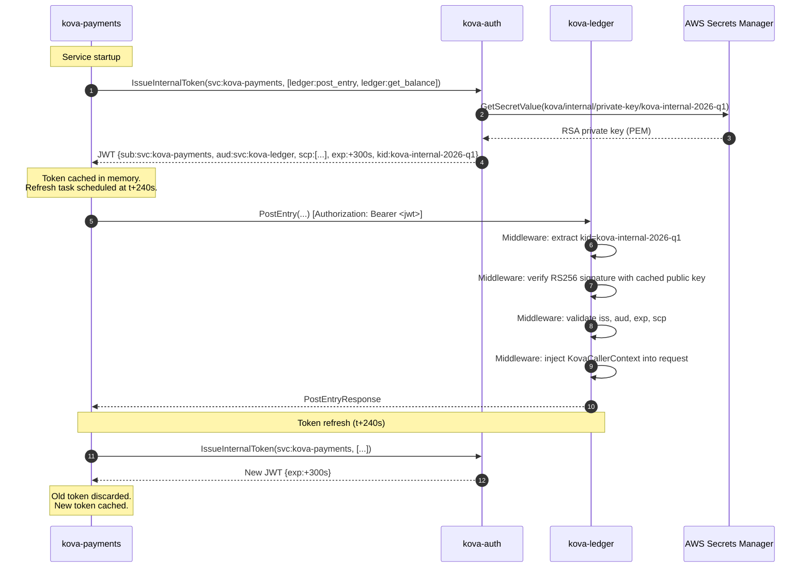

# KOVA — Internal Service Authentication Contract

Every synchronous call between KOVA services (gRPC or internal REST) must
carry a signed KOVA-internal JWT. This document is the authoritative
specification for that token format, the required scope per endpoint, the
middleware interface, and the key rotation procedure.

---

## 1. JWT Structure

### Header

```json
{
  "alg": "RS256",
  "typ": "JWT",
  "kid": "<key-id>"
}
```

`kid` identifies which key version signed the token. It must be a short
alphanumeric string matching the `kid` stored in AWS Secrets Manager
(e.g. `kova-internal-2026-q1`). Services cache the key set and select the
correct public key by `kid` at validation time, enabling zero-downtime
key rotation.

### Payload (Claims)

| Claim | Type | Required | Description |
|-------|------|----------|-------------|
| `iss` | string | yes | Always `"kova-internal"`. Reject any token with a different issuer. |
| `sub` | string | yes | Caller identity. Format: `"svc:<service-name>"`. Example: `"svc:kova-payments"`. |
| `aud` | string | yes | Target service. Format: `"svc:<service-name>"`. Example: `"svc:kova-ledger"`. Reject tokens whose `aud` does not match the receiving service. |
| `iat` | number | yes | Issued-at time (Unix seconds). |
| `exp` | number | yes | Expiry time (Unix seconds). TTL is exactly **300 seconds** (5 minutes). |
| `jti` | string | yes | JWT ID — a UUIDv7 string. Unique per issued token. Used for logging; tokens are not individually revocable. |
| `scp` | array of strings | yes | List of scopes granted. See §3 for the scope registry. |

### Example Payload

```json
{
  "iss": "kova-internal",
  "sub": "svc:kova-payments",
  "aud": "svc:kova-ledger",
  "iat": 1751203200,
  "exp": 1751203500,
  "jti": "0191b3e2-4f1a-7c3d-8e9f-0a1b2c3d4e5f",
  "scp": ["ledger:post_entry", "ledger:get_balance"]
}
```

### Signing

Algorithm: **RS256** (RSASSA-PKCS1-v1_5 with SHA-256).

Private key size: **4096-bit RSA**.

The private key is held exclusively by **kova-auth**. No other service has
access to the private key. All other services hold only the public key (or
keys, during rotation overlap).

---

## 2. Token Issuance

kova-auth exposes an internal-only gRPC endpoint (not proxied by kova-gateway)
for issuing internal service tokens:

```
POST kova-auth:50050 → IssueInternalToken(service_name, requested_scopes)
```

At startup, every KOVA service calls this endpoint once to obtain its initial
token and caches it in memory. A background task refreshes the token at
`(exp - iat) * 0.8` seconds from issue time (i.e. at 4 minutes — 1 minute
before expiry) to ensure no service is caught with an expired token.

The issuing endpoint validates that `service_name` matches the calling pod's
Kubernetes ServiceAccount (verified via the pod's own Kubernetes SA token
passed in the request).

---

## 3. Scope Registry

Every gRPC endpoint requires at least one scope. The caller must include the
required scope in its `scp` claim. The receiving service's middleware rejects
requests where `scp` does not contain the required scope.

### kova-auth (ValidateInternalToken)

| RPC | Required Scope |
|-----|----------------|
| `ValidateInternalToken` | `auth:validate_token` |

### kova-ledger

| RPC | Required Scope |
|-----|----------------|
| `PostEntry` | `ledger:post_entry` |
| `GetBalance` | `ledger:get_balance` |
| `GetStatement` | `ledger:get_statement` |

### kova-account

| RPC | Required Scope |
|-----|----------------|
| `GetAccountStatus` | `account:get_status` |
| `GetPendingPayments` | `account:get_pending_payments` |

### kova-fraud

| RPC | Required Scope |
|-----|----------------|
| `EvaluatePayment` | `fraud:evaluate` |

### kova-fx

| RPC | Required Scope |
|-----|----------------|
| `GetFxQuote` | `fx:get_quote` |
| `ConsumeQuote` | `fx:consume_quote` |

### kova-kyc

| RPC | Required Scope |
|-----|----------------|
| `GetKycStatus` | `kyc:get_status` |
| `GetKycRiskLevel` | `kyc:get_risk_level` |

### kova-payments

| RPC | Required Scope |
|-----|----------------|
| `GetPendingPayments` | `payments:read_internal` |
| `GetRecentPayments` | `payments:read_internal` |
| `GetPaymentByRailRef` | `payments:read_internal` |

### Internal REST endpoints (compliance / admin)

| Service | Endpoint | Required Scope |
|---------|----------|----------------|
| kova-kyc | `POST /internal/kyc/applications/:id/approve` | `kyc:review` |
| kova-kyc | `POST /internal/kyc/applications/:id/reject` | `kyc:review` |
| kova-fraud | `POST /internal/fraud/blacklist` | `fraud:admin` |
| kova-reconciliation | `GET /internal/reconciliation/exceptions` | `reconciliation:review` |
| kova-reconciliation | `POST /internal/reconciliation/exceptions/:id/match` | `reconciliation:review` |
| kova-reconciliation | `GET /internal/reconciliation/reports/daily` | `reconciliation:review` |
| kova-audit | `GET /internal/audit/events` | `audit:read` |
| kova-audit | `POST /internal/audit/export` | `audit:export` |
| kova-audit | `POST /internal/audit/verify-integrity` | `audit:admin` |
| kova-fx | `GET /api/v1/kova/fx/exposure` | `fx:reporting` |

---

## 4. Validation Middleware Interface

Every KOVA service must apply internal JWT validation to all inbound
gRPC calls using the following interface. The implementation lives in
`crates/kova-auth-middleware/src/lib.rs` and is imported by every service.

```rust
/// Validates an inbound KOVA-internal JWT from the request metadata.
///
/// Attach as a tonic interceptor:
///   Server::builder()
///       .layer(InterceptorLayer::new(KovaInternalAuthInterceptor::new(keys, "svc:kova-ledger")))
///       .add_service(...)
pub struct KovaInternalAuthInterceptor {
    /// Public key set, keyed by `kid`. Updated in-place on rotation.
    key_set: Arc<RwLock<HashMap<String, DecodingKey>>>,
    /// This service's own audience value, e.g. "svc:kova-ledger".
    own_audience: &'static str,
}

impl KovaInternalAuthInterceptor {
    /// Validates the token and injects a `KovaCallerContext` into
    /// the request extensions for downstream handler use.
    ///
    /// Rejects with:
    ///   UNAUTHENTICATED — missing, malformed, expired, wrong issuer/audience
    ///   PERMISSION_DENIED — token valid but required scope absent
    pub fn check(
        &self,
        mut request: Request<()>,
        required_scope: &str,
    ) -> Result<Request<()>, Status>;
}

/// Injected into request extensions after successful validation.
pub struct KovaCallerContext {
    pub service_name: String,   // e.g. "kova-payments"
    pub scopes: Vec<String>,
    pub jti: String,
    pub expires_at: DateTime<Utc>,
}
```

### Validation Steps (in order)

1. Extract the `authorization` metadata key from the gRPC request.
2. Strip the `Bearer ` prefix. Reject with `UNAUTHENTICATED` if absent.
3. Decode the JWT header to extract `kid`.
4. Look up the `DecodingKey` by `kid` in the key set. Reject with
   `UNAUTHENTICATED` if `kid` is unknown (may be a stale token from before
   the last rotation — client must re-issue).
5. Validate the signature using RS256.
6. Validate `exp` — reject with `UNAUTHENTICATED` if expired.
7. Validate `iss == "kova-internal"` — reject with `UNAUTHENTICATED` if not.
8. Validate `aud == own_audience` — reject with `UNAUTHENTICATED` if not.
9. Validate that `scp` contains `required_scope` — reject with
   `PERMISSION_DENIED` if not.
10. Inject `KovaCallerContext` into request extensions.
11. Log the call at `DEBUG` level: `jti`, `sub`, `aud`, `scp`.

**Never log the raw JWT string.** Log only the decoded claims.

---

## 5. Token Validation Flow



---

## 6. AWS Secrets Manager — Secret Naming Convention

All KOVA secrets follow the path pattern:

```
kova/<environment>/<service>/<secret-name>
```

| Secret | Path | Contents |
|--------|------|----------|
| Internal JWT signing key (active) | `kova/<env>/kova-auth/internal-jwt-private-key` | RSA 4096-bit private key, PEM format |
| Internal JWT public key set | `kova/<env>/kova-auth/internal-jwt-public-keys` | JSON array of `{kid, public_key_pem}` objects |
| End-user JWT signing key | `kova/<env>/kova-auth/user-jwt-private-key` | RS256 private key for user-facing tokens |
| End-user JWT public key | `kova/<env>/kova-auth/user-jwt-public-key` | RS256 public key |

`<environment>` is one of: `dev`, `staging`, `prod`.

The **public key set** (`internal-jwt-public-keys`) is a JSON array so it can
hold **two** keys during a rotation overlap window:

```json
[
  { "kid": "kova-internal-2026-q1", "public_key_pem": "-----BEGIN PUBLIC KEY-----\n..." },
  { "kid": "kova-internal-2026-q2", "public_key_pem": "-----BEGIN PUBLIC KEY-----\n..." }
]
```

All KOVA services load the public key set at startup and refresh it every
**60 minutes** (via External Secrets Operator — see TASK-115). When a new
`kid` appears in the set, services begin accepting tokens signed by it
immediately. When a `kid` is removed from the set, tokens signed by it are
rejected.

---

## 7. Key Rotation Procedure

Rotation is performed **every 90 days**. The procedure ensures zero downtime:
no request is rejected during the transition.

### Step-by-step

```
Day 0 — Preparation
───────────────────
1. Generate a new 4096-bit RSA key pair.
   openssl genrsa -out new-private.pem 4096
   openssl rsa -in new-private.pem -pubout -out new-public.pem

2. Choose a new kid string following the pattern kova-internal-YYYY-qN
   (e.g. kova-internal-2026-q2).

3. Write the new private key to Secrets Manager:
   aws secretsmanager put-secret-value \
     --secret-id kova/prod/kova-auth/internal-jwt-private-key \
     --secret-string file://new-private.pem

   IMPORTANT: Do NOT yet remove the old public key from the public key set.

4. Append the new public key to the public key set in Secrets Manager:
   (the set now contains BOTH old and new public keys)

5. Wait for External Secrets Operator to propagate the new public key set
   to all services (up to 60 minutes, or force a rollout).

Day 0 — Activation (after all services have loaded the new public key)
──────────────────────────────────────────────────────────────────────
6. Update kova-auth configuration to sign new tokens with the NEW kid.
   Rolling-restart kova-auth (zero-downtime via Kubernetes rolling update).

7. All new tokens are now signed with the new private key (new kid).
   Old tokens (old kid) are still accepted by all services until they expire
   (max 5 minutes outstanding).

Day 0 + 6 minutes — Cleanup
────────────────────────────
8. Remove the old public key from the public key set in Secrets Manager.
   (All old-kid tokens have now expired — 5-min TTL.)

9. Wait for External Secrets Operator to propagate the updated key set.

10. Verify: attempt a request with an old-kid token — confirm UNAUTHENTICATED.

11. Archive the old private key in a secure offline store (do not delete —
    needed for forensic audit of tokens issued during the old key period).
```

### Rollback

If the new key is discovered to be compromised before cleanup (step 8):

1. Remove the new public key from the public key set immediately.
2. Revert kova-auth to sign with the old `kid`.
3. Rolling-restart kova-auth.
4. All services stop accepting new-kid tokens within one secret refresh cycle.

---

## 8. Security Properties

| Property | Mechanism |
|----------|-----------|
| Confidentiality of private key | Stored only in AWS Secrets Manager; only kova-auth's IAM role can read it |
| Token integrity | RS256 signature; tampering changes the signature and fails validation |
| Replay prevention | 5-minute TTL limits the replay window; `jti` enables audit tracing |
| Service impersonation prevention | `aud` claim limits each token to one target service |
| Scope escalation prevention | Scopes are set by kova-auth at issuance; the caller cannot modify them |
| Non-revocability (by design) | Tokens cannot be individually revoked; rotate the key to invalidate all |
| Audit trail | Every token's `jti` is logged at `DEBUG` on the receiving service |
